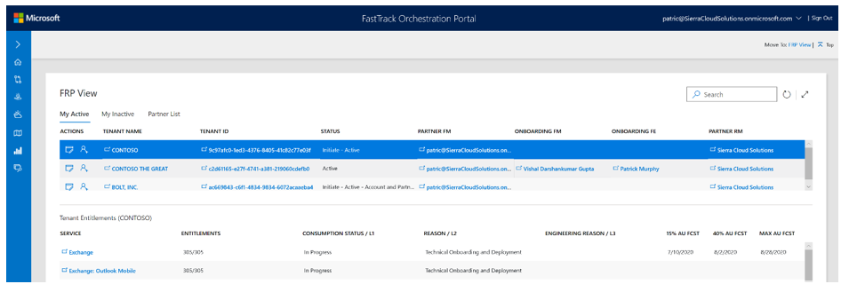
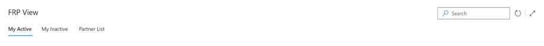
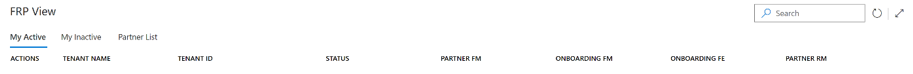
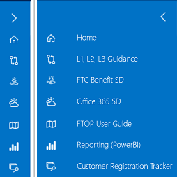
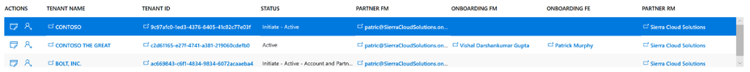
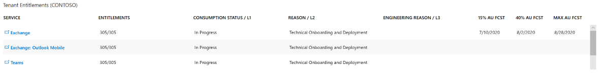
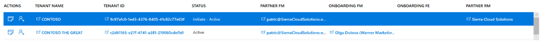
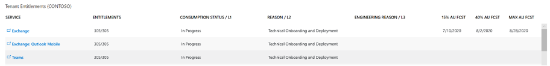

---
# required metadata
title: FTOP Partner User Guide
description: FRP View
author: Celia Kennedy
ms.author: v-cekenn
manager: pagrim
ft.owner: pagrim
ms.date: 05/15/2019
ms.topic: ftop-partner-user-guide
ms.prod: non-product-specific
ms.custom: ftop-partner-user-guide
ft.audience: internal, partner
ft.owner: pagrim
---

# FRP View

## Overview

When you launch FTOP you will see the **FRP View.** This view contains a number of elements that we will look at in depth later in this guide.

At the top, you see the **Assigned Tenant Tabs** (*My Active, My Inactive, and Partner List*) and a Search Box that will allow you to search by Tenant ID or Tenant Name, a Refresh button, and a Maximize button.

On the left side of the window, you see the **FastTrack Guidance Menu.** This menu expands to display links to useful resources, including Reporting (Power BI).

In the center of the window, you see the **Assigned Tenant List** which displays the Tenants that are associated with the **Assigned Tenant Tab.**

Below that, you see the **Tenant Entitlements** section that displays the eligible services for the tenant selected in the **Assigned Tenant Tabs** above (*see Tenant Entitlements for details*).  

> [!NOTE]
> The FRP View UI has been created specifically for Partners and is an overlay to the existing FastTrack UI. A user will either trigger a data entry pop-up or navigate to the full FastTrack UI by clicking the links in the FRP View.

## Assigned Tenant Tabs

The **My Active Tab** lists active tenants that are assigned specifically to the *logged in* partner user as P-RM, P-FM or P-FE.

The **My Inactive Tab** lists inactive tenants that are assigned specifically to the *logged in* partner user.

The **Partner List Tab** lists all tenants that are assigned to the Partner as P-RM = (Partner Name), regardless of whether they are assigned to the specific logged in user or not.  This means any partner user can see all of the tenants assigned to the Partner.

## Assigned Tenant List

This section displays the list of tenants associated with the **Assigned Tenant Tab** filter selected. When a Tenant row (*avoid clicking the hyperlinks*) is selected, relevant entitlement information for that tenant is displayed in the lower **Tenant Entitlements** section.

The hyperlinks either create a pop-up editing experience or open a new window that exposes the full FastTrack UI for additional functionality. (See *Assigned Tenant List for explanation of functionality*)

## Tenant Entitlements

This section displays entitled workloads for the selected tenant. It shows at-a-glance key data regarding the entitlements. It also provides a link to launch a new window providing edit access to the entitled workload using the full FastTrack UI. (See **Service Data Entry for explanation of functionality**)

### Next Step

[Assigned Tenant List](assigned-tenant-list.md)

### Refresh Summary

|Date|Who Changed|What Changed|
|---------|---------------|----------------------------|
|1/24/2020| Celia Kennedy| Update |
|11/20/2019| Celia Kennedy| FTOP Partner User Guide updated|

[Home](http://partner-docs.microsoft.com)