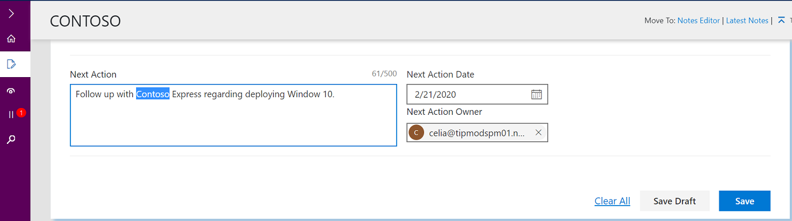

---
# required metadata
title: FTOP User Guide - Notes Library
description: Draft Notes
author: Celia Kennedy
ms.author: v-cekenn
manager: pagrim
ms.date: 12/30/2019
ms.topic: ftop-partner-user-guide
ms.prod: non-product-specific
ms.custom: ftop-partner-user-guide
ft.audience: partner
ft.owner: pagrim
---
# Draft Notes

When you are in the Notes Editor, you have the option to **save drafts.** Ten drafts may be saved to be reviewed at a later time. You can expand or hide the details of your draft using the up/down arrows, and you will be asked to confirm your deletion. To continue to work on a draft, click restore draft. A scenario where this tool is beneficial is, if you draft while on a call, save draft, then you can restore it later to finalize your draft, then save it and it will be associated with a tenant latest notes.

> [!IMPORTANT]
> Once you save a note, you cannot delete it. For guidance on crafting good notes, see [Guidance](fasttrack-playbook/english-playbook/status-guidance-partner.md)

## Next steps

- [L1L2L3 Guidance](l1l2l3-homepage-list.md)

[Back to FTOP Partner User Guide](https://partner-docs.microsoft.com/partner-site/ftop-partner-user-guide/index.md)
