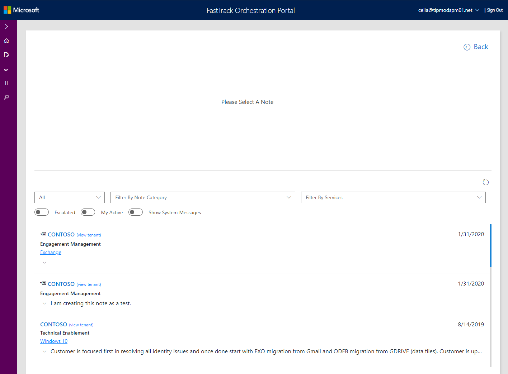
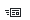

---
# required metadata
title: FTOP User Guide - Notes Library
description: Notes History
author: Celia Kennedy
ms.author: v-cekenn
manager: pagrim
ms.date: 1/20/2020
ms.topic: ftop-partner-user-guide
ms.prod: non-product-specific
ms.custom: ftop-partner-user-guide
ft.audience: partner
ft.owner: pagrim
---
# Notes History

## Overview

This page provides two separate functions depending on the context of where you access Latest Notes.

- If you access Notes History from the User Interface (UI), it displays notes for the tenants assigned to you. You will make selections from **All, Filter By Note Category, Filter By Services** from the drop-down menus to narrow down the list of notes you are viewing.

The following screen shows latest notes accessed from the Notes Library and not within the context of a tenant.

The following screen shows latest notes accessed from within the context of a tenant.

### Controls

It is important to understand that **Search** is more robust than the rest of the controls on the page which are filters.

#### Search Field

From the Search field you can see all notes within your permission level.

#### Set Date Filters

Specify your selections from the drop-down menus. When you see **Tenant** in the Notes category, it means you are viewing notes at the tenant level.

|Drop-down Menu |Menu Items and Descriptions  |
|---------|---------|
|All |All 0-30 Days 30-60 Days 60-90 Days     |
|Note Category   |Engagement Management Technical Enablement Service Intent Environment Enterprise Status        |
|Services    |List of services available. Select the services associated with the tenant that you would like your note to reference.   |

#### Turn On Flags

Specify your selections from the drop-down menus.

|Flags |Descriptions  |
|---------|---------|
|Escalated    |Turn on to mark notes with a Red Exclamation point. This marks the note and you can also search Escalated notes from the Search Notes Library.  |
|My Active   |Turn on to display your Active Tenants.        |
|Show System Messages   |Turn on if you want to display system messages.   |

#### Understand the Icons

The icons provide visual ques that help you quickly identify notes. 

|Icon  |Label |Description |
|--------|----|-----|
| |Recent Note |Shows notes that are up to a week old. |
| |Escalated Note |Shows notes that you have flagged as escalated. If you have permissions to view others notes, you will also see them.

## Next steps

To learn about saving drafts, see [Draft Notes](notes-library-draft.md).

[Back to FTOP Partner User Guide](https://partner-docs.microsoft.com/partner-site/ftop-partner-user-guide/index.html)
