---
# required metadata
title: Partner Center Org ID Credentials for FRPs
description: Establishing Partner Center credentials
ms.author: v-cekenn
manager: pagrim
ft.owner: pagrim
ms.date: 1/03/2020
ms.topic: establishing-partner-center-credentials
ms.prod: non-product-specific
ms.custom: establishing-partner-center-credentials
ft.audience: partner
ft.owner: pagrim
---

## Establishing Partner Center (Org ID) credentials

If a partner is already using Partner Center (for example, they are already enrolled in the Cloud Solution Provider Program (CSP)), they can reuse their existing partner tenant for their FRP business and do not need to go through Partner Center enrollment again.  

If this is the case, please skip this section and proceed to the section entitled **Accessing FTOP with Partner Org ID credentials.**

### Prerequisites

Before enrolling a partner through Partner Center, ensure you establish the following:

- Microsoft Partner Network (MPN) enrollment
  
    Since Gold MPN competency is a prerequisite of the FRP program, MPN enrollment is assumed and is not described further.

- Microsoft cloud services account (Azure AD tenant)

    The partner will usually have an Azure Active Directory tenant prior to enrolling through Partner Center. If they do not not, they can create one during enrollment. This is the same Azure AD tenant referred to in the section, [Partner Center credentials for FastTrack Ready Partner tools](index.md).

    This Azure AD tenant is also often referred to as a Work, School,  or Company Account. It is most commonly created with the purchase of Office 365, Microsoft Azure, or Microsoft Dynamics CRM cloud service. These services leverage Azure AD tenants as the directory store for all users and applications in those services. As stated above, if the partner does not have such an existing Microsoft cloud services account or tenant, they can create one during Partner Center enrollment.

### Partner vs. Customer Tenant

**Microsoft recommends that partners use separate tenants for their own use of Microsoft cloud services *not* the tenant that is used to manage their cloud business and partnership with Microsoft.** This is *not* a requirement, but a recommendation. If a partner has already established a single tenant for both their own use of Microsoft cloud services and their partner business, they can choose to keep that model.  

The second partner business-related tenant model is the one we wil focus on throughout this document. For example, let’s assume *Contoso Deployment Services* is an FRP partner. Contoso should create one tenant, *contoso.onmicrosoft.com,* for their own users to use Microsoft cloud services (e.g. Microsoft 365). This first tenant can be considered a customer tenant. They would then create a second tenant, (say) *contoso-partner.onmicrosoft.com,* for their partner business and partner relationship with Microsoft. This second tenant can be considered a *partner* tenant. They would enroll/onboard this second *partner* tenant through Partner Center.

The rationale behind this recommendation is when a partner uses a single tenant for their partner business and for their own use of Microsoft cloud services the setup and management of tenant administrators can become confusing and conflicts may occur.

Example: There are scenarios where only a global administrator may perform certain functions. Setting up an individual user as a global administrator may be useful for him/her as they may need to perform partner functions (using delegated admin privileges over the partner’s customers). However, this implies the user has global admin privileges over all the company’s users, which may be unwanted.

### Regional Considerations

Another important consideration for a partner **when setting up their partner tenant** is to note that tenants are country-specific. This means that when a partner sets up their tenant it will be associated with a specific country and importantly, once established, it cannot be modified. **Microsoft recommends that partners maintain separate partner tenants for their country-specific FRP businesses.** Note that this recommendation is in place because the partner may be using their partner tenant for other Microsoft partner programs such as the Cloud Solution Provider (CSP) program that have such restrictions in place. For instance, an FRP may have their deployment business in the United States (US) and the United Kingdom (UK). In this case it is recommended that they enroll two separate partner tenants (through Partner Center), one for their US business and the second for their UK business.

The only exception to this recommendation is if the partner is operating their business in one of the [regional authorization areas.](link broken) In that case, the partner can choose to maintain a single partner tenant from one of the countries for each regional authorization area. As a reminder, the above guidance is primarily for other Microsoft partner programs and not necessarily the FRP program.

### Enrollment

If an FRP does not already have a Partner Center account (i.e. a partner tenant) then they should enroll by following the process at https://partnercenter.microsoft.com/pcv/register/joinnow/enrollmentWelcome/valueaddedreseller.

A detailed walk-through is documented in the [Appendix](appendix.md).

### Accessing FTOP with Partner Center (Org ID) credentials

The [FastTrack Orchestration Portal (FTOP)](https://ftop.microsoft.com) is the primary tool used by FRPs to manage their customer deployments. Partner Center credentials are used to access FTOP.

#### Video: Establish and Maintain Your Partner Business in FTOP

Watch this video, [Establish and Maintain your Partner Business in FTOP](https://ftdocs-bcm.azureedge.net/public/frp-estab-maintain-partner-bus-ftop-v-1.mp4), to help you learn how to log into FTOP using your Org ID credentials, determine how you want to manage your partner tenant, grant partners access to FTOP, create and assign roles to your users in Partner Center, and assign a customer to a partner user in FTOP.

#### Granting partner tenant access to FTOP

Before any partner tenant users are created or granted access to FTOP, the partner’s tenant itself needs to be granted access to FTOP. This is accomplished by a one-time task completed by a **Global Admin user** from the partner tenant.

- **Step 1:** The Global Admin (GA) user needs to **copy this URL into an InPrivate (or Incognito or private) browser session: https://aka.ms/frpftoptenantapproval.**

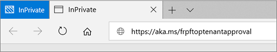

- **Step 2:** The GA user will then need to log in using their partner tenant Global Admin credentials.

- **Step 3:** The GA will be presented an approval screen. By clicking **Accept** the partner tenant will be granted access to FTOP.

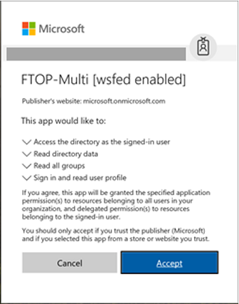

- **Step 4:** When the GA user is redirected to FTOP, they may see a ‘Page not found’ error (see screen capture below).

> [!NOTE]
> Note: Ignore this error and close the browser.

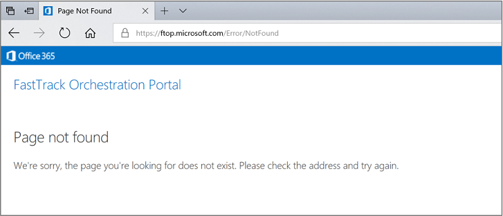

> [!NOTE]
> Important note: A non-GA user can complete a similar one-time approval step on the partner tenant by attempting to log into FTOP using their Partner Center credentials. If the partner tenant has not yet been granted access by a GA user as described above, they are presented with a similar one-time approval that they can **accept.** In this case, only the specific user will be granted access to FTOP and other users will also need to go through their own individual, one-time access-granting step unless a GA user grants access to the entire partner tenant as described in the above steps.

### User creation and role assignment in Partner Center

Microsoft recommends that all users who need to access FTOP are granted access and managed through Partner Center.

Follow the process outlined below:

- **Step 1:** To manage users in Partner Center, log into [Partner Center](https://partnercenter.microsoft.com) and navigate to the **Dashboard** as shown. Click **View users.** To add a user, click **Add new user**

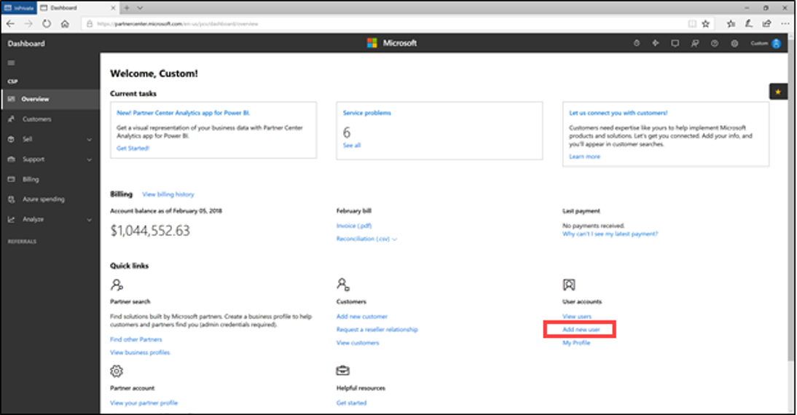

- **Step 2:** Click on the **user you wish to edit.** This will open the user management pane.

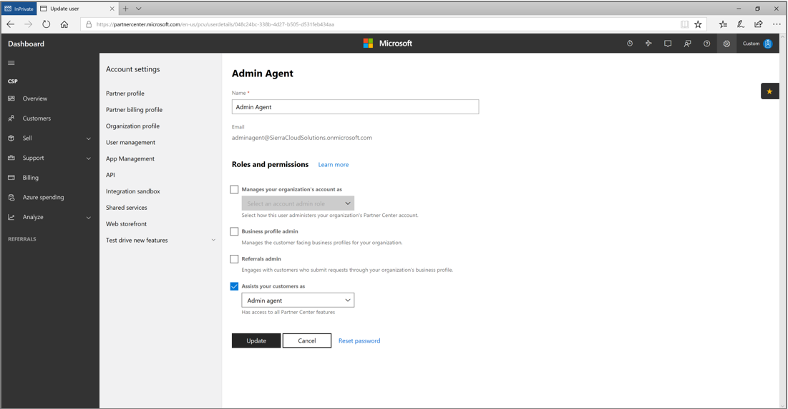

- **Step 3:** Users that need access to FTOP must be granted permission by **the agent (Admin agent, Sales agent or Helpdesk agent) or admin (Global admin, Billing admin or User management admin) roles.** A user that is *not* an agent and *not* an admin will be unable to access FTOP.

Select the appropriate agent and/or admin roles for the user and click **Update.**

### Create and assign a user in Office 365 Admin Center

Some partners may have standardized internal processes such that all their partner tenant users are created and managed in the Office 365 Admin Center (OAC), available at https://portal.office.com, rather than through Partner Center. While **this is not the recommended process for managing FTOP users,** it is still possible to do so.

It is important to note that OAC offers more user roles than are available through Partner Center. If a partner wishes to use OAC for user management, they need to ensure that the appropriate equivalent **Group Office 365 Memberships and Office 365 Admin Center Roles,** as documented in the following table, are assigned to any user that needs to access FTOP.

|Partner Center Role|Office 365 Group Membership|Office 365 Admin Center Role|
|:---------|:---------------|:----------------------------|
|Admin agent| Admin Agents/All Users| Admin agent|
|Sales agent| Sales Agents/All Users| User (no admin access)|
|Helpdesk agent| Helpdesk Agents/All Users| User (no admin access)|
|Global admin| Admin Agents/All Users| Global admin|
|Billing admin| All Users| Billing administrator|
|User management admin| All Users| User management administrator|

*Table 1: Mapping Partner Center Agent/Admin roles to Office 365 Admin Center*

### Assign a user to a customer record in FTOP

Once users have been created and assigned the appropriate roles through Partner Center (or through the Office 365 Admin Center), they need to be assigned to specific customers in FTOP so they can manage those customers.

When a user first logs into FTOP, they may be first **presented with a tenant-approval-for-FTOP step** as described above if the entire tenant has not been approved for access to FTOP. The following steps describe the process for assigning customer records to individual users in FTOP.

- **Step 1:** Once logged into FTOP, the list of customers assigned to the partner are listed under the **Partner List filter.**

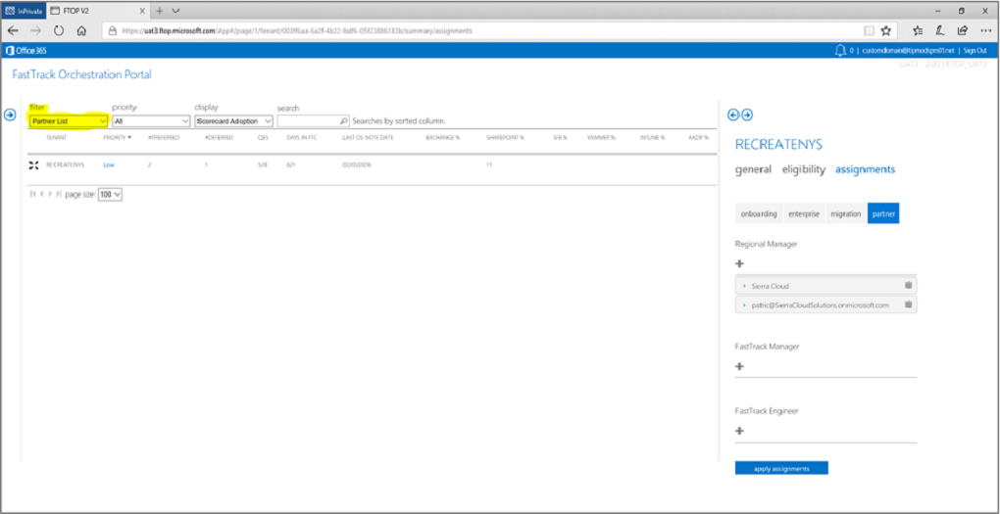

- **Step 2:** The customer records listed under the Partner List are **read-only.** In order to **enable read/write** access to the customer record, it must be assigned to a specific user as shown in the screenshot below.

> [!NOTE]
> The user must be specified using their user principal name (e-mail address) and then clicking the **Apply Assignments Button.** The user may be added to any of the Regional Manager, FastTrack Manager or FastTrack Engineer roles.

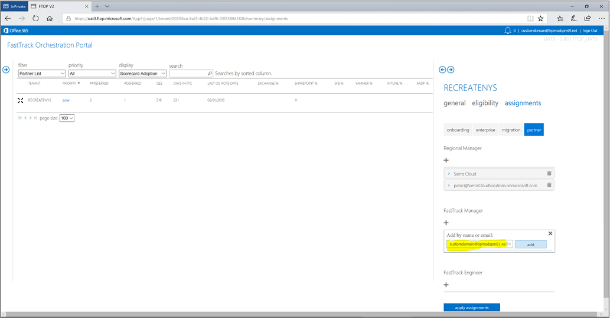

- **Step 3:** Now when this user logs into FTOP and selects the My Active Tenants filter, they will see their assigned customer records and will be able to edit it as needed.

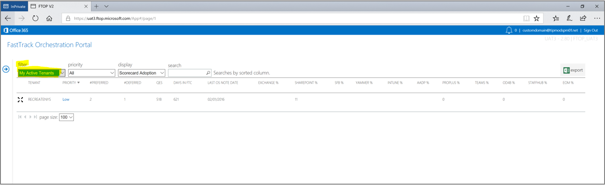

### Ongoing login experience

Once user setup is complete, logging into FTOP is as simple as navigating to [FTOP](https://ftop.microsoft.com) and entering the user’s Partner Center (Org ID) credentials when prompted.

### Accessing FastTrack Portal with Partner Center (Org ID) credentials

The FastTrack Portal, another tool partners use, allows a partner to submit a **Request for Assistance (RFA).** To setup a partner on the FastTrack portal, do the following:

- **Step 1:** Go to to the [FastTrack Portal](https://ftop.microsoft.com) and click **Sign in.**

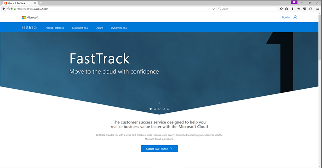

- **Step 2:** Log in with your Partner Center credentials.

- **Step 3:** If prompted, **accept the permissions request** to grant access to the user. This is a one-time step.

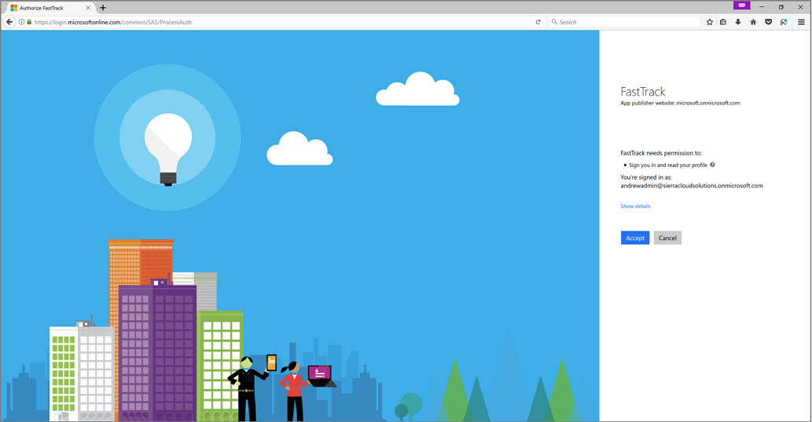

- **Step 4:** Complete the registration form (as seen in the screenshot below).

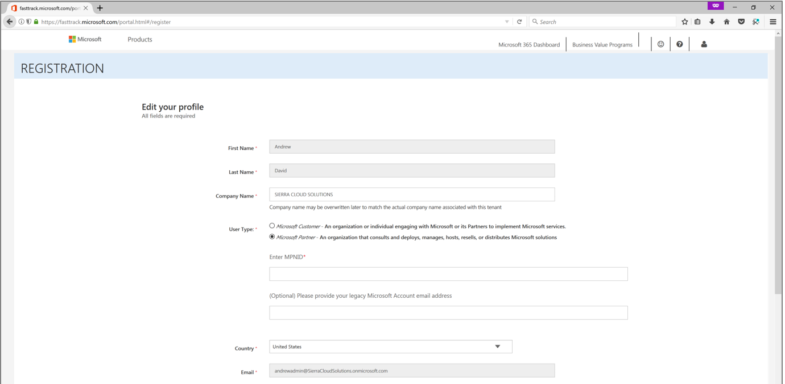

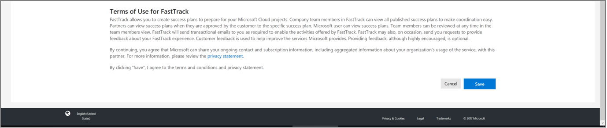

- **Step 5:** Enter the FastTrack Orchestration Portal (FTOP)

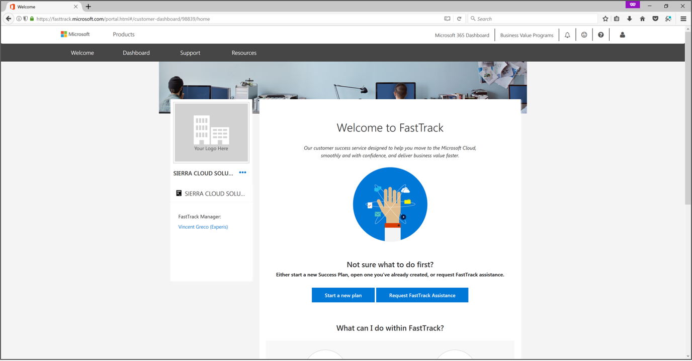

### Refresh Summary

|Date|Who Changed|What Changed|
|---------|---------------|----------------------------|
|1/3/2020| Celia Kennedy| Guide Updated|

[FTOP Partner User Guide](http://partner-docs.microsoft.com/partner-site/ftop-partner-user-guide/index.html)