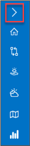
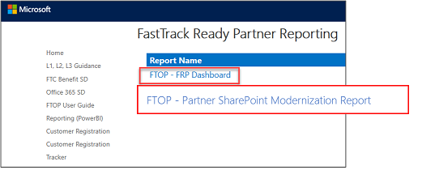
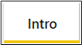
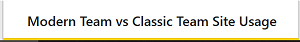
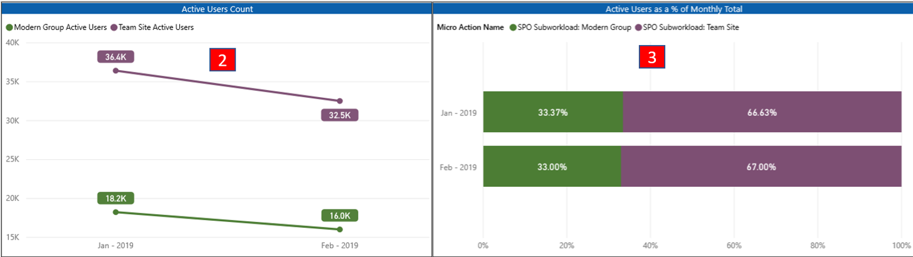
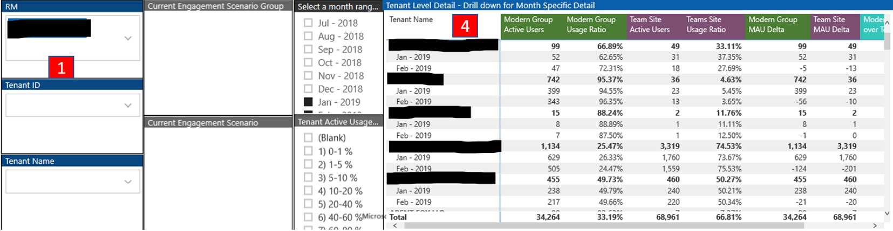

---
# required metadata
title: FastTrack Partner SharePoint Modernization Report Guide
description: Understand the Partner SharePoint Modernization Report
author: Celia Kennedy
ms.author: v-cekenn
manager: pagrim
ms.date: 12/09/2019
ms.topic: partner-sharepoint-modernization-report-guide
ms.prod: non-product-specific
ms.custom: partner-sharepoint-modernization-report-guide
ft.audience: partner
ft.owner: pagrim
---

# Overview
Use this guide to understand the Partner SharePoint Modernization Report. The primary purpose of this report is to provide partner customer portfolio insights into:

1. SharePoint Online modern Team site versus classic team site usage
2. SharePoint Online modern Communication site versus classic publishing site usage

For terms and acronyms used in this guide, see:
- Appendix A: Partner SharePoint Modernization Report Term Definitions 

Note: For privacy reasons, some areas in the screen captures in this guide are obscured.

## Sign in to FTOP and Open Power BI
To perform the procedures in this document, you’ll first need to log into FastTrack Orchestration Portal (FTOP). Here’s how:

1. In your browser, go to http://ftop.microsoft.com.
2. Log in using your Org ID credentials (user principal name1 + password).

> [!NOTE]
> These credentials are Microsoft Organization IDs (Org ID), established through the Partner Center. If you don’t have Org ID credentials contact your Partner Success Manager (PSM) or see the [Partner Center Org ID Credentials for FastTrack Ready Partners Guide.](http://o365pp.blob.core.windows.net/media/Partner%20Org%20ID%20guide.pdf)

3. In FTOP, in the left navigation pane, click  to display the menu of options.

In the expanded menu, click Reporting (Power BI).

")

4. In Power BI, click Partner SharePoint Modernization Report.

## Choose a Power BI Report Tab

This section provides you with a description of all tabs in the Partner SharePoint Modernization Report and how to interpret the data in each.

### Intro Tab

The Intro tab is the first tab on the report. It provides you with a high-level description of each report on each tab in the Dashboard.

At the bottom of the Dashboard, click the Intro tab.

 
### Modern Team vs Classic Team Site Usage Tab

Use this report to check the overall modern versus classic SharePoint team site usage trends for your assigned customers. 

At the bottom of the report, click the Modern Team vs Classic Team Site Usage tab.

 Customer level filters. Ability to filter on specific customers via their Tenant ID or Customer Name.

 **Active Users Count** graph displays raw counts for monthly active users. Segmented by Modern Team Site and Classic Team Site measures.

 **Active Users as a % of Monthly Total** graph breaks down the percentage totals for Modern Team Site user counts vs Classic Team Site user counts, for a given month.

 **Tenant Level Detail** – Drill down for month specific detail, per customer. Provides an ability to sort on modern versus classic raw numbers. Useful in identifying largest opportunity space.

**Select a month range** – ability to select monthly data ranges for the report graphs and tenant level details.

### *Modern Communication* vs *Classic Publishing Site Usage* Tab

Use this report to check the overall modern versus classic SharePoint publishing site usage trends for your assigned customers.

At the bottom of the report, click the Modern Communication vs Classic Publishing Site Usage tab.

 Customer level filters. Ability to filter on specific customers via their Tenant ID or Customer Name.

 **Active Users Count** graph displays raw counts for monthly active users. Segmented by Modern Communication Site and Classic Publishing Site measures.

 **Active Users as a % of Monthly Total** graph breaks down the percentage totals for Modern Communication Site user counts vs Classic Publishing Site user counts, for a given month. 

 **Tenant Level Detail** – Drill down for month specific detail, per customer. Provides an ability to sort on modern versus classic raw numbers. Useful in identifying largest opportunity space. 

**Select a month range** – ability to select monthly data ranges for the report graphs and tenant level details.

## Appendix A: Partner SharePoint Modernization Report Term Definitions

The following list of terms are used in this report.

### Refresh Summary

|Terms|Definitions|
|:---------|:---------------|
|Tenant| A tenant is the entity representing a partner or customer in the Microsoft cloud. A tenant is provided when an organization signs up for a Microsoft cloud service such as Azure or Office 365.|
|Modern Team Site| A SharePoint team site that is configured for group-connected modern SharePoint experiences. |
|Classic Team Site| A SharePoint team site based on the STS#0 site template. This site template will not exhibit modern SharePoint UI or group-connected collaboration capabilities.|
|Modern Communication Site| A SharePoint site based on the modern communication site template.|
|Classic Publishing Site| A SharePoint site based on the classic publishing site template.|

### Refresh Summary

|Date|Who Changed|What Changed|Notes|
|---------|---------------|----------------------------|-------------|
|12/09/2019| Celia Kennedy| SharePoint Modernization Report Guide Uploaded| |

[Home](http://partner-docs.microsoft.com)