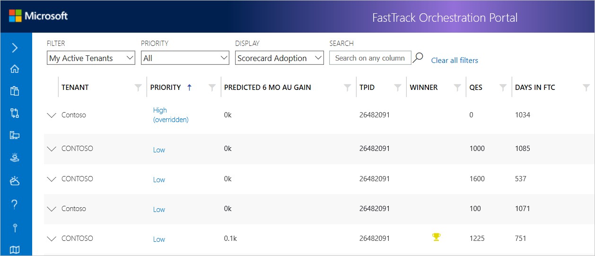
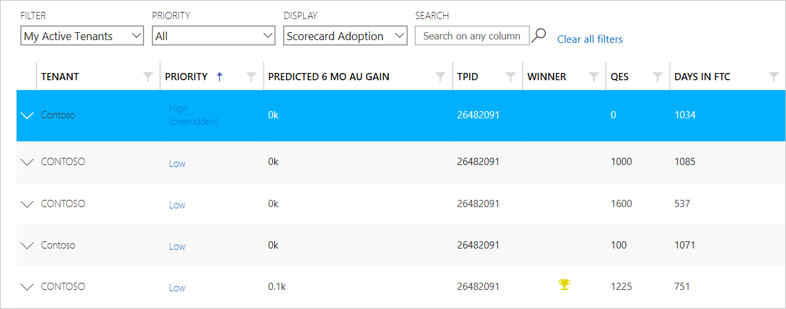
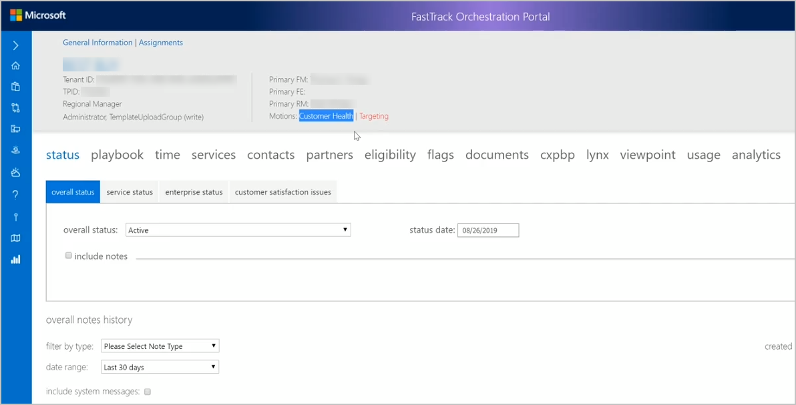
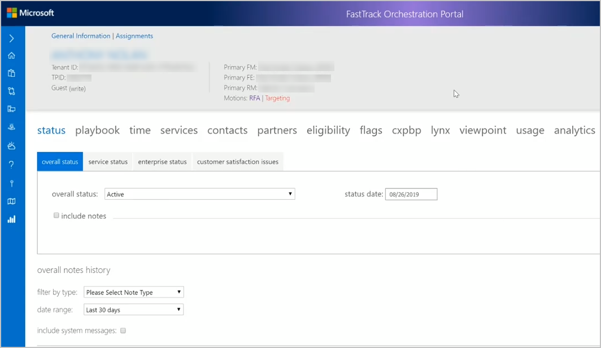
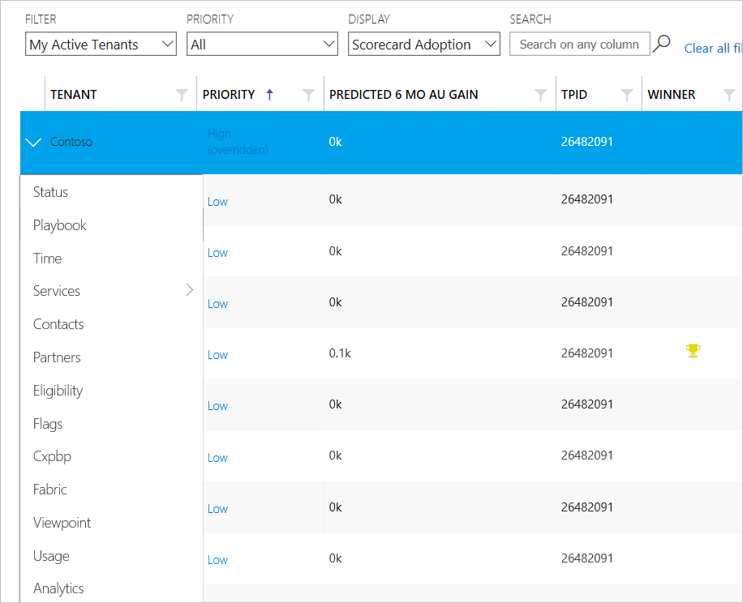

---
# required metadata
title: FTOP Partner User Guide
description: Process guidance for FTOP users
author: Celia Kennedy
ms.author: v-cekenn
manager: pagrim
ms.date: 4/16/2019
ms.topic: ftop-partner-user-guide
ms.prod: non-product-specific
ms.custom: ftop-partner-user-guide
ft.audience: partner
ft.owner: pagrim
---
# Contextual Menu

## Overview

When you access Portfolio View you will see a list of tenants, in this case, filtered by My Active Tenants.

The row is highlighted when you select a tenant.

Select the down arrow to view the contextual menu for a tenant with Motions Customer Health and Targeting.

The following example shows a tenant with Motions RFA and Targeting.

This is another example of the contextual menu with a different display.

> [!NOTE]
> These menu options are the same tab options you would see if you viewed the customer/tenant in the Detailed Tenant view.

Review the table below for a description of the tabs on the menu.

| Priority           | Description                                                                                                                                                                                                                                                                                                                                                                                                                                 |
| ------------------ | ------------------------------------------------------------------------------------------------------------------------------------------------------------------------------------------------------------------------------------------------------------------------------------------------------------------------------------------------------------------------------------------------------------------------------------------- |
| Status             | The Status tab contains subsections (tabs – for recording overall status, service status, enterprise status, and customer satisfaction issues). |
| Playbook           | The Playbook tab lists life cycle phases that display depending on Motions.|
| Time               | The Time tab provides service time entry tracking.|
| Services           | The Services Windows tab provides information and status about the services and life-cycle phases available to the customer for deployment.|
| Contacts           | The Contacts tab tracks customer, partner, and Microsoft contacts related to the customer deployment.|
| Partners           | The Partners tab is rarely used and would, when relevant, contain partner (company) information.|
| Eligibility        | The Eligibility tab displays information about tenant eligibility for the FTC. |
| Flags              | The Flags tab includes editable fields that indicate certain aspects of customer health. |
| Documents          | The Documents tab provides the Tenant an option to create a Document Library.                        |
| Cxpbp              | The Cxpbp tab is a URL that opens the current customer’s information in the CXP Business Portal. |
| ViewPoint          | The ViewPoint tab is a URL that opens the current customer’s tenant information in the ViewPoint portal.     |
| Usage              | The Usage tab opens the Usage Report that provides usage statistics for each tenant, providing detail and insight into active use at set points in time, and changes in use from month to month.  |
| Analytics          | The Analytics tab provides a different view of the customer data and is generally used for management reporting. |

## Next steps

To learn about the summary view, see [**Portfolio View Summary View**](portfolio-view-summary-view.md).

### Refresh Summary

| Date       | Who Changed       | What Changed              |
| ---------- | ----------------- | ------------------------- |
| 12/04/2019  | Celia Kennedy    | Updated images in Contextual Menu|
| 11/09/2019  | Celia Kennedy    | StaffHub documentation removed|

[Home](http://partner-docs.microsoft.com)
