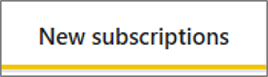
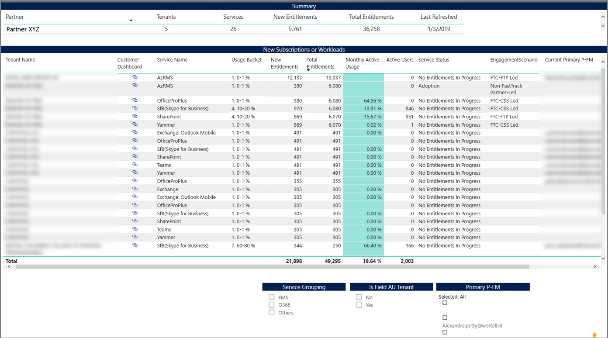

---
# required metadata
title: FastTrack Partner Power BI Report Guide
description: New Subscription Tab
author: Celia Kennedy
ms.author: v-cekenn
manager: pagrim
ft.owner: pagrim
ms.date: 12/31/2019
ms.topic: new-subscription-tab
ms.prod: non-product-specific
ms.custom: new-subscription-tab
ft.audience: partner
ft.owner: pagrim
---

### New Subscriptions Tab

Use this report to see any new entitlements added to the workloads, when the customer purchases additional licenses. This report should be used to identify the new business opportunities and to assign the new entitlements to the appropriate status in FTOP. 

At the bottom of the report, click the **New Subscriptions tab.**

This report shows all entitlements that have status as ‘Unknown’ with the reason of ‘New Subscription or Workloads’ in FTOP. **Action should be taken to assign the proper Service Status for all entitlements currently showing as Unknown.**

You can filter this report further by Service Group and Service level Primary P-FM.

### Next Step

#### Choose a Power BI Report Tab

The following provides you with a description of all tabs in Power BI Dashboard and how to interpret the data in each.

- [Intro Tab](intro-tab.md)
- [Report Level Filters Tab](report-level-filters-tab.md)
- [Performance Overview Tab](performance-overview-tab.md)
- [Performance by Usage Milestone Tab](performance-by-usage-milestone-tab.md)
- [Service Usage Tab](service-usage-tab.md)
- [New Subscription Tab](new-subscription-tab.md)
- [Conversion Rate Tab](conversion-rate-tab.md)
- [Usage Trend Charts Tab](usage-trend-charts-tab.md)
- [RM is NOT FTP Tab](rm-not-ftp-tab.md)
- [Engagement Scenario is not FTC-FTP Led Tab](engagement-scenario-not-ftc-ftp-led-tab.md)
- [Overall Status Notes Updates Tab](overall-status-notes-updates-tab.md)
- [10% Forecast Tab](10-percent-forecast-tab.md)
- [40% Forecast Tab](40-percent-forecast-tab.md)
- [Performance Tab](performance-tab.md)
- [Version History Tab](version-history-tab.md)

### Refresh Summary

|Date|Who Changed|What Changed|
|---------|---------------|----------------------------|
|12/31/2019| Celia Kennedy| Guide Updated|

[Return to Power BI Report Guide Intro](index.md)

[Back to FTOP Partner User Guide](https://partner-docs.microsoft.com/partner-site/ftop-partner-user-guide/index.html)
