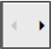
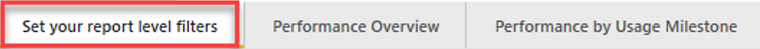
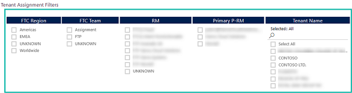
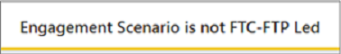
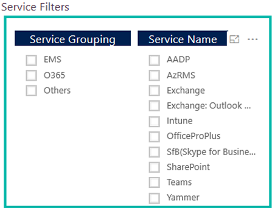

---
# required metadata
title: FastTrack Partner Power BI Report Guide
description: Report Level Filters Tab
author: Celia Kennedy
ms.author: v-cekenn
manager: pagrim
ft.owner: pagrim
ms.date: 12/31/2019
ms.topic: report-level-filters-tab
ms.prod: non-product-specific
ms.custom: report-level-filters-tab
ft.audience: partner
ft.owner: pagrim
---

### Set Your Report Level Filters Tab

When open, the **FTOP – FRP Dashboard** includes fourteen tabs at the bottom of the report. You’ll want to set filters to narrow your search for specific data. 

> [!TIP]
> Use the arrows  in the lower left corner of the Dashboard to scroll and see all fourteen tabs.

1. At the bottom of the report, click the **Set your Report Level Filters tab**.

a. Do one of the following:

- To view all customer in your portfolio, under **Tenant Assignment Filters**, check the applicable **Region, Team,** and **RM** (Regional Manager) boxes. 
- To view data specific to one or more customers, check the boxes that apply.

> [!NOTE]
> Setting these filters applies to all tabs in the dashboard.

b. Under **Engagement Status, Engagement Scenario and Service Status**, check the boxes that apply — or skip this step (leave them unchecked) and filter by services only in the next step.

c. Under **Service Filters**, check the boxes that apply.

### Next Step

#### Choose a Power BI Report Tab

The following provides you with a description of all tabs in Power BI Dashboard and how to interpret the data in each.

- [Intro Tab](intro-tab.md)
- [Report Level Filters Tab](report-level-filters-tab.md)
- [Performance Overview Tab](performance-overview-tab.md)
- [Performance by Usage Milestone Tab](performance-by-usage-milestone-tab.md)
- [Service Usage Tab](service-usage-tab.md)
- [New Subscription Tab](new-subscription-tab.md)
- [Conversion Rate Tab](conversion-rate-tab.md)
- [Usage Trend Charts Tab](usage-trend-charts-tab.md)
- [RM is NOT FTP Tab](rm-not-ftp-tab.md)
- [Engagement Scenario is not FTC-FTP Led Tab](engagement-scenario-not-ftc-ftp-led-tab.md)
- [Overall Status Notes Updates Tab](overall-status-notes-updates-tab.md)
- [10% Forecast Tab](10-percent-forecast-tab.md)
- [40% Forecast Tab](40-percent-forecast-tab.md)
- [Performance Tab](performance-tab.md)
- [Version History Tab](version-history-tab.md)

### Refresh Summary

|Date|Who Changed|What Changed|
|---------|---------------|----------------------------|
|12/31/2019| Celia Kennedy| Guide Updated|

[Return to Power BI Report Guide Intro](index.md)

[Back to FTOP Partner User Guide](https://partner-docs.microsoft.com/partner-site/ftop-partner-user-guide/index.html)
