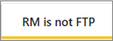
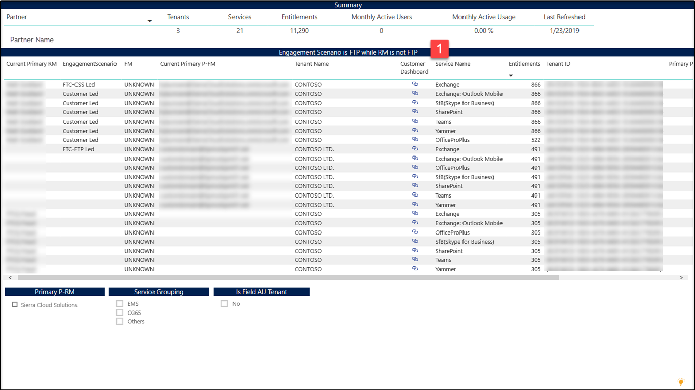

---
# required metadata
title: FastTrack Partner Power BI Report Guide
description: RM is Not FTP Tab
author: Celia Kennedy
ms.author: v-cekenn
manager: pagrim
ft.owner: pagrim
ms.date: 12/31/2019
ms.topic: rm-not-ftp-tab
ms.prod: non-product-specific
ms.custom: rm-not-ftp-tab
ft.audience: partner
ft.owner: pagrim
---

### RM is Not FTP Tab

This report helps to identify those Tenants that have any workload where the Engagement Scenario is FTP Led Or Assist, indicating that you are working with the customer, but where the Tenant level RM is not set correctly to you as the partner. **Action should be taken to add yourself as the Primary Tenant RM when appropriate.**

At the bottom of the report, click the **RM is Not FTP tab.**

 The table gives the list of Tenants with their workloads and engagement scenario that has Tenant Level RM is not set as partner (or FTP <Partner>).

You can filter this report further by Tenant Level Primary Partner RM (Primary P-RM) and Service Groups.

### Next Step

#### Choose a Power BI Report Tab

The following provides you with a description of all tabs in Power BI Dashboard and how to interpret the data in each.

- [Intro Tab](intro-tab.md)
- [Report Level Filters Tab](report-level-filters-tab.md)
- [Performance Overview Tab](performance-overview-tab.md)
- [Performance by Usage Milestone Tab](performance-by-usage-milestone-tab.md)
- [Service Usage Tab](service-usage-tab.md)
- [New Subscription Tab](new-subscription-tab.md)
- [Conversion Rate Tab](conversion-rate-tab.md)
- [Usage Trend Charts Tab](usage-trend-charts-tab.md)
- [RM is NOT FTP Tab](rm-not-ftp-tab.md)
- [Engagement Scenario is not FTC-FTP Led Tab](engagement-scenario-not-ftc-ftp-led-tab.md)
- [Overall Status Notes Updates Tab](overall-status-notes-updates-tab.md)
- [10% Forecast Tab](10-percent-forecast-tab.md)
- [40% Forecast Tab](40-percent-forecast-tab.md)
- [Performance Tab](performance-tab.md)
- [Version History Tab](version-history-tab.md)
  
### Refresh Summary

|Date|Who Changed|What Changed|
|---------|---------------|----------------------------|
|12/31/2019| Celia Kennedy| Guide Updated|

[Return to Power BI Report Guide Intro](index.md)

[Back to FTOP Partner User Guide](https://partner-docs.microsoft.com/partner-site/ftop-partner-user-guide/index.html)
