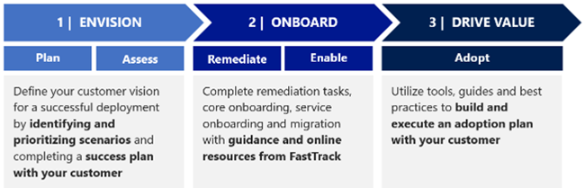

---
# required metadata
title: FastTrack Method and Readiness
description: The recommended process for delivering FastTrack
author: Joy Miller
ms.author: v-joym
manager: pagrim
ms.date: 01/11/2019
ms.topic: frp
ms.prod: non-product-specific
ms.custom: frp
ft.audience: partner
---

# FastTrack Method and Readiness

The FastTrack Ready team guides partners through a recommended process that includes best practices, subject matter expertise, and the tools needed to move customers from their on-premise infrastructure to the cloud with confidence. We have assisted thousands of customers with deployments of all sizes and complexities using a standardized, repeatable process and set of tasks, known as the "FastTrack Method".

The FastTrack Method consists of a three-phased process, designed to help customers quickly and cost-effectively make the move to Microsoft 365. In fact, more than 60,000 customer organizations have already benefitted.

We recommend that FastTrack Partners achieve the suggested outcomes in the Method using the related steps and materials. We welcome and appreciate feedback on what is and is not working so we can improve the experience for everyone.

For information about the FastTrack Method, see [FastTrack Partner Onboarding Hub.](https://www.microsoft.com/microsoft-365/partners/fasttrack-ready)

[Home](http://partner-docs.microsoft.com)
