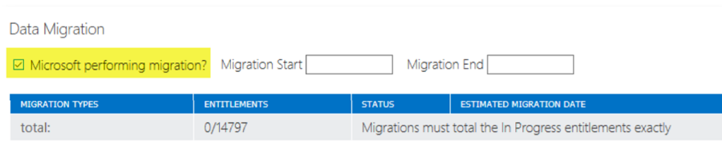

---
# required metadata
title: Migration Playbook
description: Overview
author: Celia Kennedy
ms.author: v-cekenn
manager: pagrim
ms.date: 02/18/2019
ms.topic: frp
ms.prod: non-product-specific
ms.custom: frp
ft.audience: partner
---

# FRP Migration Guidance and FTOP Use

> [!NOTE]
> It is important the customer understands that the FT Migration benefit is **only the move of either mailbox or content.**

Ensure that the customer is marked under the required service as Microsoft performing, this is a mandatory setting for the MVM to engaged with the customer.

Provide desired start and end date for the migration.

>[!NOTE]
> The team cannot and will not commit to dates. The desired start and end dates are used as indications only.

The assignment of Migration Subject Matter expert, **now MVM,** in general, takes up to two business days. In delays towards assignments, an estimated assignment date will be communicated.

#### Next Steps

- [Roles and Responsibilities](migration-roles-and-responsibilities.md)
- [Migration Process Description](migration-process-description.md)
- [Paused and Offboarding Migration Projects](paused-and-offboarding-migration-projects.md)

## Refresh Summary

|Date|Who Changed|What Changed|
|---------|---------------|----------------------------|
|02/18/2019| Celia Kennedy| Migration Playbook published in markdown|
|10/01/2019| Celia Kennedy| General Maintenance|

[Home](http://partner-docs.microsoft.com)