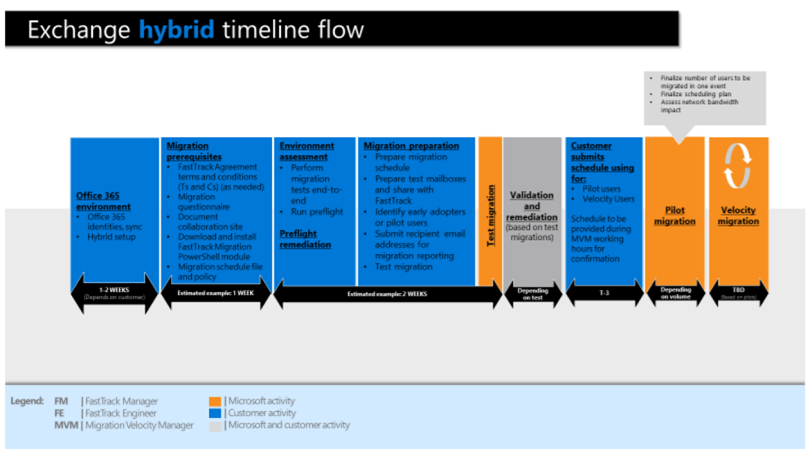

---
# required metadata
title: Migration Benefits Service
description: Migration Process Description
author: Celia Kennedy
ms.author: v-cekenn
manager: pagrim
ms.date: 02/18/2020
ms.topic: frp
ms.prod: non-product-specific
ms.custom: frp
ft.audience: partner
---

# Migration Process Description

Depending on the migration types, the onboarding phase towards the first actual production migration depends on the migration type. Refer to the Onboarding timeline in the Migration workshops.

The FRP needs to review the latest Migration Workshop and questionnaire to ensure that the expectations are clearly communicated tow the customer: 

 - What is included in the FastTrack Migration Benefit and what is not.

 - To be able to offer additional support through possible added valued services in case that some tasks are outside the capability of the customer.

Review the latest Migration workshop to understand the different onboarding timelines. The timelines are for guidance purposes only and the Migration team cannot commit to these as mentioned in the FastTrack Data migration service description. Your assigned FPM will assist you with the access to the workshops and provide them.

Sample Exchange Hybrid timeline flow:

#### Next Steps

- [Paused and Offboarding Migration Projects](paused-and-offboarding-migration-projects.md)

#### Refresh Summary

|Date|Who Changed|What Changed|
|---------|---------------|----------------------------|
|02/18/2019| Celia Kennedy| Migration Playbook published in markdown |
|10/22/2019| Celia Kennedy| General Maintenance |

[Home](http://partner-docs.microsoft.com)