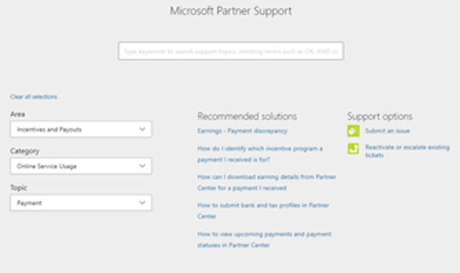
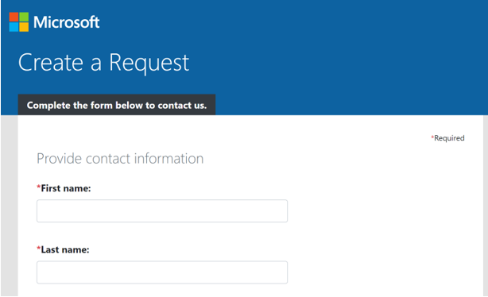
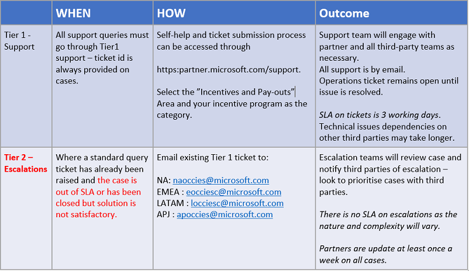

---
# required metadata
title: FastTrack Operations Guide
description: OSU-M365 Incentive Dispute Guidance
author: Celia Kennedy
ms.author: v-cekenn
manager: pagrim
ms.date: 02/13/2020
ms.topic: frp
ms.prod: non-product-specific
ms.custom: frp
ft.audience: partner
ft.owner: pagrim
---
# How to Open or Escalate an OSU-M365 incentive support ticket

## Open Help Ticket

Partners have **2** choices in how to submit an incentive dispute ticket.  

**Option 1: Send email** *(Recommended)*

Use the appropriate regional escalation OCI alias:

1. North America: ocina@microsoft.com
2. Latin America: ocilatam@microsoft.com
3. Asia Pacific including Greater China: ociapgc@microsoft.com
4. Japan: ocijp@microsoft.com
5. Europe Middle East, and Africa (EMEA): ociemea@microsoft.com

The following are the minimal details necessary to include in your email:

- MPN ID
- Claim ID
- Incentive Program
- Customer/Workload
- What thee dispute is (incentive amount, claim eligibility)
- Reason for the dispute

**Option 2:  Partner Center**

1. In Partner Center (top right corner) select the **?**

   a. This will launch the support experience.

2. Use the following selections:

   a. Area = Incentive and Payouts

   b. Category = Online Services Usage

   c. Topic = Payment

   d. Select Support Options “Submit an Issue”

   e. On the next page provide additional information and details requested and “submit”.

## Escalate Existing Ticket

If you are having issues with a support ticket or feel the answer you have received for a ticket is not satisfactory, escalate to the appropriate Tier 2 alias below.

### Refresh Summary

|Date|Who Changed|What Changed|
|---------|---------------|----------------------------|
|02/12/2020| Celia Kennedy| Add OSU-M365 Incentive Dispute guidance|

[Home](http://partner-docs.microsoft.com)