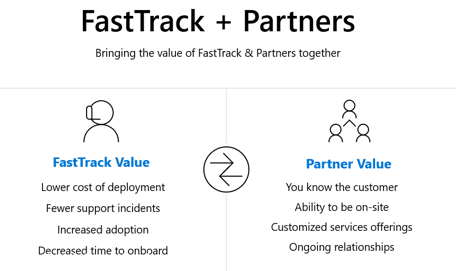

---
# required metadata
title: FastTrack Ready Partners - Program Introduction
description: FRP Partner Guide - Intro - Program Components
author: Joy Miller
ms.author: v-joym
manager: pagrim
ms.date: 01/09/2019
ms.topic: frp
ms.prod: non-product-specific
ms.custom: frp
ft.audience: partner
---

# Introduction to the FastTrack Ready Partner Program

Congratulations on becoming a FastTrack Ready Partner! You're approved to deliver the FastTrack benefit to customers in addition to your value-added services by helping them to deploy and adopt Microsoft 365. This lets you provide customers with a truly customized onboarding experience by leveraging the FastTrack resources and subject matter expertise. In addition, approved partners like you will have access to Microsoft Engineering support, customer referrals, and incentive payments to help reduce cost, drive efficiency, and grow your business. This program offers outcome-based incentives for customers with 150+ seats.

This guide describes the FastTrack Ready Program, including requirements, processes, resources, and links to detailed content for participating partners who have signed the [Terms and Conditions](http://aka.ms/fasttrackpartnerterms).

# Why Become Referral Ready

**Customer Referrals Overview** The FastTrack Ready program provides referrals to partners who are capable of delivering services to our customers. Learn about the possible [types of customer referrals](https://ftdocs-bcm.azureedge.net/public/frp-referrals-overview-v1.pptx).

## Program Components

At Microsoft, we believe that every customer should have a relationship with a deployment and adoption partner. The FastTrack Ready Partner Program consists of 3 components, all of which are intended to help partners succeed throughout the customer onboarding, deployment, and adoption process:

- Partner Success Team
- FastTrack Methodology and Intellectual Property (IP)
- Onboarding and Adoption Incentives

[Home](http://partner-docs.microsoft.com)
