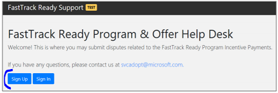
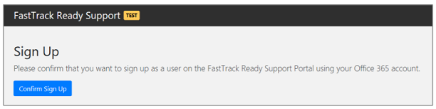
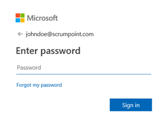
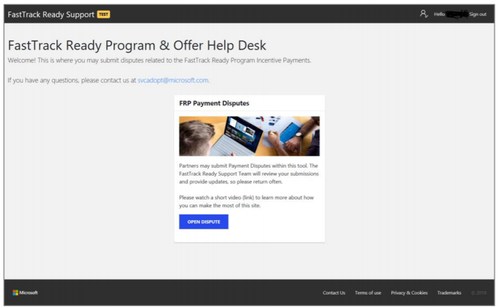
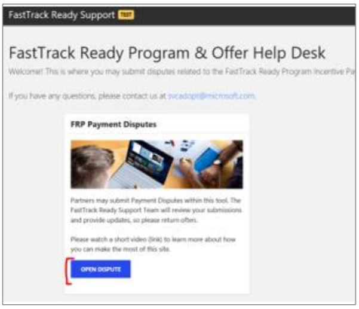
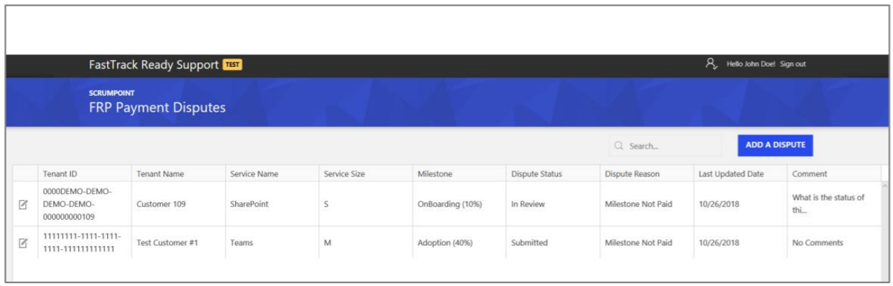
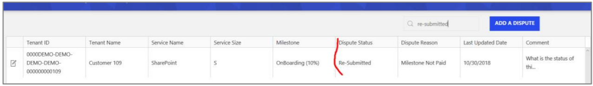
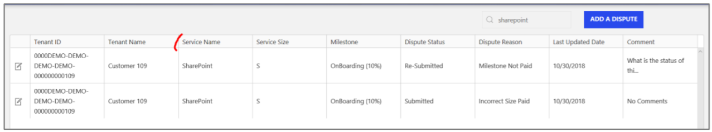

---
# required metadata
title: FastTrack Partner Payment Disputes Site Guide
description: Registration and Login
author: Celia Kennedy
ms.author: v-cekenn
manager: pagrim
ft.owner: pagrim
ms.date: 01/15/2020
ms.topic: registration-login
ms.prod: non-product-specific
ms.custom: registration-login
ft.audience: partner
ft.owner: pagrim
---

## Registration and Login

You must first register within the tool by selecting **Sign Up.**

**Note:**
You must sign up with the Office 365 Account associated with your company domain.

Enter your Office 365 Account e-mail address and password and click **Sign in.** If you have any issues with your password, please contact your Global Admin for your O365 Account.

The site will prompt you to sign in once you are registered and you will be taken to the Home Page.

This is the **FastTrack Ready Support Home Page:**

### Partner View

After you are logged onto the site, click on **Open Dispute** to open the Dispute page. You will then be taken to the **Partner View** where you will see a table of all dispute milestones submitted for your company.

Below is the **Partner View.**

- The partner name is displayed above *FRP Payment Disputes.*
- The **user profile** is displayed at the top right of the site.
- You can click on the **pencil icon** to the left of each item to open a pop-up box containing additional information.
- Values entered in the search box will be used to search the entire table.

### User Profile

The **user profile** will be displayed in the top right-hand side of the site. If you click on your name, your user profile page will appear.

This page will display your company name and selected location. **You will only see the disputed milestones associated with the partner and location chosen.** If you work at a company that has three locations, each will be listed in the drop-down menu under Dispute Location. You will need to select the appropriate location before submitting any dispute milestones.

To return to the **Partner View** (table), please click on the back arrow as there is no button that takes you back to the main page.

## Next Steps

- [Registration and Login](registration-and-login.md)
- [Partner video](https://www.microsoft.com/microsoft-365/partners/videos/fasttrack-ready-partner-payment-disputes-site)
- [Dispute Submission](dispute-submission-overview.md)
    - [Line Number Search](dispute-submission-line-number-search.md)
    - [Tenant ID Search](tenant-id-search.md)
    - [Submit a New One](submit-a-new-one.md)
    - [Submission Errors](submission-errors.md)
- [Dispute Submission Status and Challenging](dispute-submission-status-and-challenging.md)

### Refresh Summary

|Date|Who Changed|What Changed|
|---------|---------------|----------------------------|
|12/31/2019| Celia Kennedy| Guide Updated|

[Home](http://partner-docs.microsoft.com)