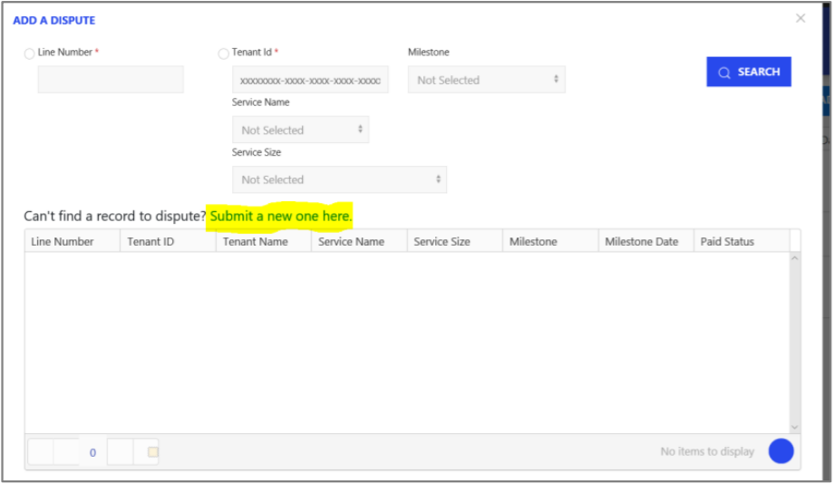
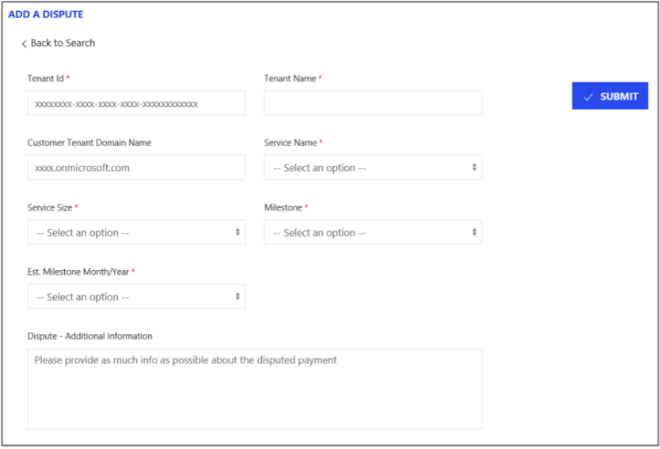

---
# required metadata
title: FastTrack Partner Payment Disputes Site Guide
description: Dispute Submission - Tenant ID Search
author: Celia Kennedy
ms.author: v-cekenn
manager: pagrim
ft.owner: pagrim
ms.date: 01/15/2020
ms.topic: dispute-submission-tenant-id-search
ms.prod: non-product-specific
ms.custom: dispute-submission-tenant-id-search
ft.audience: partner
ft.owner: pagrim
---

# Submit a New One

If you used the Tenant ID and were still unable to find the milestone you want to dispute, please click **Submit A New One.**

You **must** fill in all the required information and click **Submit.** Once you click Submit, the milestone **will be added** to the Partner View Table as Submitted.

- [Registration and Login](registration-and-login.md)
- [Partner video](https://www.microsoft.com/microsoft-365/partners/videos/fasttrack-ready-partner-payment-disputes-site)
- [Dispute Submission](dispute-submission-overview.md)
    - [Line Number Search](dispute-submission-line-number-search.md)
    - [Tenant ID Search](tenant-id-search.md)
    - [Submit a New One](submit-a-new-one.md)
    - [Submission Errors](submission-errors.md)
- [Dispute Submission Status and Challenging](dispute-submission-status-and-challenging.md)

### Refresh Summary

|Date|Who Changed|What Changed|
|---------|---------------|----------------------------|
|12/31/2019| Celia Kennedy| Guide Updated|

[Home](http://partner-docs.microsoft.com)