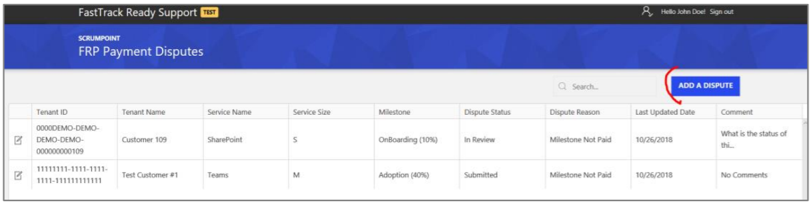

---
# required metadata
title: FastTrack Partner Payment Disputes Site Guide
description: Submit a payment dispute
author: Celia Kennedy
ms.author: v-cekenn
manager: pagrim
ft.owner: pagrim
ms.date: 01/15/2020
ms.topic: submit-a-payment-dispute
ms.prod: non-product-specific
ms.custom: submit-a-payment-dispute
ft.audience: partner
ft.owner: pagrim
---

# Submit a Payment Dispute

This site is designed to make it easy to submit a payment dispute. The first step to submitting a payment dispute is clicking on the button “Add a Dispute” on the right-hand side of the search box.

**Note:**

- If you are disputing a size or any other factor for a milestone that has already been paid, please search for the milestone using the Line Number in the statement. If you do not have a line number, please search for the customer using the Tenant ID. If you do not find the milestone you are looking for, please click submit a new one.

## Next Steps

- [Registration and Login](registration-and-login.md)
- [Partner video](https://www.microsoft.com/microsoft-365/partners/videos/fasttrack-ready-partner-payment-disputes-site)
- [Dispute Submission](dispute-submission-overview.md)
    - [Line Number Search](dispute-submission-line-number-search.md)
    - [Tenant ID Search](tenant-id-search.md)
    - [Submit a New One](submit-a-new-one.md)
    - [Submission Errors](submission-errors.md)
- [Dispute Submission Status and Challenging](dispute-submission-status-and-challenging.md)

### Refresh Summary

|Date|Who Changed|What Changed|
|---------|---------------|----------------------------|
|12/31/2019| Celia Kennedy| Guide Updated|

[Home](http://partner-docs.microsoft.com)