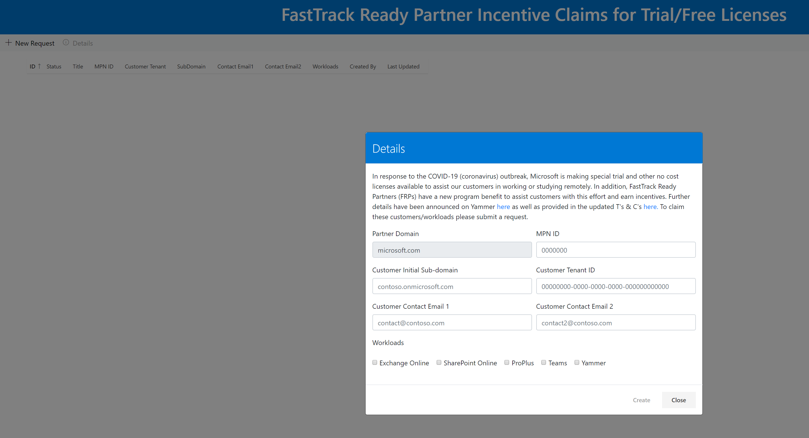

---  
# required metadata  
title: FastTrack Playbook - COVID FastTrack Ready Partner 
description: FastTrack Playbook - COVID FastTrack Ready Partner
ms.author: ryanme  
manager: eduardod  
ms.date: 4/14/2020  
ms.topic: playbook  
ms.prod: non-product-specific  
ms.custom: internal-playbook  
ft.audience: internal  
ft.owner: ryanme
---   
[!INCLUDE [Playbook Feedback](./includes/questions-feedback.md)]

# FastTrack Ready Partner  

## Tools and Incentives  

We have enabled FastTrack Ready Partners (FRPs) to deliver the FastTrack Benefit as Microsoft addresses COVID-19. A registration tool specifically for trial SKUs to support #covid customers has been made available to partners via the FTOP Portal. (For new customers, using normal paid SKUs partners will register them through CPOR.) Partners have also had incentives associated with usage realization. It is important for us to track the impact of COVID-19 on our demand and capacity. We also want to understand shifting customer priorities on workload deployment and adoption.

## FRP Documentation  

For customers that request M365 deployment assistance or shifted deployment/adoption priorities due to COVID-19 (e.g., Teams), we're asking that the **#covid** hashtag be added to the **Engagement Management** and/or **Service Intent** notes fields along with additional details of how COVID-19 has changed the customer's priorities. For general guidance on using **FTOP Notes**, [click here](https://partner-docs.microsoft.com/partner-site/fasttrack-playbook/english-playbook/guidance-ftop-notes-guidance-partner.html).  

## COVID-19 Registration  

The [FRPCovidRegistration](https://aka.ms/FRPCovidRegistration) tool enables partners to directly record new customers using the special trial SKUs associated with #covid. It also assists the FRP team in tracking these new customers and forecasting incentives.

  

## COVID-19 On-boarding Incentives  

On-boarding incentives are available to FRP Partners when they assist with on-boarding E1/G1/A5 trial SKU's. A Student Enablement fee, equivalent to the value of the Teams incentive for eligible tenants, has been added. The FastTrack Ready Partners [Terms & Conditions](http://aka.ms/fasttrackpartnerterms) have been updated to reflect incentives.  

### E1/G1 Trial On-boarding Incentive  

- E1/G1/CSP Office 365: 6-month Trial SKU's will be eligible for on-boarding milestone incentives
- All O365 services (EXO, ODSP, OPP, Teams, Yammer) are eligible
- Tenants must be 150+ seats to qualify
- No Adoption milestone, except XS, eligibility
- Customers must have started their trial on or after **February 1, 2020**
- Tenant must be registered as COVID-19 assistance request
- Standard RFA process

  **OR**  

- Using the FastTrack Ready Partner Incentive Claims for Trial/Free Licenses form
- Tenant must be managed in FTOP like any other customer
- Service(s) must achieve milestone by **June 30, 2020**
- Incentives will be calculated in June for qualifying tenants and paid on the **June incentive statement that will be sent in July 2020**

### A5 Trial Faculty & Staff On-boarding Incentive  

- A5 6-month Trial SKU: Eligible for on-boarding milestone incentives for Faculty & Staff seats
- All O365 services (EXO, ODSP, OPP, Teams, Yammer) are eligible to earn incentives
- Tenants must be 150+ seats to qualify 
- No Adoption milestone, except XS, eligibility 
- Customers must have started their trial on or after **February 1, 2020**
- Tenant must be registered as COVID-19 assistance request 
- Standard RFA process 

  **OR**  

- Using the [FastTrack Ready Partner Incentive Claims for Trial/Free Licenses form](https://aka.ms/FRPCovidRegistration)
- Tenant must be managed in FTOP like any other customer 
- Service(s) must achieve milestone by **June 30, 2020** 
- Incentives will be calculated in June for qualifying tenants and paid on the **June incentive statement that will be sent in July 2020**

### Student Enablement Fee  

- A1/A3/A5/A5 Trial SKU's will be eligible for the Student Enablement fee
- 1-time fee per eligible tenant
- Tenants must be 150+ seats to qualify
- Achieving Onboarding milestone with Student licenses for one or more O365 services triggers fee eligibility
- Fee value is equivalent to the Teams Onboarding incentive for the customer size tier
- Tenant must be registered as COVID-19 assistance request
- Standard RFA process 

  **OR**  

- [FastTrack Ready Partner Incentive Claims for Trial/Free Licenses form](https://aka.ms/FRPCovidRegistration)
- Tenant must be managed in FTOP like any other customer
- Service(s) must achieve milestone by **June 30, 2020**
- Incentives will be calculated in June for qualifying tenants and paid on the **June incentive statement that will be sent in July 2020**

## Resources to help customers achieve success:  

### General  

- [Guidance for supporting remote workers](https://docs.microsoft.com/en-us/MicrosoftTeams/support-remote-work-with-teams)
- [Remote working tips](https://techcommunity.microsoft.com/t5/microsoft-teams-blog/4-tips-for-working-from-home-with-microsoft-teams/ba-p/1202083)
- [Partner resource page for Microsoft Teams Calling and Meetings](https://www.microsoft.com/microsoft-365/partners/calling-and-meetings)
- [Helping businesses rapidly set up to work securely from personal PCs and mobiles](https://techcommunity.microsoft.com/t5/enterprise-mobility-security/helping-businesses-rapidly-set-up-to-work-securely-from-personal/ba-p/1239830)

### Webinars  

Virtual delivery of Microsoft 365 Partner Workshops  

Partner workshops can now be conducted virtually. To help ease the change in delivery method, the timeline to conduct workshops with completion dates after March 31, 2020, has been extended from 90 to 110 days.  

To learn more about delivering a virtual partner workshop, [watch our webinar on demand](https://www.microsoft.com/microsoft-365/partners/videos/virtual-delivery-of-m365-partner-workshops) and review these key resources:  

- [Download the webinar presentation](https://www.microsoft.com/microsoft-365/partners/resources/virtual-delivery-of-m365-partner-workshops)
- [Check out virtual delivery guidance for all workshops](https://o365pp.blob.core.windows.net/media/Resources/Microsoft%20365%20Fundamentals/Virtual%20Delivery%20Guidance%20-%20all%20workshops.pdf)
- [Download Microsoft 365 partner workshop delivery kits](https://www.microsoft.com/microsoft-365/partners/microsoft-365-accelerators#microsoft-365-partner-accelerators-tabs)

More information and resources here: [https://www.microsoft.com/microsoft-365/partners/virtual-workshop-delivery-resources](https://www.microsoft.com/microsoft-365/partners/virtual-workshop-delivery-resources)
