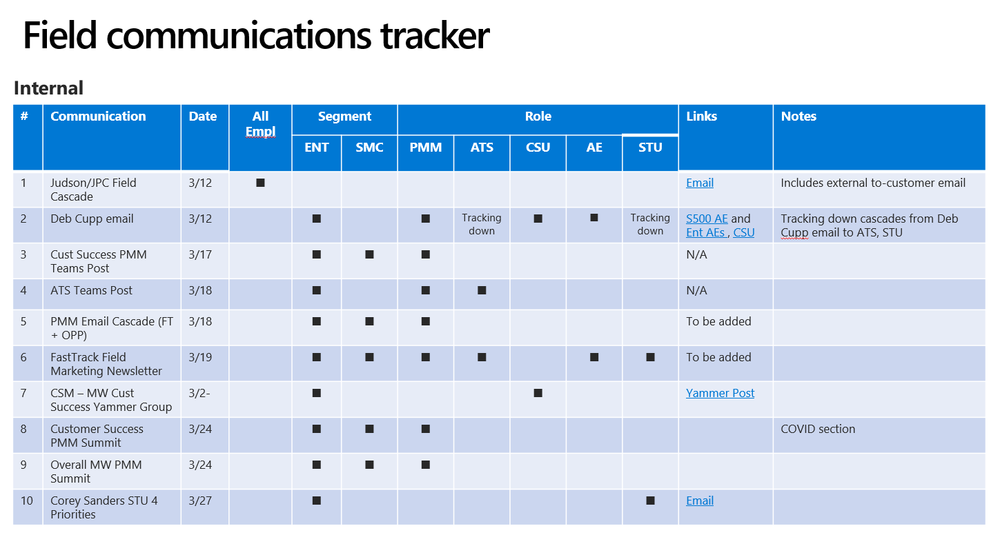
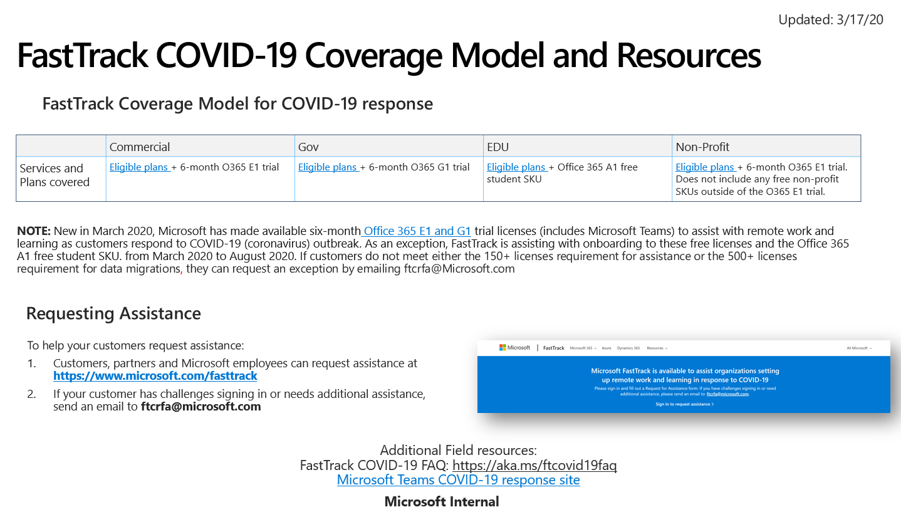

---  
# required metadata  
title: FastTrack Playbook - COVID Field Messaging and Guidance 
description: FastTrack Playbook - COVID Field Messaging and Guidance
ms.author: ryanme  
manager: eduardod  
ms.date: 4/14/2020  
ms.topic: playbook  
ms.prod: non-product-specific  
ms.custom: internal-playbook  
ft.audience: internal  
ft.owner: ryanme
---   
[!INCLUDE [Playbook Feedback](./includes/questions-feedback.md)]

# Field Messaging & Guidance  

To help organizations and schools as they respond to COVID-19, FastTrack is providing assistance for setting up remote work and learning. For customers using the [6-month Office 365 E1 and G1](https://transform.microsoft.com/customer-trials?tab=o365e1trial) trials and the Office 365 A1 free student SKU, FastTrack assistance is also available now from March 2020 to August 2020 (see [FastTrack Service Description](https://docs.microsoft.com/en-us/fasttrack/m365-eligible-services-and-plans) for detail on this offer). Refer to this internal summary of all [trial offers](https://microsoft.sharepoint.com/:w:/t/MicrosoftRemoteWork/EbEe9NOBCa1JnNWyoOJOwFcBPVw1hr83rhTnl75eMziTtw?e=aUTjR5) available to customers and the level at which FastTrack will support.     

Field, customers, and partners can request assistance at [https://www.microsoft.com/fasttrack](https://www.microsoft.com/fasttrack). Please familiarize yourselves [here](https://aka.ms/FTCovid19coverage) with the FastTrack COVID-19 coverage model and the exception process for  customers that do not meet seat requirements.  

See link to a summary of all field communications: [Field Comms, Messaging FT COVID Response.pptx](https://microsoft.sharepoint-df.com/:p:/t/FastTrackCOVID-19ResponseTeam/EfRJqVfDHwRMiY4yAsjE0mgBfdtaYDr2CJbvgMVkxnjNQA?e=hIpxZp)  

  

## Engaging FastTrack  

1. If your customer is already engaged with FastTrack, engage the assigned FastTrack Architect, FastTrack Manager or FastTrack Ready Partner.
1. If your customer is not already engaged with FastTrack, submit a request for assistance (RFA).  
   - Customer, Account Team, partner, or MCS—visit the [FastTrack portal](https://www.microsoft.com/fasttrack) and select **Sign in** to request assistance.
   -  Select your customer from the list (or add customer if they are not yet listed), click on **Services**.
   - Before creating a Request for Assistance, check that FastTrack is not already working with the customer by looking under the Team Members tab. If FT is assigned, then contact the FastTrack Manager, FastTrack Architect, or the FastTrack Ready Partner.
   - Under the **Services** tab, use **Request Assistance with Microsoft 365** and follow the wizard.
   - If you are unable to request assistance using this method, you may email [ftcrfa@microsoft.com](mailto:ftcrfa@microsoft.com).  **Note:** Please only use this as a fallback method, as this is a manual process.

## Field and FastTrack Alignment  

The FastTrack Area Leads will continue to work with their Field Area leads (PMM/ATU/STU/CSU/EDU, etc.), as needed, to assist with their COVID-19 response. See coverage model here at: [aka.ms/ftcovid19coverage](https://aka.ms/FTCovid19coverage)

  

Please provide feedback on the customer and partner-facing communication assets provided on the [COVID-19 Response site](https://microsoft.sharepoint.com/SitePages/COVID-19Response.aspx). This can include customer or partner questions not yet addressed in the [FAQ](https://microsoft.sharepoint.com/SitePages/Coronavirus-customer-partner-FAQ.aspx). Every entry will be reviewed and will inform how Microsoft continues to respond to this growing concern.  

- [COVID-19 Customer and Partner Communication Assets Feedback](https://forms.office.com/Pages/ResponsePage.aspx?id=v4j5cvGGr0GRqy180BHbR1T00qBBNxFHmOVqcpOalnRUNVROMVI4MDFSOVFNOTMzUEUxVU5LNTdCRy4u)  

## Microsoft 365 Customer Trials  

- [Microsoft 365 Customer Trials Sales Team Support](https://transform.microsoft.com/customer-trials?tab=o365e1trial)
- If your customer needs more seats than provided through these promo codes, please follow these instructions:
  - Request the appropriate, largest seat trial option in the form below.
  - Distribute the promo code to the customer to be activated on their tenant.
  - Once activated, submit an [Extension Request via this form](https://transform.microsoft.com/#tenantextensionform), selecting the corresponding trial as the Trial Type.
