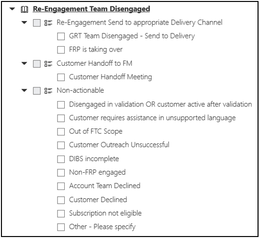

---  
# required metadata  
title: FastTrack Playbook - Windows 10 and Edge RFA Process Guide  
description: FastTrack Playbook - RFA Process Guide 
author: Erin Saville  
ms.author: v-ersav  
manager: steveso
ms.date: 1/3/2020  
ms.topic: playbook  
ms.prod: non-product-specific  
ms.custom: internal-playbook  
ft.audience: internal  
ft.owner: alicia.evans
---  
[!INCLUDE [Playbook Feedback](./includes/questions-feedback.md)]

# Windows 10 and Edge RFA Process Guide

## Type and use of document

- Topic category: Request for Assistance (RFA)
- Primary role: Gateway RFA FMs
- Use: The branch of the RFA Process Guide for processing *relevant* **Windows 10** *and* **Edge** *tenants*

## Summary

This article provides step-by-step guidance for Gateway RFA FMs to follow when processing M365 FastTrack Benefit RFAs submitted via the [FastTrack Portal](https://fasttrack.microsoft.com/) for *relevant* **Windows 10** *and* **Edge** *tenants*. To determine if this process flow is applicable to your RFA tenant, follow the guidance found in the main [RFA Process Guide](rfa-process-guide.md), paying special attention to the [Determine customer type and branch to Process flow](rfa-process-guide.md#7-determine-customer-type-and-branch-to-process-flow) section.

## I. Check qualifications and identify Reference tenant

### 1. Determine if Windows 10 and Edge qualify for FastTrack Support

***Note:*** *“Qualified” indicates the requestor answered the RFA Form questions correctly, in turn qualifying the tenant for FastTrack Assistance with that product. “Eligible” indicates the eligibility determined tenant was eligible for the product to be selected on the RFA Form.*

> [!Important]
> If **Edge** is showing as an **Attempted Workload** on the RFA Form, then the customer *does not* qualify for FastTrack Assistance with **Edge**.
> [!Note]
> If neither **Windows 10** nor **Edge** qualify for FastTrack assistance, and no other workloads were selected on the RFA form, then this is considered a ***standalone disqualified Windows10/Edge request***.

1. To qualify for **Windows 10**, ***both*** of the following conditions must be met:

    1. Condition one: *Are you planning to deploy Windows 10 Enterprise?* = **Yes** on the RFA Form under **Windows 10**

        *AND*

    1. Condition two: *If you plan to use System Center Configuration Manager to deploy Windows 10, are you on or able to update to Current Branch?* = **Yes** on the RFA Form under Windows 10

1. To qualify for **Edge**, ***one*** of the following conditions must be met:

    1. Condition one: *Do you have Windows 10 Enterprise?* = **Yes** on the RFA Form under **Edge**

        *OR*

    2. Condition two:

       1. *Are you planning to deploy Windows 10 Enterprise?* = **Yes** on the RFA Form under **Edge**

            *AND*

       1. *If you plan to use System Center Configuration Manager to deploy Windows 10, are you on or able to update to Current Branch?* = **Yes** on the RFA Form under **Windows 10**

1. Proceed to next step.

### 2. Identify the Reference Tenant

Note: *If the SLT Watchlist flag is already set in the RFA tenant **and** the tenant has Windows 10 or Edge entitlements, or entitlements for both, showing in the FTOP services tab, the RFA tenant is most likely the Reference tenant.*

1. In the FTOP dashboard, set **Filter** to **All Customers**.

1. Set **Display** to **Customer Engagement**.

1. Search by the customer’s TPID (listed in the customer name card in the FastTrack Portal for your RFA tenant).

1. If there is a reference tenant affiliated with the TPID, then it will show up in the **Customer Engagement** display.

    - If the tenant ID for the Reference tenant matches the tenant ID for the RFA tenant, then only one tenant will need to be updated.

    - If the tenant ID for the Reference tenant does NOT match the tenant ID for the RFA tenant, then the Windows 10 or Edge workload, or both, will be updated in the Reference tenant and the rest of the workloads will be updated in the RFA tenant.

1. If there is not a Reference tenant in the **Customer Engagement** display, default to the RFA tenant and proceed with next steps.

1. If there *is* a Reference tenant, assign yourself to the Reference tenant (See the [Search for tenant in FTOP and assign yourself](rfa-process-guide.md#6-search-for-tenant-in-ftop-and-assign-yourself) section in the [RFA Process Guide](rfa-process-guide.md) article for guidance, if needed); otherwise, proceed to the next step.

1. If this is a standalone disqualified Windows 10/Edge request, skip to the [Update RFA Assignment Dashboard](#iv-update-rfa-assignment-dashboard) section to cancel this RFA.

1. If this is a qualifying request for Windows 10, Edge, or both, or other workloads were also selected on the form, proceed to the next step.

## II. Identify potential escalations

### 1. Check for Skype for Business selection

1. On the RFA form, check to see if **Skype for Business** appears in the **Chosen Products** section.

    1. If no, proceed to the next section, [Check tenant assignments in FTOP](#2-check-tenant-assignments-in-ftop).

    1. If yes, proceed to the article, [Teams First Pitch](rfa-teams-first-pitch-win-10-and-edge.md).

### 2. Check tenant assignments in FTOP

1. If this is a *Net New tenant* scenario, skip to the [Determine if a FastTrack Ready Partner (FRP) conflict exists](#3-determine-if-a-fasttrack-ready-partner-frp-conflict-exists) section. Otherwise, proceed to the next step.

1. In the FTOP dashboard, open the tenant's Assignment fly-out window.

    1. In FTOP's dashboard, set **Filter** to **All**.

    1. Set **Display** to **Partner Validation**.

    1. Search by the tenant ID (listed as **Company ID** in the **Profile tab** of [ViewPoint](https://support.office.net/?modern=0&source=ViewPointV2)).

    1. Click the row of your tenant to allow the assignment flyout window to appear.

1. Review the **RM, FM,** and **FPM** assignments to determine the type of team that is currently assigned to the RFA tenant.

    Note: *These assignments will impact the routing of your RFA tenant later in the guide.*

### 3. Determine if a FastTrack Ready Partner (FRP) conflict exists

1. Determine if an FRP or Non-FRP is engaged.

    1. If the domain of a non-customer contacts on the RFA form belongs to a Partner company (for example, not a Microsoft or personal email account), a partner is likely engaged.

        > [!Note]
        > If you see a v- Microsoft account, you’ll need to confirm this is not an MCS contact. If confirmed MCS, then this contact should be considered a partner contact.

    1. If the partner can be found in the [FRP List](https://msit.powerbi.com/groups/me/apps/f8dbc5ed-8560-4384-99bb-6486899741e9/reports/0044c4ce-f721-4137-b985-10df1bb7ea17/ReportSection?ctid=72f988bf-86f1-41af-91ab-2d7cd011db47), an FRP is engaged.

        > [!Note]
        > Some FRPs are associated with a specific location, for example, Avanade US verses Avanade UK. Currently, these are regional designations. Avanade US is for the entire Americas region and Avanade UK is for the entire EMEA region. If an Avanade resource filed an RFA for a Canadian customer, the tenant would still be assigned to Avanade US.

    1. If no partner is engaged, skip to the [Review RFA Assignment Dashboard](#iii-review-rfa-assignment-dashboard) section. Otherwise, proceed to the next step.

1. Escalate to an FPM via the instructions found in the [FPM Escalation process](rfa-fpm-escalation-process-win-10-and-edge.md) article ***if*** one or more of the following are true:

    - An FRP is engaged and the customer does not meet the criteria for FRP assignment (outlined in the FRP [Assignment Business Rules](rfa-assignment-business-rules.md))

    - If an FRP is engaged, the customer does not meet the criteria for FRP assignment (outlined in the FRP [Assignment Business Rules](rfa-assignment-business-rules.md)), or the customer is already assigned to another FRP, or both

    - If a non-FRP is engaged, and the customer is already assigned to another FRP

1. If none of the scenarios in step two (2) above are true, proceed to the next step.

### 4. Confirm the Get Modern assessment has been completed

1. If the tenant does not exist in FTOP, skip to the [Review Staging Contacts Tab in RFA Assignment Dashboard](#1-review-staging-contacts-tab-in-rfa-assignment-dashboard) section below. Otherwise, proceed to the next step.

1. Search for Task ID 3652 in the FTOP Playbook. This cannot be done at the Core Onboarding level and Windows 10 must be selected to view this task.

    1. Complete = Task ID 3652 is marked complete with one or more reasons for dis-engagement selected, and no Targeted FM is assigned to the tenant.

        

    1. In Progress or Not Started = Task ID 3652 is not marked complete, and no reasons for dis-engagement are selected

1. If the assessment is In Progress or Not Started, then skip to the [Review Staging Contacts Tab in RFA Assignment Dashboard](#1-review-staging-contacts-tab-in-rfa-assignment-dashboard) section below. Otherwise, proceed to the next step.

1. If the assessment is Complete, proceed to the next step.

### 5. Update Engagement Scenario

1. Review the [FTOP Assignment Scenarios Guide](rfa-ftop-assignment-scenarios-guide.md) as a reference to determine or confirm where your tenant will be assigned.

1. If the tenant is being assigned or reassigned to **FTCQ All FTC** for possible partner referral, do not update the Engagement Scenario, and skip to the [Review Staging Contacts Tab in RFA Assignment Dashboard](#1-review-staging-contacts-tab-in-rfa-assignment-dashboard) section below. Otherwise, proceed to the next step.

1. Open the Services tab.

1. Update the **Engagement Scenario** based on where the tenant will be assigned to in FTOP.

    1. Leave the previous value for unselected workloads.

    1. For selected workloads, follow the logic below:

        1. **Non-FastTrack Partner-Led:** The workload is selected on the RFA form and the customer has intent to deploy the workload with the Non-FRP. If a partner is listed on the RFA form and they are *not* on the [FRP List](https://msit.powerbi.com/groups/c7c3e56c-a80b-4323-bdb1-402cf94ca2a5/reports/49386223-5d87-4d95-abcf-a18667dbcdcd/ReportSection?ctid=72f988bf-86f1-41af-91ab-2d7cd011db47), they are considered a non-FRP.

        1. **FTC-CSS Led:** The workload is selected on the RFA form and the tenant meets the criteria for CSS assignment.

        1. **FTC-FTP Led:** The FRP eligible workload is selected on the RFA form and the customer has intent to deploy the workload with an FRP.

            > [!Note]
            > We are not required to change the Engagement Scenario for RFAs to **FTC-FTP Led** when an FRP is engaged or in an FRP Referral scenario because CPOR will update this information.

        1. **CXP Led w/CSS Assist:** The workload is AADP and meets **all** AADP CAT Team requirements (see footnote four (4) in the [Assignment Business Rules](rfa-assignment-business-rules.md#footnote-reference) article).

        1. **FTC-CXP Led**: The selected workload is MDATP or OATP, or both, and meets **all** the following MDATP/OATP CAT Team requirements (see footnote three (3) in the [Assignment Business Rules](rfa-assignment-business-rules.md#footnote-reference) article).

    1. If the **Engagement Scenario** is being changed ***from*** **FTC-CSS Led**, **FTC-FTP Led**, or **FTC-CXP Led**, then proceed to the [Send Engagement Scenario Escalation](rfa-send-engagement-scenario-escalation.md) article to submit an Engagement Scenario Escalation. Otherwise, proceed to the next step.

    1. If the **Engagement Scenario** is being changed, select the desired Engagement Scenario from the **Engagement Scenario** dropdown for the workload within the **Services** tab, and then select **Save**.

    1. Proceed to the next step.

## III. Review RFA Assignment Dashboard

### 1. Review Staging Contacts Tab in RFA Assignment Dashboard

1. If Automation has been closed in the [RFA Assignment Dashboard](https://ftop.microsoft.com/rfa/dashboard/#/), open your RFA in the Dashboard and select **Start Automation**.

1. Open the **Staging Contacts Tab** in a separate browser tab to confirm contact automation is correct.

1. Select the row for each contact shown and review the **Update Source** note on the right-hand margin. The note will identify the **Sources** where each contact was pulled from and will also serve as an indication of the type of contact. The **Source** note for the contacts are displayed as follows:

    - Requestor (RFA Form): **RFA_REQUESTOR**

    - Customer Contact (RFA Form): **RFA_CUSTOMER**

    - Account team Contact (CALC): **CALC**

    - TAM Contact (PSR): **PSR**

1. Any older duplicate contacts (that is, contacts existing prior to automation that are the same as what is pulled in from automation) must be deleted from the record after automation is accepted.

### 2. Review Staging Services Tab in RFA Assignment Dashboard

Note: *All eligible, unselected workloads in the RFA form will not be changed and will remain as is. All eligible, selected workloads in the RFA form will update their corresponding fields on the Services Tab as described in this section.*

1. Open the **Staging Services Tab** in a separate browser tab to confirm intent automation is correct.

1. Select **View** for each workload selected on the RFA Form and review the following elements:

    1. **Consumption Status/L1: In Progress**

    1. **Reason/L2** = Will automatically be determined by existing FTOP logic.

    1. **Target Date:** The target date will be updated in the corresponding row for **In Progress** and match the **Product Launch Date** on the RFA form (see example).

    1. **Notes:** “Intent information updated automatically with input from RFA (ID #xxx)" will be added.

    1. **Technical Service Notes:**  For EXO, the note **Current Mail System** is added and the name of the mail system in the RFA form is populated.  There is a known bug that adds the note **Current Mail System** to all workloads other than EXO.

        

    1. **Business Reason:** This should match the Purchase Reason noted on the RFA form.

    1. **Success Owner Role:** This should match the **Business Sponsor** details on the RFA Form.

        1. **Other** should only be selected if the role in RFA is not one of the options in the dropdown list. If there is no match and **Other** is selected, then the **Success Owner Role** should be added to the entitlement notes field.

    1. **Data Migration** is *selected* then the following fields should be updated:

        1. **Microsoft Performing Migration?** checkbox is checked

        1. **Migration TBD** is selected from the dropdown list

        1. The **“+”** is selected and the number of entitlements is populated

        1. The migration notes field has a note **Data Migration assistance was selected on the RFA form** (see example)

        

    1. **Data Migration** is *unselected* then the following fields should be updated:

        1. **RFA Undetermined** is selected from the **Migration Rejection Reason** dropdown list

        1. The **migration rejection reason** has the following note: “Data Migration assistance was not selected on the RFA form”

## IV. Update RFA Assignment Dashboard

>[!Important]
> If the **Is Valid** checkbox in the is left unchecked per guidance below, then the automation will not populate in the tenant’s FTOP record and manual processing and validation is required.

1. If Request is being Approved:

    1. In the [RFA Assignment Dashboard](https://ftop.microsoft.com/rfa/dashboard/#/), fill in the **Final Customer Tenant Domain** field with the final tenant domain.

    1. Fill in the **Final Customer OMS Tenant ID** field with the final tenant ID.

    1. If *both* of the following are true, ***then** skip to **sub-step six (6)** below*:

        - It was determined that the Reference tenant *is* the RFA tenant

            ***AND***

        - The Reference tenant *was **not*** found in the **All Customers** filter in FTOP

            (Otherwise, proceed to the next step.)

    1. If the conditions of sub-step three (3) above are not met, then ***do not*** check the **Is Valid** checkbox and leave the **Reason for Invalid** dropdown blank.

    1. Skip to **sub-step eight (8)** below.

    1. If ***all*** automation is correct in staging, check the **Is Valid** checkbox.

    1. If ***any*** automation is incorrect in staging, ***do not*** check the **Is Valid** checkbox and select all invalid reasons from the **Reason for Invalid** dropdown.

    1. Select **Request Approved** from the **Status** dropdown.

    1. Select **Save**.

    1. Skip to the next section, [Update FastTrack Portal RFA Status](#v-update-fasttrack-portal-rfa-status).

1. If Request is being set to anything other than approved:

    1. Select desired status from the **Status** dropdown (**On Hold**, **On Hold Pending Requestor Response**, or **Cancelled (closed)**).

    1. Select **Save**.

    1. Proceed to the [Update FastTrack Portal RFA Status](#v-update-fasttrack-portal-rfa-status) section.

## V. Update FastTrack Portal RFA Status

1. **Approve, Cancel,** or place the RFA **On Hold** in the [FastTrack Portal](https://fasttrack.microsoft.com/).

    Note: *If cancelling in the FT Portal due to a duplicate RFA, be sure to use the* **Cancelled(closed)** *note for duplicate RFAs in the [FastTrack Portal Notes Bank](https://microsoft.sharepoint.com/:x:/r/teams/FastTrackAssignmentTeamLeads/_layouts/15/Doc.aspx?sourcedoc=%7BCA587309-09E4-445C-A7CB-28058CE91555%7D&file=FastTrack%20Portal%20Notes%20Bank.xlsx&action=default&mobileredirect=true).*

    1. Return to the customer’s FastTrack Portal record via the link provided in the **Request URL** column in the [RFA Assignment Dashboard](https://aka.ms/assignmentdashboard).

    1. Click on the **Services** tab.

    1. Click **View Submitted Requests**.

    1. In the **View Service History** tab, select the status from the **Status** column.

    1. In the fly-out window, scroll down to the **Update Request** section and select **Request Approved**, **On Hold**, **On Hold Pending Requestor Response**, or **Cancelled(closed)** from the **Status** dropdown list.

    1. In the **Status Details** section, record the appropriate status note from the [FastTrack Portal Notes Bank](https://microsoft.sharepoint.com/:x:/r/teams/FastTrackAssignmentTeamLeads/_layouts/15/Doc.aspx?sourcedoc=%7BCA587309-09E4-445C-A7CB-28058CE91555%7D&file=FastTrack%20Portal%20Notes%20Bank.xlsx&action=default&mobileredirect=true).

    1. Click **Save**.

1. If the RFA is being **canceled** and it ***is*** a ***standalone disqualified Windows 10/Edge RFA*** or an ***Edge Attempted RFA***, or both, then proceed to the [Update Overall Notes History in FTOP](#1-update-overall-notes-history-in-ftop) section below.

1. If the RFA is being **canceled** and it *is **not*** a ***standalone disqualified Windows 10/Edge RFA*** or an ***Edge Attempted RFA***, or both, then there are no additional steps necessary for this RFA.

1. If the tenant is **On Hold**, then follow any prescribed steps in the process relevant to the RFA's **On Hold** status. Once that process is complete, return to the step subsequent to that process blocker.

1. When ready for **Approval**, return to the beginning of the [Update RFA Assignment Dashboard](#iv-update-rfa-assignment-dashboard) section and proceed from there.

1. Once the RFA is **Approved**, and the RFA Dashboard and FT Portal have been updated accordingly, then proceed to the [Update FTOP](#vi-update-ftop) section below.

## VI. Update FTOP

### 1. Update Overall Notes History in FTOP

Update the **Overall Notes History** in FTOP using the following steps.

> [!Important]
> **Windows 10 and Edge RFAs:** If the Reference tenant was determined to be separate from the RFA tenant, you will need to update the overall status note (as well as other FTOP sections identified throughout this section), for the Reference tenant (in addition to the RFA tenant) by following the same steps.

1. Select the **Status** tab.

1. Change **Overall Status** to **Active**.

1. Select **Include Notes** and complete the following fields as indicated below:

    1. **Status Note**: Copy and Paste the status note template (see [**Template**](#template) below) into the **Status Note** box and add the relevant details from the RFA.

    1. **Next Action:** Complete next steps for RFA tenant

    1. **Next Action Date:** [next business day]

    1. **Next Action Owner:** FM

1. Click **Save**.

1. If the RFA is a *standalone disqualified Windows 10/Edge* RFA, skip to [Send Email Notifications](#viii-send-email-notifications) section; otherwise proceed to next step.

#### Notes about Template

- ***[MDATP and/or OATP] are assigned to [CSS and/or Teresa Santos]; all other workloads are assigned to [Delivery Team]:*** This note is only required If MDATP, OATP, or both are being assigned to the FTC or Teresa Santos in addition to existing queues (that is, FRP or Targeting queues).

- ***The RFA tenant [tenant domain] is separate from the Reference tenant [tenant domain]:*** This note is necessary if the Reference tenant was determined to be separate from the RFA tenant. If the Reference tenant and RFA tenant are one in the same, do not include this note in the overall status.

- ***Information that may impact the project:*** This can include, but is not limited to, additional comments from the RFA Form, information related to FPM escalations, or any other pertinent information related to the RFA.

#### Template

*RFA/WinRoom Hi Pri: [Reason for RFA Approval included in the FastTrack Portal status note]*

*[**Include if relevant**] [MDATP and/or OATP] are assigned to [CSS and/or Teresa Santos]; all other workloads are assigned to [Delivery Team]*

*[**Include if relevant**] The RFA tenant [tenant domain] is separate from the Reference tenant [tenant domain].*

*Partner Engaged? [Yes/No]*

*Contacts:*

- *Requestor contact information: [Details]*
- *Customer contact information: [Details]*
- *Partner contact information: [Details]*

*Location and Language:*

- *City:*
- *State: [Details]*
- *Country: [Details]*
- *FT Supported Language: [Details]*

*RFA Approved Workloads (**including percent Active Usage & seat count**): [Details]*

*Information that may impact the project: [Details]*

*RFA Form URL: [URL]*

*[**Include if a Duplicate RFA was submitted**] A duplicate RFA was submitted due to [Reason].*

*[**RFAs where Windows 10 was disqualified. In scenarios where this is a standalone disqualified Windows 10 request, this will be the only note used.**] Requestor expressed interest in Win10 on the RFA form; however, they do not qualify for Win10 assistance from FastTrack because [they don't intend to deploy Win10 Enterprise or they don't intend to deploy Win10 Enterprise using SCCM Current Branch]*

*[**Include for Edge Attempted RFAs**] Requestor expressed interest in Edge on the RFA form; however, they do not qualify for Edge assistance from FastTrack because they don't intend to deploy Win10 Enterprise.*

### 2. Completed the Get Modern Assessment for Windows 10

1. In the designated Reference Tenant, select the **Windows 10** workload from the **playbook** tab in FTOP.

1. Search for Task ID **4021**.

1. Expand the **Conduct Specific Workshops** phase and select the **Get Modern Assessment Workshop**.

1. Select the link for the **Wizard - Get Modern Deployment**.

1. Update the following fields for Windows 10 using the information provided in the RFA Form for **Windows 10**.

    1. When requestor selects **Yes** to the question, *If you plan to use System Center Configuration Manager to deploy Windows 10, are you able to update to ConfigMgr Current Branch?*

        1. **Device management** = System Center Configuration Manager

        1. *If using Configuration Manager for device management, is it on Current Branch?* = Yes

### 3. Validate Services Tab

1. If the **Is Valid** checkbox was selected when the RFA was approved in the RFA Dashboard, then review the **Services** tab to make sure that it was populated correctly.

1. If automation did not populate the **Services** tab correctly, or the **Is Valid** checkbox was not selected, then populate the services tab with the correct information from the RFA form.

### 4. Validate Partners Tab

1. Add partner related details to the **Partners** tab in FTOP as indicated below:

    1. **Partner**: [partner name and competency]

    1. **MPN ID**: [MPNID #]

    1. **Partner Type**: Onboarding Partner

    1. **Notes**: Partner information updated per RFA (RFA ID: [#####])

1. ***Windows 10 or Edge RFAs, or both:*** If the Reference Tenant was determined to be separate from the RFA tenant, you will need to report the partner contact in the Reference tenant (in addition to the RFA tenant) by following the same steps.

### 5. Validate Contacts Tab

1. If Automation was accepted in the **RFA Assignment Dashboard**, review existing contacts to ensure automation was successful and remove any duplicate contacts existing prior to automation being run.

1. If Automation was not accepted in the **RFA Assignment Dashboard**, perform manual validation lookups for the customer, account team, and partner.

1. ***Windows 10 or Edge RFAs, or both:*** If the Reference Tenant was determined to be separate from the RFA tenant, you will need to report all RFA related contacts in the Reference Tenant (in addition to the RFA tenant) by following the same steps.

### 6. Validate Assignment Urgency Flag

1. If Automation was accepted in the **RFA Assignment Dashboard**, skip to the next step, [Validate Priority Wizard](#8-validate-priority-wizard).

1. If Automation was not accepted in the **RFA Assignment Dashboard**, set the **Assignment Urgency** flag in FTOP:

    1. Select the **Flags** tab in tenant’s FTOP record.

    1. Select **High** from the dropdown for **Assignment Urgency**.

    1. Click **Save**.

1. ***Windows 10 or Edge RFAs, or both:*** If the Reference Tenant was determined to be separate from the RFA tenant, you will need to set the Assignment Urgency Flag in the Reference Tenant (in addition to the RFA tenant) by following the same steps.

### 7. Set the SLT Watchlist Flag

1. If this is a pre-determined reference tenant found in the All Customers filter, skip to the [Validate Priority Wizard](#8-validate-priority-wizard) section below.

1. Navigate to the **flags** tab in FTOP.

1. Select **True** for the **SLT Watchlist** flag.

1. Select **Save**.

    1. If the entitlements do not update after 4 hours, override the entitlements to what is staged in the Assignment Dashboard for Windows 10.

    1. If staging is inaccurate, confirm tenant is eligible for one or more of the following: Exchange Online, SharePoint Online, or Office ProPlus. Once confirmed, override the Windows 10 entitlements to 150.

### 8. Validate Priority Wizard

1. If your tenant is not already assigned or being assigned to a Delivery queue, skip to the next step, [Complete Task 2453](#9-complete-task-2453).

1. If automation was not accepted, and your tenant is already assigned or being assigned to a Delivery queue (that is, an FRP or FTC queue), set the Priority Wizard to **High Priority** using the following steps:

    1. Select the **Wizard Experience** from the **Portfolio View** in FTOP.

    1. Click on the row of the desired tenant from the list.

        Note: *If tenant is not listed, verify all filters are set to **Show All** and the checkbox to **Display only my primary assignments** is unchecked.*

    1. Select **Change priority for my tenant**.

    1. Select **High**.

    1. In the **Change reason** dropdown, select **Other**.

    1. Another free form field will appear; type **RFA Tenant**.

    1. Click **Save Priority**.

1. ***Windows 10 or Edge RFAs, or both:*** If the Reference Tenant was determined to be separate from the RFA tenant, you will need to set the Priority Wizard in the Reference Tenant (in addition to the RFA tenant) by following the same steps.

### 9. Complete Task 2453

1. Update Task 2453 in FTOP to indicate RFA Completion. This step will be completed individually for every approved workload.

    1. Select the **playbook** tab in the RFA tenant record in FTOP.

    1. Select the approved workload from the available list.

    1. Select the **Assignment** phase.

    1. In the **Search** box, search for **2453**.

        Note: *The task will be auto-filtered after typing it into the **Search** box.*

    1. Check the box to **Complete RFA Process**.

    1. Select **Complete** from the **Status** dropdown.

    1. Complete the task **Note**.

        1. The task **Note** will include the queue the tenant is being assigned or reassigned to (for example, [FTCQ CSS Americas], [FTCQ ALL FTC], or [FTP Dell]).

        1. *If* the tenant is being assigned to CSS, a reason code will need to be included in the task note. Assignment Reason Codes can be found [here](https://microsoft.sharepoint.com/:x:/t/FastTrackAssignmentTeamLeads/ET2oyY1BT99Ei2fyuJPCYeoB-FNfZO-e-t6fDGs8r0bQTg?e=HxnWr8&CID=1E962D6A-5006-4077-80D7-CE8D4D608A69&wdLOR=c6AC4E13F-4407-4293-9361-FB4EFA7020A0).

1. ***Windows 10 or Edge RFAs, or both:*** If the Reference Tenant was determined to be separate from the RFA tenant, you will need to complete Task 2453 in the Reference Tenant (in addition to the RFA tenant) by following the same steps.

## VII. Assign to downstream team

***Note:** The following instructions outline the most common FTOP Assignment Scenarios related to Customer Type. Corner case scenarios that are not covered here may occur; in which case you may need to consult your leads for next steps.*

### Select customer type, and follow the instructions for that type ***only***

#### Customer Type one: Windows 10 disqualified or 3652 Complete, or both

1. Refer to [FTOP Assignment Scenarios Guide](rfa-ftop-assignment-scenarios-guide.md) article to match your tenant’s current assignment in FTOP, completing assignment instructions according to that Guide.

1. Then, skip to the [Send email notifications](#viii-send-email-notifications) section below.

#### Customer Type two: Windows 10 qualified ***and*** 3652 Not Started or In Progress

Reviewing the scenarios below to find the scenario that matches your tenant’s current assignment in FTOP, completing the assignment for that scenario.

##### 1. For all Windows 10 qualified scenarios where 3652 is Not Started or In Progress

- If MDATP, OATP, or both workloads were selected on the RFA form, they will be assigned as primary at the workload level to FTCQ CSS [Americas, EMEA, or APJ] unless the tenant meets MDATP/OATP CAT Team requirements.

##### 2. RM specific scenarios: Identify the Assignment scenario below that matches your RFA tenant and follow the instructions below for that scenario

- RM = *[Gateway Queue](rfa-ftc-leads-contact-list-and-queue-information.md#gateway-queues)*

    *FM = Gateway FM or N/A; FE = N/A*

    1. Assign to **FTCQ Targeting RFA** as RM in addition to all currently assigned RM’s.

    1. Then, proceed to the [Send email notifications](#viii-send-email-notifications) section below.

- RM = *[FTC Regional Delivery Queues](rfa-ftc-leads-contact-list-and-queue-information.md#ftc-regional-queues)* or *[FTC Holding Queue](rfa-ftc-leads-contact-list-and-queue-information.md#ftc-holding-queues)*

    *FM = FTC Delivery FM or N/A; FE = FTC Delivery FE or N/A*

    1. Assign to **FTCQ Targeting RFA** as RM in addition to all currently assigned RM’s.

    1. Then, proceed to the [Send email notifications](#viii-send-email-notifications) section below.

- RM = *FRP Delivery Queue*

    *FM = FRP Delivery FM or N/A; FE = FTC Delivery FE or N/A*

    1. If the FPM confirmed that the assigned FRP will be handling the Windows 10 engagement, then leave the tenant assigned as is.

    1. If the FPM confirmed that the assigned FRP will not be handling the Windows 10 engagement, then assign the tenant to FTCQ Targeting RFA as RM in addition to all currently assigned RM’s.

    1. Then, proceed to the [Send email notifications](#viii-send-email-notifications) section below.

## VIII. Send email notifications

Following the tenant assignment to the appropriate downstream team, select the corresponding approval email scenario below and send the emails included in that scenario.

> [!Note]
> For **Skype for Business** requests, see footnote ([fn](#skype-for-business-footnote)) where indicated below.

### 1. Email to be sent in *all* scenarios

- ***All*** RFAs:

    1. Notify non-Requestor field contacts generated in FTOP through this RFA’s automation. Do *not* include any historical field contacts in FTOP.

        - [Approval notification for generated field contacts](https://microsoft.sharepoint.com/teams/FastTrackAssignmentTeamLeads/Shared%20Documents/AiR%20Leads/Gateway%20RFA%20Team%20GitHub%20files/rfa-approval-notification-for-generated-field-contacts.msg).

### 2. Additional emails needed for your RFA's *specific* scenario

- ***Customer*** submitted RFA ***with*** FRP engaged (assigned or reassigned to tenant in FTOP):

    1. Notify customer requestor:

        - [Approval notification to Requestor - general](https://microsoft.sharepoint.com/teams/FastTrackAssignmentTeamLeads/Shared%20Documents/AiR%20Leads/Gateway%20RFA%20Team%20GitHub%20files/rfa-approval-notification-to-requestor-general.msg) ([fn](#skype-for-business-footnote))

    1. Notify the FRP (Program Contact in the [FRP list](https://msit.powerbi.com/groups/c7c3e56c-a80b-4323-bdb1-402cf94ca2a5/reports/49386223-5d87-4d95-abcf-a18667dbcdcd/ReportSection?ctid=72f988bf-86f1-41af-91ab-2d7cd011db47)) with the [FPM](https://msit.powerbi.com/groups/me/dashboards/2d456979-c0ff-4a19-a2a8-2c92c791ef91) copied:

        - [Approval notification to FRP and FPM (cust Req)](https://microsoft.sharepoint.com/teams/FastTrackAssignmentTeamLeads/Shared%20Documents/AiR%20Leads/Gateway%20RFA%20Team%20GitHub%20files/rfa-approval-and-assignment-notificaton-for-frp-and-fpm-when-cr.msg)

- ***Customer*** submitted RFA ***with*** non-FRP Partner engaged or assigned, *or* no partner engaged or assigned:

    1. Notify customer Requestor:

        - [Approval notification to Requestor - general](https://microsoft.sharepoint.com/teams/FastTrackAssignmentTeamLeads/Shared%20Documents/AiR%20Leads/Gateway%20RFA%20Team%20GitHub%20files/rfa-approval-notification-to-requestor-general.msg) ([fn](#skype-for-business-footnote))

- ***Microsoft*** submitted RFA ***with*** FRP engaged (assigned or reassigned to the tenant in FTOP):

    1. Notify the Requestor and copy the Partner contacts from the RFA form, Primary Customer contact from the RFA form, and the [FPM](https://msit.powerbi.com/groups/me/dashboards/2d456979-c0ff-4a19-a2a8-2c92c791ef91):

        - [Approval notification to Microsoft Requestor, FRP, FPM, and customer](https://microsoft.sharepoint.com/teams/FastTrackAssignmentTeamLeads/Shared%20Documents/AiR%20Leads/Gateway%20RFA%20Team%20GitHub%20files/rfa-approval-and-assignment-notif-microsoft-requestor-frp-fpm-customer.msg)

- ***Microsoft*** submitted RFA ***with*** non-FRP Partner engaged or assigned, *or* no partner engaged or assigned:

    1. Notify field Requestor:

        - [Approval notification to Requestor - general](https://microsoft.sharepoint.com/teams/FastTrackAssignmentTeamLeads/Shared%20Documents/AiR%20Leads/Gateway%20RFA%20Team%20GitHub%20files/rfa-approval-notification-to-requestor-general.msg) ([fn](#skype-for-business-footnote))

    1. Notify the customer:

        - [Approval notification to customer (non-customer Requestor)](https://microsoft.sharepoint.com/teams/FastTrackAssignmentTeamLeads/Shared%20Documents/AiR%20Leads/Gateway%20RFA%20Team%20GitHub%20files/rfa-approval-notification-to-customer-when-non-customer-requestor.msg)

- ***Partner (FRP)*** submitted RFA:

    1. Notify the Partner contacts from the RFA form, and copy the Primary Customer contact from the RFA form and the [FPM](https://msit.powerbi.com/groups/me/dashboards/2d456979-c0ff-4a19-a2a8-2c92c791ef91):

        - [Approval notification to FRP requestor Partner contacts, FPM, and customer](https://microsoft.sharepoint.com/teams/FastTrackAssignmentTeamLeads/Shared%20Documents/AiR%20Leads/Gateway%20RFA%20Team%20GitHub%20files/rfa-approval-and-assignment-notif-partner-requestor-frp-customer-and-fpm.msg)

- ***Partner (non-FRP)*** submitted RFA:

    1. Notify the non-FRP Partner:

        - [Approval notification to Requestor - general](https://microsoft.sharepoint.com/teams/FastTrackAssignmentTeamLeads/Shared%20Documents/AiR%20Leads/Gateway%20RFA%20Team%20GitHub%20files/rfa-approval-notification-to-requestor-general.msg) ([fn](#skype-for-business-footnote))

    1. Notify the customer:

        - [Approval notification to customer (non-customer Requestor)](https://microsoft.sharepoint.com/teams/FastTrackAssignmentTeamLeads/Shared%20Documents/AiR%20Leads/Gateway%20RFA%20Team%20GitHub%20files/rfa-approval-notification-to-customer-when-non-customer-requestor.msg)

- *Standalone Disqualified **Windows 10*** RFA:

  - Notify the Requestor: [Rejection of Windows 10 Request – Answered “No” to Win10 Enterprise Deployment](https://microsoft.sharepoint.com/teams/FastTrackAssignmentTeamLeads/Shared%20Documents/AiR%20Leads/Gateway%20RFA%20Team%20GitHub%20files/rfa-rejection-win10-no-to-win10-enterprise.msg)

    ***OR***

  - Notify the Requestor: [Rejection of Windows 10 Request – Answered “No” to use of SCCM](https://microsoft.sharepoint.com/teams/FastTrackAssignmentTeamLeads/Shared%20Documents/AiR%20Leads/Gateway%20RFA%20Team%20GitHub%20files/rfa-rejection-win10-no-to-sccm-current-branch.msg)

- *Standalone Disqualified **Edge*** RFA:

  - Notify the Requestor: [Rejection of Edge Request – Answered “No” to “Do you have Windows 10 Enterprise?”](https://microsoft.sharepoint.com/teams/FastTrackAssignmentTeamLeads/Shared%20Documents/AiR%20Leads/Gateway%20RFA%20Team%20GitHub%20files/rfa-rejection-edge-no-to-win10-enterprise.msg)

    ***OR***

  - Notify the Requestor: [Rejection of Edge Request – Does not plan to deploy Windows 10 Enterprise using SCCM Current Branch](https://microsoft.sharepoint.com/teams/FastTrackAssignmentTeamLeads/Shared%20Documents/AiR%20Leads/Gateway%20RFA%20Team%20GitHub%20files/rfa-rejection-edge-no-to-win10-via-sccm-cb.msg)

#### Skype for Business footnote

If Skype for Business was rejected after an Exception request was sent following the [Teams First Pitch](rfa-teams-first-pitch-win-10-and-edge.md), you will replace the *Approval notification to Requestor - general* email with the [Approval for All Requested Services except Skype for Business](https://microsoft.sharepoint.com/teams/FastTrackAssignmentTeamLeads/Shared%20Documents/AiR%20Leads/Gateway%20RFA%20Team%20GitHub%20files/rfa-approval-notification-to-requestor-sfb-not-approved.msg).

[!INCLUDE [rfa-resources-for-footer-of-every-article-include](includes/rfa-resources-for-footer-of-every-article-include.md)]
