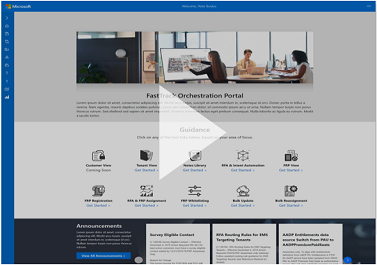
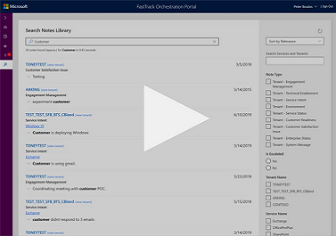
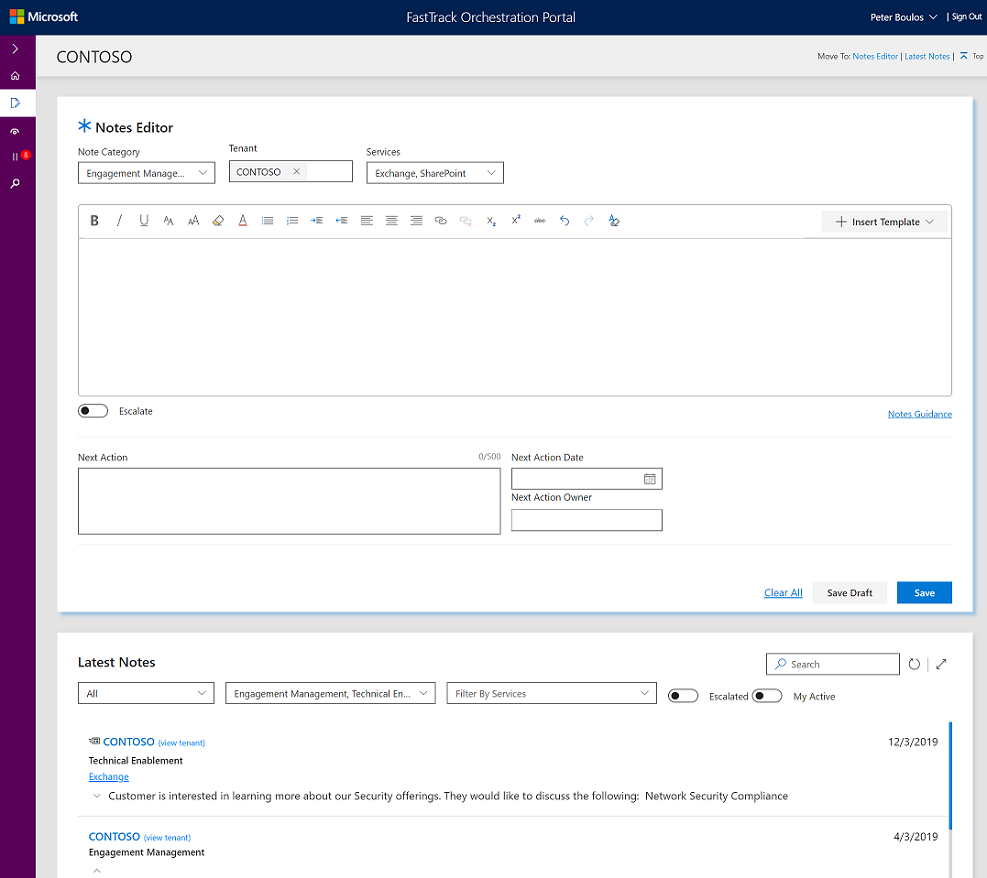
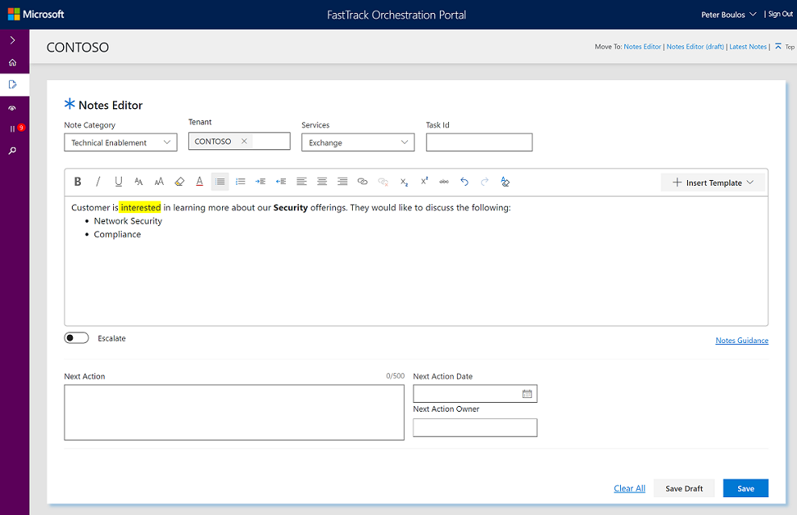
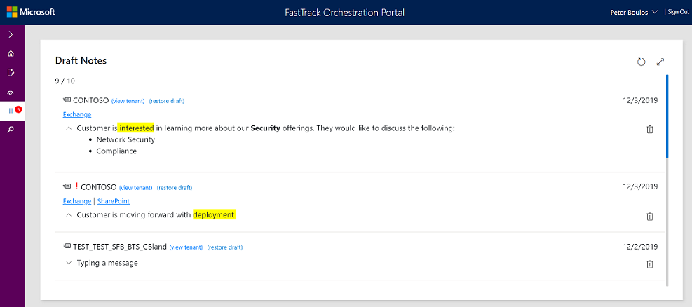
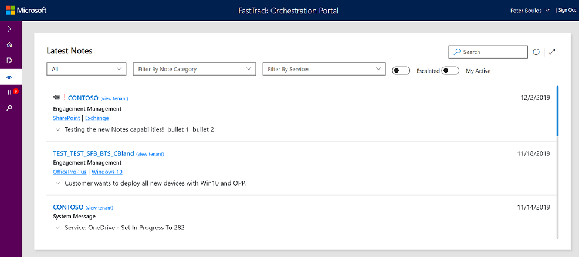

---  
# required metadata  
title: New Notes Experience - Preview
description: New Notes Experience - Preview
author: Peter Boulos  
ms.author: pboulos
manager: mareich  
ms.date: 11/19/2019
ms.topic: playbook  
ms.prod: non-product-specific
ms.custom: internal-playbook  
ft.audience: internal  
ft.owner: pboulos
---  

# A New Notes experience within FTOP is coming soon\!

We have been hard at work incorporating your feedback and building a
completely redesigned Notes Experience within FTOP.  
It’s called the
**Notes Library** and gives end users a centralized way to both create
and consume Notes via a modernized and streamlined toolset.

### Brief Video Walkthroughs:  

[Notes Library Overview](http://aka.ms/ftopnoteswalkthru1) *(1:16 minutes)*  

  

[Creating Notes within the New Notes Editor](http://aka.ms/ftopnoteswalkthru2) *(1:43 minutes)*  

  

[Finding Notes quickly](http://aka.ms/ftopnoteswalkthru3) *(1:20 minutes)*  

  

&nbsp;

## Centralized Notes Experience

A re-envisioned Notes environment that consolidates entry and
consumption of notes into a single interface.

- Intuitive navigation
- Ability to enter multiple notes to different tenants without having to return to the Portfolio page (greatly reducing the number of clicks)
- Ability to consume notes and filter for relevant information quickly  

&nbsp;

  

&nbsp;

## Search Notes Library

Modern and powerful search experience that enables you to find the notes
you are looking for instantly\!  

&nbsp;

  

&nbsp;

## Rich Text Formatting

Leverage familiar formatting capabilities such as:

- [Hyperlinks](Http://ftop.microsoft.com)
- ***Formatting***
- Bullets
- Ability to copy and paste and from Outlook and OneNote  

&nbsp;

  

&nbsp;

## Drafts 

New drafts capability enables you to capture notes during a call freely
and then return to finalize them before saving.

- Prompts to save your note prior to transitioning to your next action within the Notes Library (*Different behavior from AutoSave*)  

&nbsp;

  

&nbsp;

## Latest Notes

A view of all notes you have access to with a set of filters to help you
narrow down exactly what you are looking for.

&nbsp;

  
