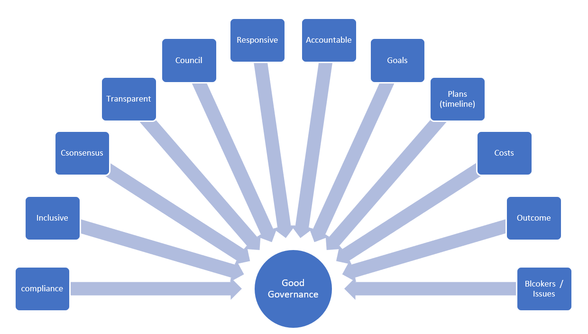
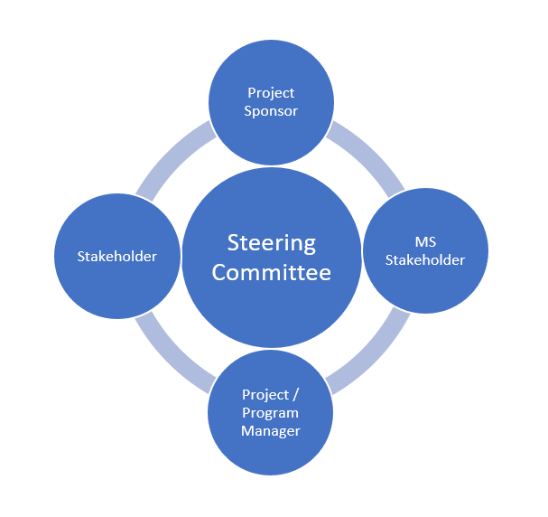

---  
# required metadata  
title: FastTrack Playbook - Customer Health Good Governance
description: FastTrack Playbook - Customer Health Good Governance
author: Mark Eichenberger
ms.author: mareich
manager: eduardod  
ms.date: 9/3/2019  
ms.topic: playbook  
ms.prod: non-product-specific  
ms.custom: internal-playbook  
ft.audience: internal  
ft.owner: mareich
---  
[!INCLUDE [Playbook Feedback](./includes/questions-feedback.md)]

# Customer Health - Good Governance

## Summary 

  - Why do we do Program Governance, its role within the FT Organization
    and the Principles, tasks and elements of good Governance.

  - What is Governance?

  - Why is it needed?

  - Principles of good Governance are what?

  - How you ensure Good Governance structures (roles, tasks and
    elements), are easily setup, accepted by Customers and how you
    maintain those?

  - Most importantly why is governance critical to your engagement
    success?

  - Also what are traditional governance structure versus Agile/Scrum
    Governance and describes some hands-on tips and tricks from FTA’s
    who implement Good Governance at every stage of the engagement.

## What is Good Governance

Essentially as the way we manage organizations at the highest possible
level, establishing process and systems to achieve this, and is your
role and your activities of governing the engagement. Translating this
into our FT organization to apply this to your engagement/deployment
project- and/or program management. It is a way to establish continuous
monitoring of correct application of FastTrack motion and deployment of
M365, through the Governing body or steering committee at your customers. Allowing
you to manage and influence the authority and controls (with associated
accountability), while enhancing the priority and viability within the
customer and convey that through Situational Awareness into your
Leadership as needed. Thus, Program Governance is the management
framework within which progress and decisions are agreed and executed.

## The Lack of Applying Good Governance

The lack of organizational knowledge about applying Good Governance
cannot be underestimated.  It is a critical element of any
project/program since typically a customer usually has in place a
"static" governance model through a traditional organization chart but
has seldom defined an equivalent "deployment" or other framework to
govern its ongoing projects. Typically, a customer’s organization chart
provides a good indication of who in the organization is responsible for
any operational activity. But not all organizations have specifically
developed a project governance policy or have thought about a proper
governance structure upfront when starting their deployment project.

## Project Governance Purpose 

The purpose of Program Governance is to provide a decision making
framework that is logical, robust and repeatable to govern any type of
customer or program. It is also independent of the underlying
usage of the type project methodology and used by customers or their
partners. In this way, an organization will have a structured approach
for conducting both its business-as-usual activities and its business
change or project-activities.

Good Governance will formalize resolve the **what if** scenarios in
case of issue management (such as budget restrictions, unforeseen
project events, scope creep, blocker misalignment expectations) and most
of all decision management to agree path forward. It will resolve the
uncertainties or blockers of "who can decide that" and most important of all
"what to do to adjust" in an environment that is professional and is
focused on end goals. It also allows to clarify roles of all defined and
designated stakeholders that form the group.

## Principles of Good Program Governance 

**Ensure there is a single point of accountability for the project
success at the customer.** The concept of a single point of
accountability is the first principle of effective governance. However,
it is not enough to nominate someone to be accountable – the right
person must be made accountable and endorsed/empowered by the senior
management to hold enough authority within the organization.

**Detach and separate the project ownership from stakeholder(s).** It is
imperative that the program lead defines a stakeholder map of all its
stakeholders and a project specific governance structure for a formal
decision process along the project lifecycle. The only proven mechanism
to ensure that projects meet customer and stakeholder needs, while
optimizing value for money, is to allocate the project ownership to a
specialist party that otherwise would not be a stakeholder to the
project.

**Ensure separation of stakeholder management and project decision
making activities.** There is no question that activities, project
decision making and stakeholder management are essential to the success
of the project. But they are separate activities and need to be treated
as such. If this separation can be achieved, it will avoid clogging the
decision-making. Whatever stakeholder management mechanism is put in
place must adequately address the needs of all project stakeholders. It
will need to capture their input and views and address their concerns to
their satisfaction.

**Ensure separation of project governance and organizational governance
structure.** Project governance structures are established because it is
recognized that organizational structures do not provide the necessary
framework to deliver a project. Projects require flexibility and speed
of decision making and the hierarchical mechanisms associated with
traditional organization charts do not enable this.

Project governance structures overcome this by drawing the key decision
makers out of the organization structure and placing them in a forum.
Consequently, the project governance framework established for a project
should remain separate from the organization structure.

It is recognized that the organization has valid requirements in terms
of reporting and stakeholder involvement. However, dedicated reporting
mechanisms established by the project can address the former and the
project governance framework must itself address the latter.

What should be avoided is the situation where the decisions of the
steering committee or project board are required to be ratified by one
or more persons in the organization outside of that project decision
making forum. Either include these individuals as members of the project
decision making body or fully empower the current steering
committee/project board. The steering committee/project board is
responsible for approving, reviewing progress, and delivering the
project outcomes and its intended benefits. Therefore, they must have
capacity to make decisions which may commit resources and funding
outside the original plan. This is the final principle of effective
project governance.

## Who is the Project Sponsor?

A key role in project governance is that of the project sponsor. The
project sponsor has three main areas of responsibility which are to the
board, the project manager and the project stakeholders. The project
sponsor engages with stakeholders, governs stakeholder communications,
directs client relationship, directs governance of users, directs
governance of suppliers and arbitrates between stakeholders.

**Typical customer Roles Alignment**

### What is the Steering Committee (a.k.a. Program Board)? 

The Steering Committee has overall responsibility for governance of project management
but is usually not involved in detailed project follow up. It consists
of senior managers/executive members and can be called upon in case of
serious issues such as critical decision-making needs, additional budget
allocations, urgent risk issues, contingency measures etc. All
projects have an approved plan containing authorization points, at which
the business case is reviewed and approved. Decisions made at
authorization points are recorded and communicated. Members of delegated
authorization bodies need to have enough representation, competence,
authority and resources to enable them to make appropriate decisions.
The project business case is supported by relevant and realistic
information that provides a reliable basis for making authorization
decisions.

The board or its delegated agents decide when independent scrutiny of
projects and project management systems is required and implement such
scrutiny accordingly. For the board, the sponsor provides leadership on
culture and values, owns the business case, keeps the project aligned
with the organization's strategy and portfolio direction, governs
project risk, works with other sponsors, focuses on realization of
benefits, recommends opportunities to optimize cost/benefits, ensures
continuity of sponsorship, provides assurance and provides feedback and
lessons learned.

### The Project Manager

The project manager owns the day-to-day responsibility of the project.
That person manages the milestones and information flows that inform decision
makers: 
- Certain key documents that describe the project -- foremost of
which is the business case.
- Regular reports on the project issues and
risks escalation.

The sponsor and the project manager align closely on:
- Timely decisions
- Clarify the decision-making framework
- Clarify business priorities and strategy
- Communicate on business issues
- Deal with provisioning of resources
- Engender trust
- Manage relationships
- Promote ethical working within the project team.

### Project stakeholder(s) 

Your project stakeholders are usually mid- to senior level management
and hand picked by the project sponsor.

A stakeholder is either an individual, group or organization that is
impacted by the outcome of a project. They have an interest in the
success of the project and can be within or outside the organization
that is sponsoring the project. Stakeholders can have a positive or
negative influence on the project and might have their own personal
agendas to deal with. Therefore, stakeholder engagement is crucial. The
first step is to identify all the relevant stakeholders. This seems like
a daunting task, but it is actually a key step. If one stakeholder
is left out, this can derail the entire project and can have a
detrimental impact to the deployment plan.

Steering committee, project sponsor, project manager and project
stakeholders usually meet together at the Steering Committee meeting.  This meeting should be organized by the project manager on a regular basis.

### Agile and Governance

Establishing project governance is not a simple task. Significant
investment on this task needs to be made when embarking on a new
engagement. It is often challenging to quantify what the benefits are
when it comes to investing in the creation of the project governance
framework.

While the traditional governance tends to put in place a rather formal
governance structure while Agile promotes, in principle, a more
self-steering control of the project team members.  It is best to use common sense in setting up a proper governance for your
project, irrespective of the underlying methodology used.

### Recommendations 

  - Assure that all your defined governance bodies are actively involved
    and can add value to your project. Do not over-engineer your
    governance with entities that are only there for political reasons and do not contribute value.

  - Establish your governance structure (steering committee members, issue
    management, governance meeting agendas) as "lean" as possible, and
    trust the project team's decision making abilities until proven
    otherwise (Agile principle).

  - Use common sense to manage governance agendas: it is always
    difficult to have everyone available for every (governance) meeting. 
    Use the principle to confirm the meeting if at least half of the
    invitees have accepted.

  - Manage your stakeholders carefully.  Ultimately, they will "make or
    break" the project in case of red-zone issues.

  - Always take time to de-escalate team member issues; do not neglect
    or delay.

  - Establish yourself as the single point of accountability.

  - Outlines roles, responsibility and relationships among project
    stakeholders.

  - Establish issue management and resolution processes.

  - Information dissemination and transparent communication.
    
  - Most of all be **Open, Honest and Transparent**.
