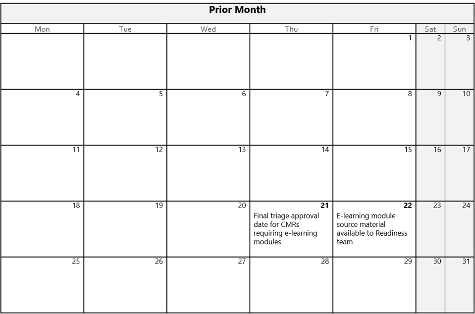
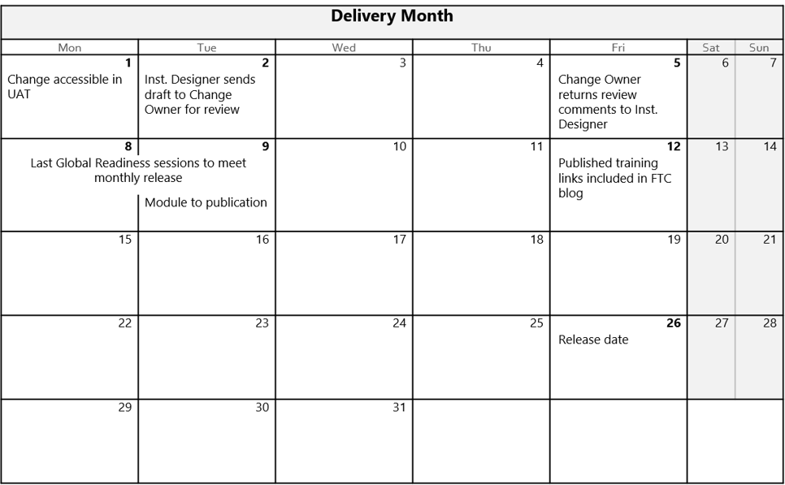

---
# required metadata 
title: Readiness and Requirements - Delivery Training
description: Article provides the content requirements for change owners working with the training team.
author: Connie Brenden
ms.author: Jim Muir, Gail Burke, Connie Brenden
manager: jimmuir
ms.date: 7/25/2019
ms.topic: readiness-requirements
ms.prod: non-product-specific
ms.custom: approved
ft.audience: internal
ft.owner: jimmuir
---

# Delivery Training

## Overview

If your change impacts the delivery team, training material should be developed to support the change. All training, regardless of format, is published to the Nexus Learning Catalog.

A VSTS task is automatically created to track the training needs of a CMR. For changes which require training, use the VSTS task to communicate with the readiness team. For changes that do not require training, change the “State” field of the task to Removed.

## Requesting Training

If you feel your CMR requires training or if you are unsure, @mention the [FTCReadiness@microsoft.com](mailto:FTCReadiness@microsoft.com) in the training (child) task. The readiness team will work with you to determine the type of training required.

## Types of Training Available

Several delivery mechanisms are available to address the training needs associated with your change management request (CMR), including:  

- [E-learning Module](e-learning-module.md)  

- [Global Readiness Session](global-readiness-session.md)

- [E-learning/Global Readiness Hybrid and Airlift with E-learning Modules](e-learning-global-readiness-hybrid-and-airlift-with-e-learning-modules.md)

Once the type of training has been determined, the process for training creation will begin.

## Timeline

All training must be completed and linked in the change communication 10 business days prior to release. The calendars below show milestones and handoffs that must occur to deliver training.

> [!NOTE]
> Triage occurs every Tuesday and Thursday.

## Compliance

- All content must be compliant to accessibility, global readiness, and licensing/privacy standards. The Readiness Team will verify compliance before publishing. For more information, review the compliance standards at [Worldwide Learning Compliance Policy Library](https://microsoft.sharepoint.com/teams/learning/GCL/Pages/Home.aspx?TAB=4%3AMBR%E2%80%8B%2C%20QBR%2C%20and%20BI).

## Dependencies

- CMR must be approved 15 business days before the FTC info blog is published. In the above example, the latest triage falls on the 21st of the prior month.

- Content from change owner must be available to the readiness team 15 days prior to when the FTC info blog is published.

- Change owner must adhere to established review schedule in order for content to be delivered on time.

- Change owner must submit training content the day after the CMR is approved.

- For CMR that requires training, approval should be contingent on having content available for training.

- Global readiness session must be delivered no later than the first week of the desired release month.

## Next steps

See [E-learning module](e-learning-module.md)
