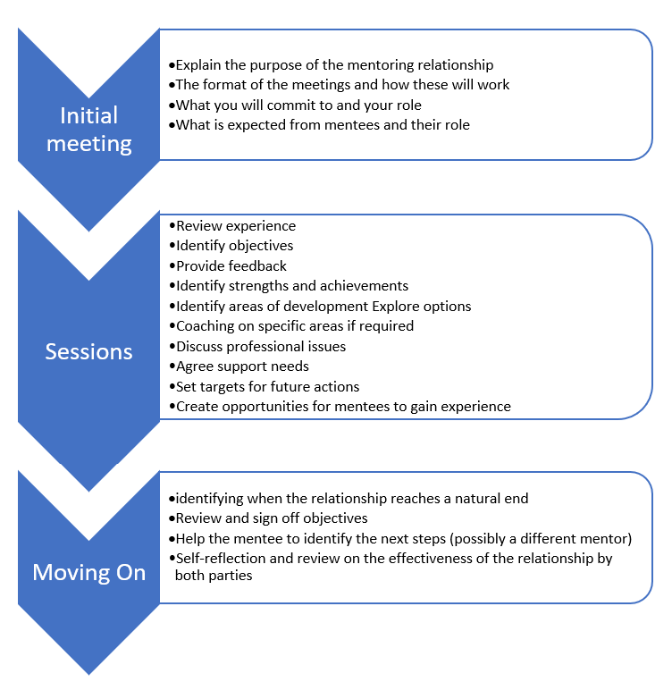
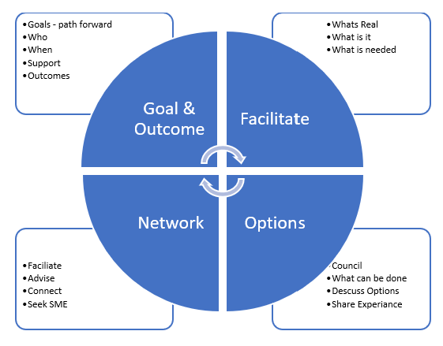

---  
# required metadata  
title: FastTrack Roleguide - Mentoring and Coaching
description: FastTrack Roleguide - Mentoring and Coaching
author: Mark Eichenberger
ms.author: mareich
manager: eduardod  
ms.date: 2/18/2019  
ms.topic: playbook  
ms.prod: non-product-specific  
ms.custom: internal-playbook  
ft.audience: internal  
ft.owner: mareich
---  
[!INCLUDE [Playbook Feedback](./includes/questions-feedback.md)]
 
# FTA Mentoring and Coaching

## Overview

FTA Buddies are mentoring and coaching resources within FastTrack. This
program is a great opportunity for both mentees and mentors alike.
Mentees gain valuable real-life knowledge from seasoned project &
program managers, and mentors can find their own skills sharpened as a
result of the mentoring relationship.

Mentoring is essentially about helping people within Fastrack to develop
more effectively. It is a relationship designed to build confidence and
support the mentee, so they can take control of their own development
and work. Mentoring is not the same as training, teaching or coaching,
and a mentor doesn't need to be a qualified trainer or an expert in the
role the mentee carries out.

They need to be able to listen and ask questions that will challenge the
mentee and help them identify the course of action they need to take
regarding their own development.

FTA Buddy operates to help in a 1 on 1 relationship facilitating
transactions in knowledge, working or thinking in order to help the
mentee develop into the role and understand health and Manage Customers

The FTA mentor is not the mentee's direct line manager. A mentor is
different from a line manager in that they will not have direct
responsibility for the mentee's work performance but they will be
responsible for encouraging the mentee to work towards their own
individual objectives and be a motivating guide for the mentee on their
journey as well as guiding them to hit the FastTrack organisational
goals, objectives and metrics

### The rewards of being a mentor or a mentee:

-   Advancement of Management practices and culture

-   Exposure to different perspectives

-   Recognize and motivate high performing individuals

-   Satisfaction of contributing to the success of others and actively
    contributing to the community

-   Powerful real-time learning and development

-   Take networking to a new level

-   Build your trust in management competencies

-   Put into practice your professional development in a safe
    environment

-   [Being a Good Mentee](https://www.linkedin.com/learning/being-a-good-mentee)

Mentoring can be used for a wide variety of situations and different
points of someone's working life for example:

-   Induction for a new starter into FastTrack

-   Individuals working towards promotion

-   Staff who have changed roles with the department or across the Microsoft organisation

-   Changes to job roles for example following a restructure

-   Continuous Professional Development

## What is an FTA Mentor?

An experienced program or project manager who can be a trusted advisor,
guide and/or coach to another project manager to help develop further

 The role as FTA mentor will cover the following:

-   [Effective Listening](https://www.linkedin.com/learning/effective-listening)

-   Ask questions to help develop theirs and the mentee's
    understanding of a situation or problem

-   Provide information and knowledge and share informal networks

-   Provide advice on career development

-   Offer different perspectives

-   Provide support and encouragement

-   Provide an insight into your work and career

-   Offer guidance and advice in regard to qualifications

-   Be a sounding board

-   Be a critical colleague

-   Encourage self-reflection

-   Help mentees identify areas for development

As a mentor you will have the opportunity to use your experience and
knowledge in a facilitative manner to support the development of the
mentee. However, the responsibility for making things happen and putting
plans into action lies primarily with the mentee - not with you! But you
should validate by ensuring progress of customers Health.

### Skills and experience required to be an FTA Mentor

-   Being an experienced FTA, which includes delivery to complex
    organisations

-   Self-Awareness -- have a good understanding of your own strengths
    and development needs.

-   Organisational know-how -- know how to get things done at Customers
    and within FT and how things work.

-   Credibility -- have personal and professional credibility

-   Accessibility -- be willing and able to commit sufficient time to
    your mentee to offer support and guidance.

-   Communication -- have excellent communication skills and be able to
    understand the ideas and feelings of others, but also know how to
    influence.

-   Listening -- be a great listener, listen to the perspectives of the
    person and the challenges they are having and offer then sound
    guidance in adherence to the Microsoft philosophy.

-   Ability to empower -- your able to create a working environment
    where it is safe for individuals to try out different things,
    allowing them to contribute in different ways but meet the
    organisation goals.

-   A desire to help others develop -- you should understand how
    individuals develop and have experience, either formally or
    informally, of developing others.

-   Inventiveness and have growth mindset -- be open to new ways of
    doing things and different ways of working.

-   Empathy -- Ability to empathise with others, customers situation and
    simply do what right and best.

-   Understanding --You should be prepared to try to understand
    different perspectives, approaches and possibly backgrounds of
    different mentees.

## What is a Mentee?

A project manager seeking to obtain advice from an experienced
professional to improve their project management skills as a FastTrack
Manager developing into Health and exploring the profession and learning
how to interact professionally with customers.

## Why Mentoring?

-   It has flexibility -- mentoring can happen in so many ways and under
    lots of different circumstances

-   Is an FTA activity- it is not a role carried out by the mentee's
    line manager although mentoring conversations can become part of day
    to day activity and don't always need to be scheduled, they can tale
    place informally using Face to Face, using Teams via Audio / Video
    or even through IM.

-   It relates to work they need to achieve and the role that they are
    fulfilling i.e. their job

-   It is individual -- each relationship will be unique to those two
    individuals

-   involved

-   It is people centred

-   It provides a feedback system- feedback is central to mentoring and
    is a great tool to enhance and embed learning

-   It is broad in focus -- it should meet the needs of the mentee and
    mentor

-   It is not exclusive -- but actually complements other methods of
    learning

 

## Mentoring "Program"

To support FastTrack and the evolution to support customers and ensure
positive Customer Health the mentoring program brings together our FTA
members in mentoring partnerships to meet the professional development
goals of the FM Health within FastTrack to ensure successful execution
and meeting our goals, objectives and metrics. But most important to
develop skills needed to for customer interaction and successful
outcomes.

The goal of the mentorship as well as the frequency of exchange is up to
the individuals who are assigned Both parties agree and set up basic
rules and expectations.

The duration of a mentorship typically lasts approximately 6-12 months,
depending on the individual and organisational goals & objectives.

## Support for FTA Mentors

At times you the FTA may feel that you need a little support yourself as
a mentor; you may have faced or be dealing with a situation with your
mentee and be unsure how to approach it. There are a range of support
methods available to mentors.

-   Your colleagues and peers

-   Your own mentor FTA Area Liaison (a good idea if you are going to
    mentor

-   others)

-   A Regional Leader

-   Organisation Development & Training team

-   Mentor development sessions/programmes -- [Being a Good Mentor](https://www.linkedin.com/learning/being-a-good-mentor/welcome?u=3322) (60
    min course)

-   How to Coaching & Mentoring others [leading-without-formal-authority](https://www.linkedin.com/learning/leading-without-formal-authority)
    (60 min course)

-   On-line resources and tools, including information provided by and
    through the FT Playbook LINK \<NEED link here\>

 

## The Benefits of Mentoring “what’s in it, for me?”

| **FTA**                                                                                        | **FM Health**                                                                                    | **FastTrack Organisation**                                                                                         |
|------------------------------------------------------------------------------------------------|--------------------------------------------------------------------------------------------------|--------------------------------------------------------------------------------------------------------------------|
| Role/Job satisfaction from seeing others develop                                               | Increased self-confidence and learning from others                                               | Increased levels of motivation from those involved to meet FastTrack evolution                                     |
| Increased recognition from peers and other around you                                          | Support and challenge in formulating a clear sense of personal direction                         | Employees who have a clear direction and clear objectives                                                          |
| Continuously Challenging and Stimulation                                                       | Understanding of the formal and informal culture and structures of customers                     | Improved communication and skill-set at all levels and across levels                                               |
| Identifying the future potential of the person and what skills are required to develop further | An opportunity to develop skills by observing others                                             | Sharing of knowledge and experiences and best practice as standard working practice                                |
| Learning and developing yourself from the process                                              | A source of knowledge and experience to tap into                                                 | Tangible and measurable gains through increased time to deployment measured through progression of customer health |
| Satisfaction at the success of the mentee further developing and becoming successful           | A sounding board to discuss ideas and approaches, challenges before action is taken              | Innovation and continuous Skill improvement in the way that employees approach their work to meet the goals        |
| Recognition of your mentoring skills by your Manager and FastTrack and Microsoft               | An opportunity to think about things in a different way to further develop and become recognised | Increased knowledge and impact from individuals developing                                                         |
| Motivation from self-development and responsibility                                            | Increased motivation and know how                                                                | Improved Skills and execution                                                                                      |

## The Process

[]

## What Does the FTA mentor do!

### Coach
This an active role for the FTA mentor where you will be working with the mentee to encourage them in the development of relevant skills and attitudes for the future. The focus of the coaching role is on the ability to help the mentee see beyond the current situation and to identify what the future can look like and what needs to happen to help achieve this. This is helpful in setting goals and identifying what actions are needed to be taken next or what the individual requires to do next.

**What to do!**  
-	Listening with an open mind and suspending judgement.
-	Being able to see the issue from a different perspective, that of the mentee.
-	Identifying behaviour that needs to change
-	Helping mentees to recognise their own individual strengths and areas of weakness
-	Providing constructive feedback.
-	Setting projects that will stretch the mentee
-	Ability to clarify so both parties have a shared understanding.
-	Being able to take a mentee back through and experience, to help them to evaluate it and to recognise what could have been done differently.

### Counsel
As a counsel, the FTA acts as a sounding board what the mentee is trying to solve, it might be a problem or making a difficult decision. As a confidant top the person, the FTA helps the mentee to clarify the real issues involved, removing the emotion and to see the bigger picture

**What to do!**  
-	Listening – withholding comments unless it helps the mentee to clarify their thoughts
-	Focusing on observable behaviours rather than personality traits
-	The ability to handle negative information without driving the mentee into an emotional corner
-	Avoiding unconstructive arguments
-	Being able to help move the mentee into constructive problem-solving mode
-	Knowing when to call in specialist advice.

### Network
In the role of networking the FTA mentor alerts the mentee to the use of contacts both formal and informal outside of the official structure of the department. They also explain how these individuals can add value to the mentee in the achievement of their goals.

**What to do!** 
-	The ability to define and understand networks, what adds value and why.
-	Understanding key areas, you need to influence and who are the key individuals 
-	Creating opportunities for mentees to meet others who will help provide information or opportunities to help develop gaps in the mentee’s knowledge

### Facilitate 
The FTA acts as a facilitator takes action that will indirectly smooth the way for something else to happen. This could be as simple as passing on a contact, creating a connecting, sending an email, setting up a meeting or making an introduction to someone who will be helpful for the mentee either now or in the future. By facilitating you are starting a process that will help the mentee to pursue their goals and address the challenge.

**What to do!** 
-	Being clear about what needs to happen and why
-	Recognising potential barriers and what causes them
-	Provides advice and guidance on ways to overcome barriers
-	An understanding of the politics of management
-	Smoothing the path for mentees for example by providing introductions, backing ideas and spreading the word on projects the mentee is working on

## Mentoring using the FTA buddy model

The FTA buddy model is a good way to structure a meeting with your mentee. You
can either start with the goal and work logically through the model or you can
move the model around, starting with the realism and then the goal, if this
works best. Remember to always finish with an agreed Goal and outcome, to ensure
that this is set and owned by the mentee. The model is outlined below.

[]

## Managing the Meetings

The FTA mentor should take on the role of a facilitator during the meetings
using questions and a non-directive, non-judgemental approach. Following the FTA
Buddy model will be helpful during the meetings. The purpose of the meetings
could be for some or all the following reasons:

-   Reviewing and identifying the mentee’s experience

-   Helping the mentee to identify individual strengths and areas for
    development

-   Discussing professional and work issues

-   Agreeing what support is required

-   Exploring the options open to the mentee

-   Coaching on specific skills

-   Supporting the mentee to set achievable realistic and stretching action
    plans

Remember meetings will not be the only form of contact with your mentee.
Audio/Video, emails and brief on the job discussions will also be a part of the
process but you should have an agreed number of scheduled meetings with your
mentee set to fit around the action plan of the mentee, and around specific
points in their development and on joint availability.

## Making the Meetings & guidance Work

Have a clear structure and purpose. Before the meeting consider the structure
and the time parameters. These should be agreed during the initial meeting when
you are contracting with the mentee. Having a clear structure and purpose in
mind will be the best and most effective use of your time and their time.

Think about the content of the meetings. There should be a balance of looking
back and reviewing the mentee experiences and reviewing if objectives set have
been met or, if not, why not? There should also be a balance of discussing
current issues and thinking about the future and ensuring the mentee sets
realistic objectives for their action plan.

Keep to dates and times set. It is easy to let the day job get in the way but
try to focus on the benefits to everyone (including the organisation) of
engaging in this process. Give it the priority it requires to be successful.

## Ending the Mentoring Relationship

It is important to consider how the mentoring relationship will end. Discuss the
reasons for the ending of the relationship with your mentee, the Area Lead and
Regional LT. you can assume that this Mentoring will run for a minimum of 6 – 12
months, the end date is agreed during the initial meeting, but it is not always
possible in all situations to be able to identify a clear end date. Reasons for
ending the mentoring relationship can be varied:

### The relationship has achieved its objective

-   You feel that your mentee is confident and fully capable and ready to move
    on without your assistance and will be successful in the FM health role
    across the S1500 customers.

-   You have tried but the mentee is not responding this will require LT meeting
    to provide your feedback, potentially another FTA is better suited.

-   The relationship isn’t working successfully and both parties wish to move
    on.

-   The program is coming to a close.

It is useful and good practice for the mentor and mentee to revisit the original
goals and objectives and compare them with actual outcomes. This allows both
parties to review what progress has been made and to acknowledge what has been
achieved. It is useful to encourage the mentee to find another mentor for the
next stage of their journey and you may even be able to suggest individuals the
mentee may like to approach. However, you should take time to evaluate how you
feel you have developed during the relationship and what lessons you have
learned as a result.
