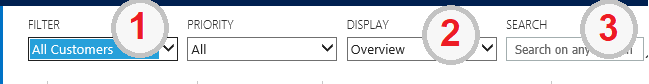
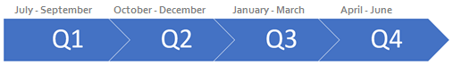
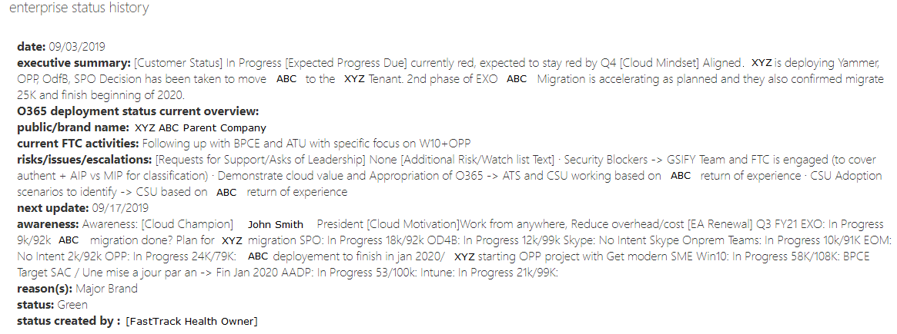

---
# required metadata  
title: FastTrack Roleguide - Situational Awareness Resources
description: FastTrack Roleguide - Situational Awareness Resources
author: Mark Eichenberger
ms.author: mareich
manager: eduardod  
ms.date: 2/18/2019  
ms.topic: playbook  
ms.prod: non-product-specific  
ms.custom: internal-playbook  
ft.audience: internal  
ft.owner: mareich
---  
[!INCLUDE [Playbook Feedback](./includes/questions-feedback.md)]

# FastTrack Situational Awareness: Resources

## Tools Required

  - [FastTrack Orchestration Portal – FTOP](https://ftop.microsoft.com/)
  - [FastTrack FY20 Forecasting Site](http://aka.ms/ftcforecast)
  - [Subscriptions & Licensing - Lynx](https://lynx.office.net/)
  - [Customer Health Dashboard Power BI](https://aka.ms/ftcustomerhealth)
  - [Get Modern Dashboard Power BI](https://aka.ms/ftcgetmodern)
  - [Teams: FY20 Customer Health](https://teams.microsoft.com/l/channel/19%3ad2d969a931ec48d494df5775c2d45ec3%40thread.skype/General?groupId=c43199f3-be42-4a6a-9f4a-f6224586c2e1&tenantId=72f988bf-86f1-41af-91ab-2d7cd011db47)

## Additional Resources

- **Health Motion**
  - [Customer Health Motion Overview](/playbook/motion-customer-health.html)
  - [Customer Health Activities](/playbook/motion-customer-health-activities.html)
- **Get Modern Approach**
  - [Get Modern Motion Overview](/playbook/approach-get-modern.html)
  - [GM ConversationPPT](https://microsoft.sharepoint.com/:p:/t/ftccm/EXDbJtjMF-VBoLKq_P-oiV0ByR2pr2zPlrR0409OquTAHA?rtime=-BHt-XMR10g) (slide 6)
- **FTOP**: [Enterprise Status Note Guidance](/playbook/guidance-fta-notes.html)
- **Forecasting**: [Forecasting Site Guidance](/playbook/motion-customer-health-forecasting.html)
- **Summer School**: [Stream Channel](https://msit.microsoftstream.com/channel/c0cd980f-42a2-4bc5-8ce2-cd5b9587fce9)

## Customer to Tenant mapping

As a Health owner, you are accountable at a TPID/Customer level. FTOP tenant assignment guidelines are as follows:
- A Health Owner is required to be assigned as Primary FM/FTA to the winner tenant (a.k.a. referencing tenant) that has already been selected as such in FTOP.
- A Health Owner should also be assigned to any other tenant(s) under the TPID where there is an active FastTrack engagement.
- Tenants that are neither the winner tenant, nor an active engagement, should follow the same routing rules that apply to non-health duplicate, unresponsive, and otherwise inactive tenants.

We have already identified each single FTOP tenant that will serve to
represent each S1500 TPID until tooling changes can better represent
this relationship model.

For the time-being: All Situational Awareness information and data
points (except Forecasting) are expected to be added to the single
referencing tenant for the TPID.

There are a few ways you can identify which FTOP tenant has been
selected to represent the TPID, here are two:

  - **SLT Watchlist flag = True**  
    In FTOP, go to the “flags” tab. If the SLT Watchlist value is set to
    “True”, then it is considered the referencing tenant. \*Please do
    not change this value\*

  - **FTOP Filter = All Customers**  
    Use the image below to guide you:  
    1\. Select the “All Customers” filter  
    2\. Select the “Overview” display  
    3\. Paste the TPID value into the search pane  
    The result will be the referencing tenant.

## Information Requested and Output:  

| **Data Point** | **Description** | **Collection Method** | **Values** (if defined)| 
| - | - | - | - |
| CAT team resources | If you know there are workload-specific resources assigned to your customer, please add them to FTOP | FTOP: **Contacts** | Place in Title Field: Intune CAT, Win CAT, Mgd Dsktp CAT, AADP GTP, Sec GTP, RA, CLS, or Network  |
| Enterprise Status Notes: **Executive summary** | Crisp executive level summary that serves to answer the question: What is preventing this engagement from having a Green status? Answer format: High Level Topic, Brief Description, Impact, Action(s). | FTOP: **Executive Summary** | (Free Text)  |
| Customer Status | Categorize the Customer's M365 Onboarding status as a whole. | FTOP: **Executive Summary** | In Progress / Blocked-Technical / Blocked-Business / No Intent  |
| Expected Progress Due | Date when we expect a significant improvement in customer health will occur / Health Forecast. Example: “\[Customer\] is currently red, expected to turn yellow by Q3”) | FTOP: **Executive Summary** | (Free Text) |
| Customer Cloud Mindset |  Set for customer level. Aligned: Would you say the customer is interested in using their licensing?  Averse: Would you say the is difficult to move to the cloud from on-premises solutions? Compete: Would you say the customer is aligned with going to the cloud, but perhaps not with Microsoft?| FTOP: **Executive Summary** | Aligned Averse Compete |
| Enterprise Status Notes: **Risk/Issues** | Highlight any risks or issues within the account. Describe efforts to respond-to, resolve, or elevate escalations. | FTOP: **Risk** | (Free Text) |
| Requests for Support / Asks of Leadership | Describe requests for support, or leadership assistance to remove blockers. | FTOP: **Risk** | (Free Text) |
| Enterprise Status Notes: **Awareness** | What does our leadership need to be aware of? Consider including partner activity, company restructuring/re-organization, etc. Our measure of success is **adoption** and **customer satisfaction**, so include things that would affect our ability to secure these. | FTOP: **Awareness** | (Free Text)  |
| Customer Cloud Champion | Call attention to the contact on the customer side that is leading the charge toward utilizing our cloud services. | FTOP: **Awareness** | (Free Text)  |
| Customer Cloud Motivation | Call attention to the primary motivation for the customer to move to our cloud services. Choose from the set value options to the right. | FTOP: **Awareness** | -End of life of existing IT; -Increase security; -Improve service quality; -High Availability/Improved uptime; -Eliminate on-premise hardware; -Reduce overhead/cost; -Collaborate and communicate; -Transform business processes; -Use our collective knowledge; -Work with partners and suppliers; -Work from anywhere; -Get insights from data  |
| EA Renewal | This is a field to indicate when the customer will be up for renewal. Since we don’t have the information piped-in automatically at this time, health owners are asked to research and provide it, if known. | FTOP: **Awareness** | (Free Text)  |
| Workload Status EXO, SPO, OD4B, Skype, Teams, EOM, OPP, Win10, AADP, Intune | Similar to status but describes the level of intent or ability to onboard a **workload** for the entire TPID/Customer. Example: “For all of Johnson and Johnson, they are blocked on Exchange because of a legal issue” Enter: "EXO: Blocked-Business" | FTOP: **Awareness** | In Progress / Blocked-Technical / Blocked-Business / No Intent   |
| Workload Forecasting | Consider all situational awareness information when forecasting: Enter total “Active Users” (EXO/ SPO/ Teams/ Yammer/ ODFB/ Intune/ AADP / OPP) or “Active Devices” (Windows 10) predicted for each workload per quarter. | FY20 Forecasting Site | (Numerical)  |

## Template Suggestions for FTOP

**Exec Summary:**  
\[Customer Status\] \[Expected Progress Due\] \[Cloud Mindset\]  
\[Additional Executive Summary Text\]

**Risk/Watch list:**  
\[Requests for Support/Asks of Leadership\]  
\[Additional Risk/Watch list Text\]

**Awareness:**  
\[Cloud Champion\]\[Cloud Motivation\]\[EA Renewal\]  
EXO:  
SPO:  
OD4B:  
Skype:  
Teams:  
EOM:  
OPP:  
Win10:  
AADP:  
Intune:  
\[Additional Awareness Text\]

## Example of good Exec Summary, Risk, and Awareness content

