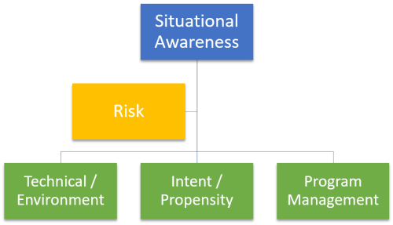
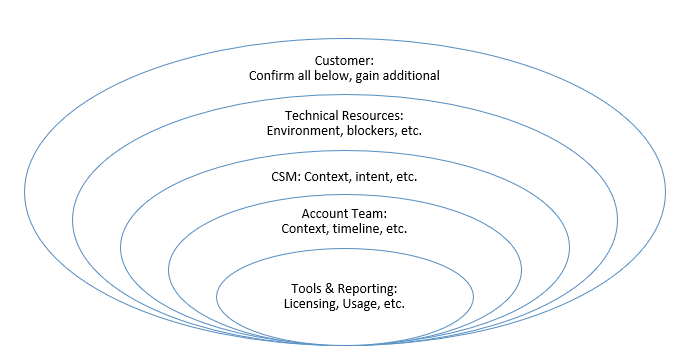

---  
# required metadata  
title: FastTrack Roleguide - Situational Awareness
description: FastTrack Roleguide - Situational Awareness
author: Mark Eichenberger
ms.author: mareich
manager: eduardod  
ms.date: 2/18/2019  
ms.topic: playbook  
ms.prod: non-product-specific  
ms.custom: internal-playbook  
ft.audience: internal  
ft.owner: mareich
---  
[!INCLUDE [Playbook Feedback](./includes/questions-feedback.md)]
# FastTrack Enterprise Situational Awareness

## Overview

Situational Awareness (SA) is being aware of what is happening at your
customer, and anything that relates to deployment in terms of where you
are in the life cycle, timelines and progress made to date or impeded,
whether something around you is a potential risk and hinders or prevents
progress or outcomes of your customer moving forward with customer
health.

Your knowledge, experience enables FastTrack leadership to understand
what is occurring at your customers and helps others to determine what
support you may require. This means that everyone's situational
awareness is individual and potentially different. Situational awareness
is used to make informed decisions and allows others to assist or
provide guidance and support if required.

Situational Awareness is only as accurate as our own perception or
reading of the situation, thus what we believe is happening may not
accurately reflect reality or consider all moving parts. How we
interpret a situation can be influenced by many things such as the type
of information you have been given, our own experience and distractions.

### [Situational Awareness Resources](fta-situational-awareness-resources.md)
- Use the resources page above for quick access to several Situational Awareness links and guidance.

## Understand and Document Situational Awareness

Across all workloads under a TPID, a Health Owner should seek
information from current tools, reporting, the Account Team (AE, TAM,
etc.), Customer Success Team (CSM), Technical Resources (FE, SME, CAT,
etc.), and the customer for each of the above categories.

It is important to talk to all parties involved, and not rely on the
slice of information in the tools. Questions like: *“How does the
customer feel about our services and the FastTrack Center?” Do you
believe* *usage* *will* *increase,* *decrease,* *plateau?* *Why?”* With
each step along the path, the health owner will develop a deeper level
of situational awareness.

**Example:** Contoso – Exchange Online

*“Contoso has intent to deploy all EXO licensing (Intent/Propensity)
before the end of the CY19 (Program Management) from Exchange 2010
(Technical/Environment), but they want to migrate themselves (Risk).”*

### Monitor usage and activations

It is suggested that each Health Owner establish a habit of checking the
Usage and Activations for their customers on a regular basis. Doing so
will both keep them current on the rate of growth, as well as alert them
of any declines that could precede an escalation.

> [!Note]
> It is not enough to simply monitor usage for one FTOP tenant
> per TPID. The Customer Health score is calculated by usage and licensing
> on all tenants under the TPID.

The FY20 Customer Health Dashboard for monitoring usage and activations
is located here: http://aka.ms/FTCustomerHealth

**Definitions**:

  - AE – Active Entitlements; used to represent how many users are
    active on a particular service

  - QE or PAU – Qualified Entitlements or Paid Available Units; used to
    represent the number of users or seats for which the customer has
    purchased a license

  - MAU – Monthly Active Usage; used to represent how many users are
    active on a particular service over the closed timeframe of one
    month

  - MAD – Monthly Activated Devices; used to represent how many unique
    devices are active on Windows 10 over the closed timeframe of one
    month

  - PCIB – PC Install Base; used to describe the number of devices on
    which the customer plans to install Windows 10

  - AU – Active Usage, synonymous with AE/QE, MAU/PAU, and MAD/PCIB; a
    calculated percentage to indicate consumption out of the entirety of
    the eligible licensing available for a particular service

## 1\. Why should you improve your situational awareness

It is important that you understand the challenges you may face/ could
face and how serious they are or could become to prevent acceleration of
you customer deployment. We recognize that there are many moving parts
and what is occurring or going on at your customer and the program, or
you could become absorbed in details, that you might potentially
overlook something significant and loose the opportunity to identify
stuff that could slow-down or become a blocker towards successful
deployment.

## 2\. Situational awareness is important to everyone -- your colleagues and your leadership

It is important that everyone is aware of your customers situation and
progress or the potential issues, blockers you and your customer face.
It is important that everyone obtains situational awareness, so they can
offer support, guidance and where necessary provide additional guidance
or resource to help you progress or become unblocked. Even the most
experienced resources require situational awareness and support to
overcome the challenges when needed from others through supporting
networks.

These could include benefiting from shared experiences, FastTrack
Architects, Subject Matter Experts, Managers Assisting, or Executive
Support being required.

Don't be afraid to ask for support to overcome any challenge.

## 3\. How do I improve my situational awareness?

Get into the habit of regularly assessing the status of your engagement.
When doing so, consider the following:

  - Where are we according to our plan and timelines?

  - Are we on track to meet our objectives?

  - Is there any blocker, issue or risk to timelines?

  - Is there anything that could potentially slow you down?

  - Do you require support, help or guidance to course correct?
    
      - If **Yes**, to what extent
    
      - Is the issue/concern blocking progress?
    
      - Is there anything you can do to reduce or resolve the issue or
        remove the blocker towards progress?

Understand and convey what the issue is and find the facts, bring those
to the attention to others on your team. Use your assigned FastTrack
Architect or Manager in council, in more detail describe the issue. If
you see something that you're not sure about, raise it to others around
you -- take responsibility and bring awareness to the issue at, ask
questions and obtain and provide situational awareness. Raise these
during the Regional Health meetings when reviewing your customer
engagements to obtains help, provide insight and provide status as well
as any ASK's.

During the Regional Health meetings explain the effects of the issues/
blocker on your engagement, the impact, and procedures that are impeded,
priorities that are adjusted and timeline impact if any, those around
you have direct avenues into product teams and engineering and will work
with you towards a positive outcome.

In preparation for the regional health meetings consider that if you
have the knowledge and support, resources to overcome the issue what
would you do to overcome this challenge.

## 4\. Learn from your past to Predict future events

The most effective aspect of Situational Awareness involves the ability
to project the future actions of elements and your engagement.

After you have been able to identify issues / blockers in your
engagement and you fully understand the situation, it is the time to
take your Situational Awareness one step further.

Look for the indicators ahead of time and use this knowledge and
experience to apply these to your future engagements, by leveraging or
seeking support earlier to minimize the impact thus keeping your
engagement on-track with minimal external support.
