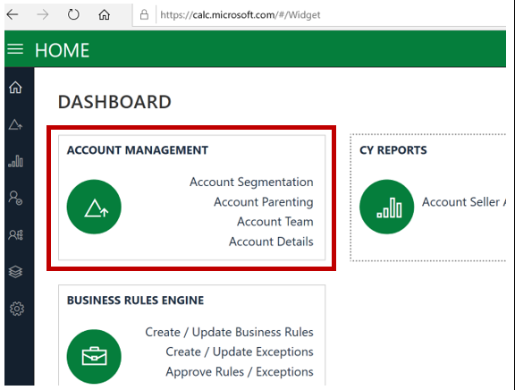
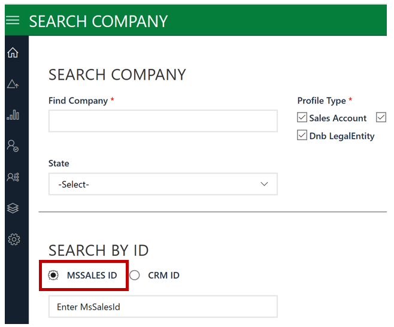
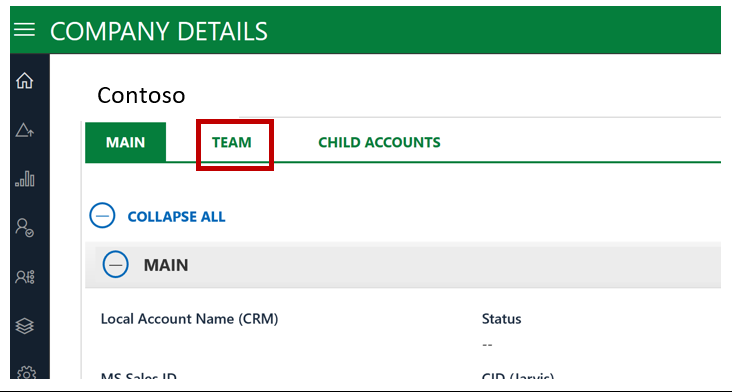

---
# required metadata 
title: Working in the Field - How to find your field contacts
description: Article provides best practices for FastTrack Managers who communicate with the field.
author: Connie Brenden
ms.author: v-conbre
manager: jimmuir
ms.date: 3/27/2020
ms.topic: courses-for-everyone
ms.prod: non-product-specific
ms.custom: readiness
ft.audience: internal
ft.owner: jimmuir
---

# How to find your field contacts

In FTOP, we have a section called Contacts. Updated Account Team members should be included in this section. If not up to date, or does not include all Field Team members, use the CALC tool. Review the Privacy section below to review what we can share with our Field Teams.

We also have a tool called CALC with the latest account team information.

1. Navigate to https://calc.microsoft.com/

2. Select **Account Management**.

3. Search for Customer by TPID (listed as MSSALES ID in tool).

4. Select customer from the results page.

5. Click TEAM section.

6. Scroll to the right and Search by Standard Title to find the account team resource you are looking for.

>[!NOTE]
>EXCEPTION: Use this for all roles except the CSM. They are aligned by region. For CSMs, ask your TAM and ATS if there is a CSM aligned.

## Next steps

See [Privacy and Reporting](privacy-and-reporting.md)
