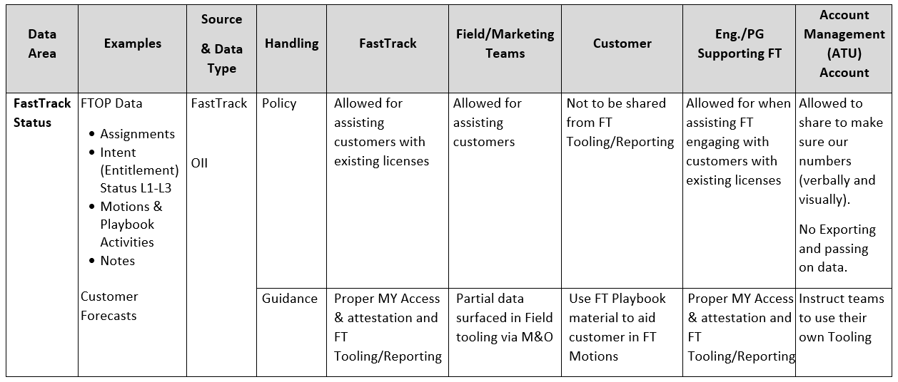

---
# required metadata 
title: Working in the Field - Privacy and Reporting
description: Article provides best practices for FastTrack Managers who communicate with the field.
author: Connie Brenden
ms.author: v-conbre
manager: jimmuir
ms.date: 3/27/2020
ms.topic: courses-for-everyone
ms.prod: non-product-specific
ms.custom: readiness
ft.audience: internal
ft.owner: jimmuir
---

# Privacy and Reporting

FastTrack is encouraged to utilize the Field teams to remove blockers and partner with them for smoother, faster deployments for our customers.

One of the key items that we are NOT allowed to share are our FastTrack Usage reports. Sales generating resources are not allowed access to our reports for compliance reasons.

Field teams also do not have access to FastTrack tooling (FTOP). However, FastTrack teams are allowed to discuss FT Status (assignment, notes, entitlement "Intent" status, Playbook activities). Ensure you do not export any data from FTOP to share with your Field Teams – they should only be utilizing the reporting mentioned above.

Follow the below:

## Next steps

See [Field needs additional support](field-needs-additional-support.md)
