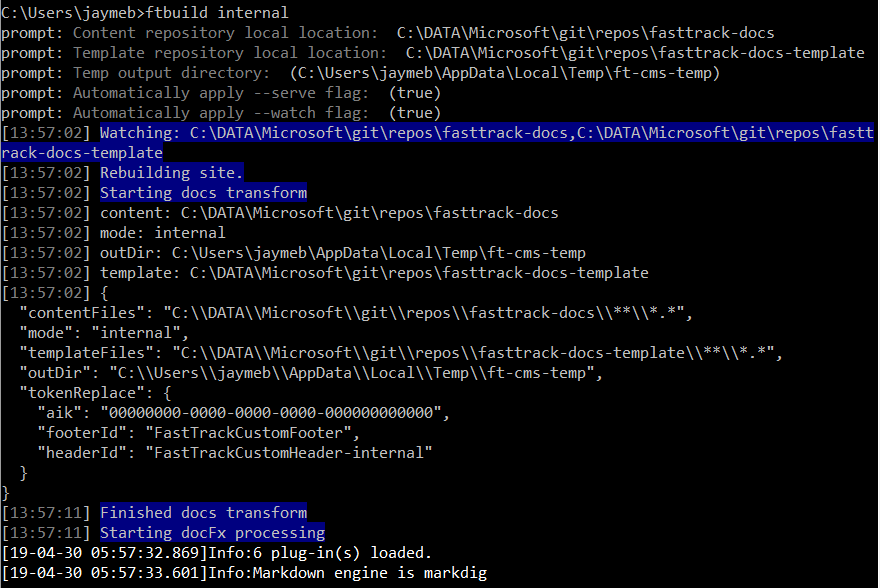

# View content changes locally

To ensure documentation changes appear as expected, we **strongly recommend** that you view your updates locally, that is, in a website built on your local machine before submitting them to be published on the production site(s).

With a local copy of both the documentation and template files, DocFx can be used to generate the entire site on your own computer. A custom package hosted in Azure Artifacts (run using node.js) assembles all the necessary components.

## Prerequisites
See [Set up to view content changes locally](contribute-get-started-setup-view-content-changes-locally.md).

## Build the local site

> [!NOTE]
> You can also use Powershell to perform the following steps.

#### To build the **internal** site:
In **Node.js command prompt**, enter the following command:
```node
ftbuild internal
```

#### To build the **partner** site:
In **Node.js command prompt**, enter the following command:
```node
ftbuild partner
```
### Configuration parameters
On the first run, ftbuild prompts you to enter some configuration parameters. The values you supply are saved in a configuration file for later use.
- **Content repository local location**: The location of the fasttrack-docs content repository on your local PC.
- **Template repository local location**: The location of the fasttrack-docs-template content repository on your local PC.
- **Temp output directory**: The location where the local site is built on your local PC. This defaults to a folder in your temp directory. Press **ENTER** to accept the default.
- Accept the remaining defaults.

    

    The local site automatically launches in your default browser. 

Press **CTRL-C** and close your browser window to end the process.

### Additional options
You can specify other options that will take precedence over options already configured. For example, to specify a different template repository local location, use:

```node
ftbuild internal -t "c:\path\to\template\files"
```

The following table lists all of the available options as well as their corresponding aliases if available.

|   |   |   |
| - | - | - |
| **Command** | **Alias** | **Description** |
| mode |  | Positional parameter which must be the first option specified ("internal" or "partner") |
| content | c | Absolute or relative path glob to the content files |
| template | t | Absolute or relative path glob to the template files |
| outDir | o | Absolute or relative path where output will be written |
| watch | w | If supplied the source files will be watched for changes |
| serve | s | If supplied a local webserver will be started to server the transformed files |
| | | |

#### Clean
The **clean** command deletes the temporary folder where the transformed artifacts are written. This can be helpful if things seem to get "stuck" or old files persist.

```node
ftbuild clean
```

#### Config
The **config** command can be used to rerun the configuration file builder which will re-ask the questions, capture the results, and overwrite the existing config file.

```node
ftbuild config
```

### Local changes automatically detected
One helpful feature of this local build process is the ability to dynamically make changes to your content without having to repeat the steps to end and re-run the build process. This feature detects changes to your content when you save them in VS Code and rebuilds the local site automatically. You can then see your changes within a few seconds after saving.

> [!NOTE]
> Once the local site is built, you can let it run and use it as you want. If you end the process for any reason, you'll need to follow the steps in [**Build the local site**](#build-the-local-site) to rebuild the local site.

### Troubleshooting
If your local site fails to build, the first step you should take - after you confirm your content is well-formed - is to run the ftbuild with the [clean parameter](#clean):
```node
ftbuild clean
```

If problems persist, enter a [GitHub issue](https://github.com/microsoft/fasttrack-docs/issues) to get help.

## Next steps
When your content appears in the local site as you expect, you can submit your changes for approval. See [Submit your content changes](contribute-get-started-submit-changes.md).