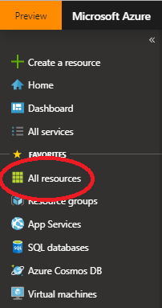
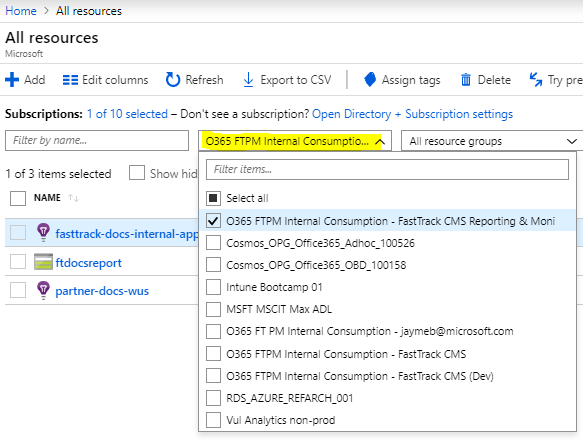
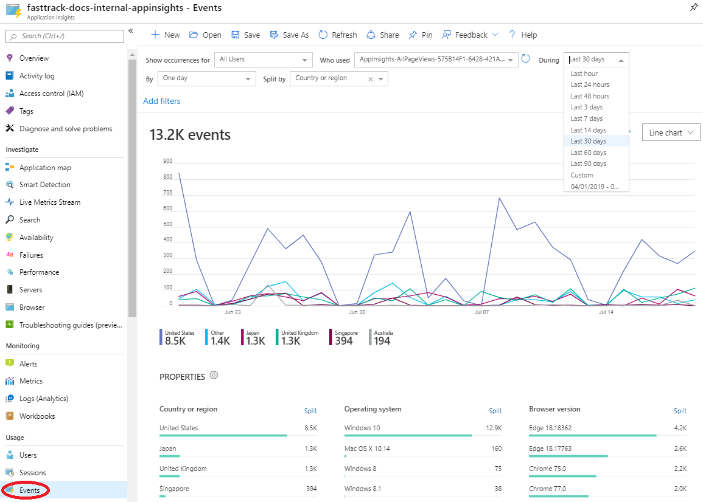
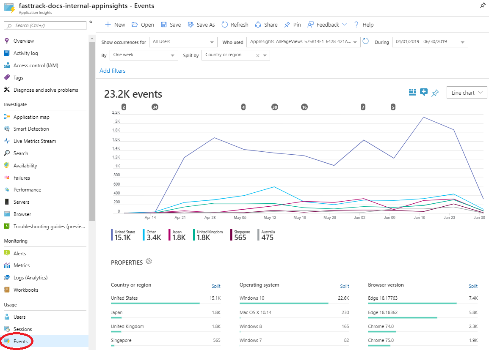
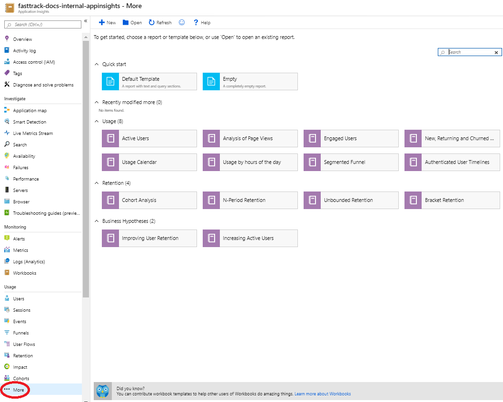
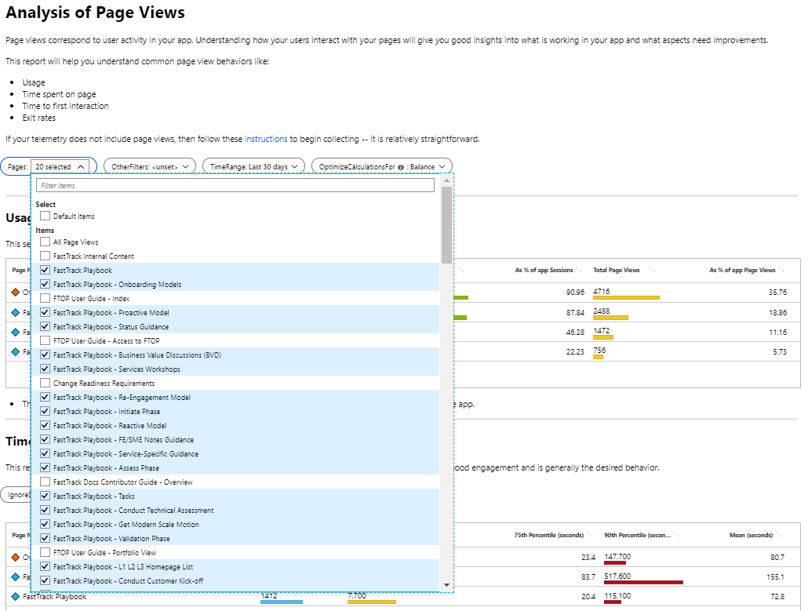

---
# required metadata 
title: FastTrack Docs Contributor Guide - Self-Serve Reporting
description: This article describes how to get started with FastTrack CMS self-serve reporting via the Azure portal.
author: Jayme Bowers
ms.author: jaymeb
manager: jwilkes
ms.date: 7/19/2019
ms.topic: contributor-guide
ms.prod: non-product-specific
ms.custom: internal-contributor-guide
ft.audience: internal
ft.owner: jaymeb
---
# Get Started with FastTrack CMS Self-Serve Reporting via Azure Portal

## Overview
Self-serve reporting for the FastTrack Content Management System [internal](https://fasttrack-docs.microsoft.com/) and [partner](https://partner-docs.microsoft.com/) sites is available via [Azure portal](https://portal.azure.com/). This article describes how to get started viewing statistics and metrics that interest you and your team.

## Prerequisites
You must be a member of the **ftcms-reporting** security group to view the reporting resources in Azure portal. The **ft-bcm-readwrite** security group is nested within this group. So, if you are a content contributor and you've already joined this group, you should already have access. Otherwise, select [this link](https://idwebelements/GroupManagement.aspx?Group=ftcms-reporting&Operation=join) to submit your request to join the **ftcms-reporting** security group (membership requires business justification).

## Terminology
**Blade**. A section within Azure portal that displays properties, functions, and additional blades, or subsections.
  
**Left rail**. The left-most section of Azure portal containining a list of top-level blades.

## Get started
The following guidance describes *one way* to get started viewing FastTrack CMS metrics in Azure portal. Once you are familiar with the portal, you can use any method available.
1. Select [this link](https://portal.azure.com/) to launch Azure portal.
2. In the left rail, select **All Resources**.

    

3. In the All Resources blade, filter on the **O365 FTPM Internal Consumption - FastTrack CMS Reporting & Monitoring** subscription.

    

4. Select anywhere outside the Subscriptions drop-down (anywhere that's not a hyperlink) for your selection to take effect.
5. Select an Application Insights resource. 
    - Events for the internal site are in **fasttrack-docs-internal-appinsights**.
    - Events for the partner site are in **partner-docs-wus**.
    Selecting one of these resources opens the Application Insights blade.
6. Select one of the available reports in the **Usage** section.

## Examples

### Events view
The Events view allows you to analyze page view events over time.

Use the filter options to select the data you want to view. For example:
 - Who used: **Any Page View**
 - During: **Last 30 days**
 - By: **One week**
 - Split by: **Country or region**

This allows you to see a breakdown of page views by country or region over the last 30 days.

One of the advantages of using the Events view is the ability to specify a custom date range.

To specify a custom date range, change the **During** option to **Custom** and select the start and end dates and times.

### Analysis of Page Views
One commonly used report of Application Insights is **Analysis of Page Views**. To get to this report, select **...More** under the **Usage** section of the Application Insights blade. 

This displays a list of additional canned reports that you can customize based on the pages you want to analyze.

Select **Analysis of Page Views**. Within this report are sections that allow you to view page statistics by Usage, Time Spent on Page, Time to First Interaction, and Page Exit Rates.

You can customize the report by selecting the pages you would like to analyze and the time range, such as 30, 60, or 90 days.

## Additional resources
For more information on Azure Application Insights and reporting, view these articles:

[Getting started with Azure Metrics Explorer](https://docs.microsoft.com/en-us/azure/azure-monitor/platform/metrics-getting-started)

[Feed Power BI from Application Insights](https://docs.microsoft.com/en-us/azure/azure-monitor/app/export-power-bi)
