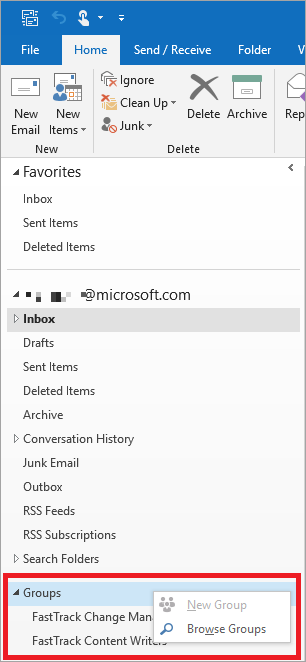
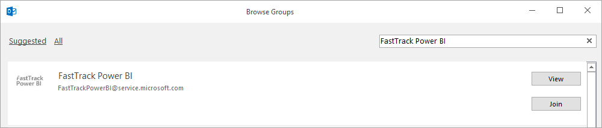
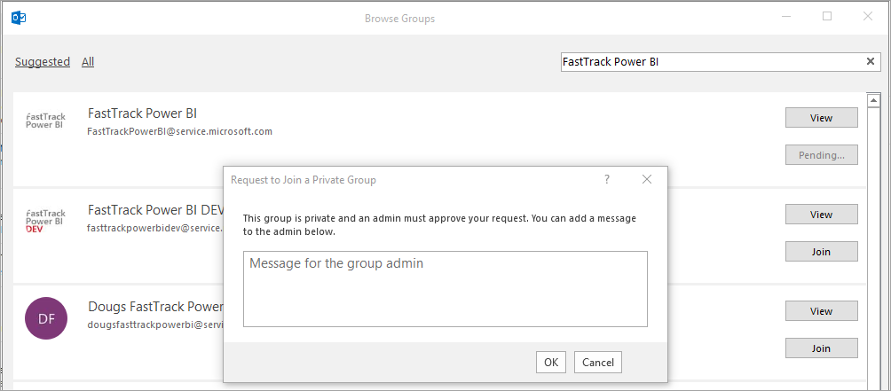

---
# required metadata
title: FastTrack Reporting Power BI Access Guide - Access FastTrack Power BI Reports
description: Process guidance
author: Reed Lee
ms.author: reedl
manager: Jeff Wilkes
ms.date: 5/31/2019
ms.topic: fasttrack-reporting-guide
ms.prod: non-product-specific
ms.custom: fasttrack-reporting-guide
ft.audience: internal
ft.owner: jwilkes
---

# Access FastTrack Power BI Reports

## Overview

**Prerequisite**: You must already be approved for FastTrack Reporting (FTR) access before you take the following steps. See [Request MyAccess Project](raise-request-in-myaccess.md) for instructions if you have not already joined one of the MyAccess Projects for FTR.

In this section you are requesting access to Power BI reports. This is a separate set of permissions from those already described in the MyAccess instructions.

> [!IMPORTANT]
> Please do not directly email the *FastTrack Power BI* Outlook Group to gain access, as it contains over 1200 members.**

## Procedure

The following procedure guides you step-by-step to access FastTrack Power BI Reports.

### How to access FastTrack Power BI

To access <https://aka.ms/fasttrackpowerbi>, the following steps must occur:

1. Open Outlook and right-click on **Groups** to expand **Browse Groups**.

2. Search for **FastTrack Power BI** and select **Join**.

3. Enter your request message and select **OK**.

One you are approved, you will receive a “Welcome to the FastTrack Power BI group” email.
