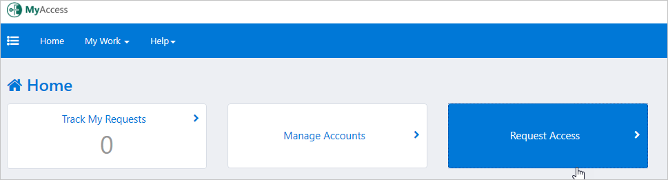
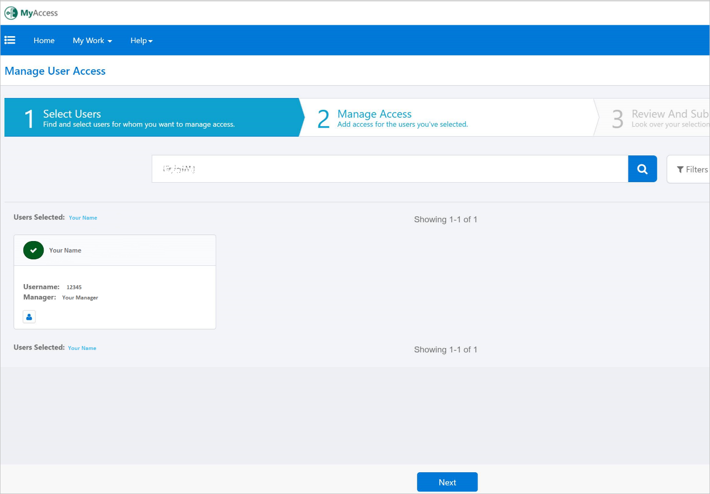
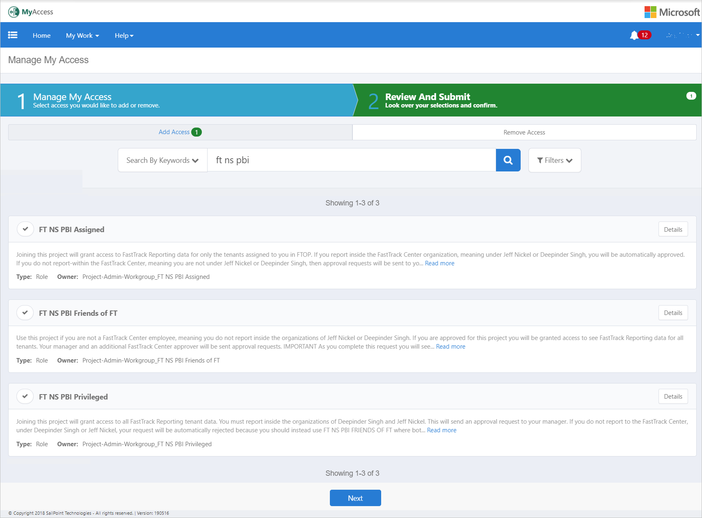
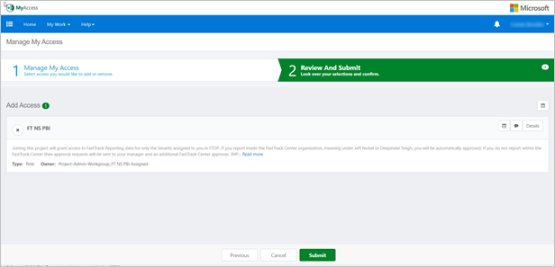
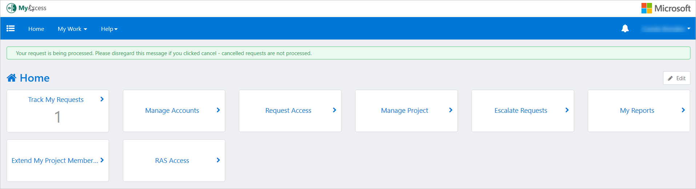

---
# required metadata
title: FastTrack Reporting Power BI Access Guide - Raise Request in MyAccess
description: Process guidance
author: Reed Lee
ms.author: reedl
manager: Jeff Wilkes
ms.date: 5/31/2019
ms.topic: fasttrack-reporting-guide
ms.prod: non-product-specific
ms.custom: fasttrack-reporting-guide
ft.audience: internal
ft.owner: jwilkes
---

# Raise Request in MyAccess

## Overview

This section provides instructions for requesting access to FastTrack Reporting (FTR), using [MyAccess](https://myaccess/).  

> [!IMPORTANT]
> On May 30, 2019 the FastTrack Center (FTC) changed how you access FTR. You no longer use the MyAccess project called FastTrack Insights for FTR. However, FastTrack Orchestration Portal (FTOP) still uses FastTrack Insights, so you must maintain your membership in FastTrack Insights to continue using FTOP.

For details on joining and maintaining FTOP access, see [Access to FTOP](../ftop-user-guide/access-to-ftop.md).

## MyAccess projects

There are three MyAccess Projects used to access FTR. You should join one of them using the steps that follow the descriptions. It is important to read the descriptions and select the right project. If you try to join a project that does not match your situation you will be automatically rejected; specifically, the project rules behave differently depending on if you report inside the organizations of Deepinder Singh or Jeffrey Nickel, as shown in the Microsoft Global Address Book.  

|MyAccess Project  |Description  |
|---------|---------|
|FT NS PBI Assigned       |Joining this project will grant access to FastTrack Reporting data for only the tenants assigned to you in FTOP. If you report inside the FastTrack Center organization, meaning under Jeff Nickel or Deepinder Singh, you will be automatically approved. If you do not report-within the FastTrack Center then approval requests will be sent to your manager and an additional FastTrack Center approver. **Non-FastTrack Center employees**: As you complete this request you will see a Justification field. Please use it to describe, and list people that can help confirm your business justification. Need help, email FTMyAccess@microsoft.com.         |
|FT NS PBI Friends of FT  |Use this project if you are not a FastTrack Center employee, meaning you do not work inside the organizations of Jeffrey Nickel or Deepinder Singh. If you are approved for this project you will be granted access to see FastTrack Reporting data for all tenants. Your manager and an additional FastTrack Center approver will be sent approval requests. IMPORTANT: As you complete this request you will see a Justification field. Please use it to describe, and list people that can help confirm your business justification. **FastTrack Center employees**: If you report up to Deepinder Singh or Jeff Nickel you will be automatically rejected because you should not use this project, instead use the FT NS PBI PRIVILEGED or FT NS PBI ASSIGNED projects. Need help, email FtMyAccess@microsoft.com.          |
|FT NS PBI Privileged     |Joining this project will grant access to all FastTrack Reporting tenant data. You must work inside the organizations of Deepinder Singh and Jeffrey Nickel. This will send an approval request to your manager. If you do not report to the FastTrack Center, under Deepinder Singh or Jeffrey Nickel, your request will be automatically rejected because you should instead use FT NS PBI FRIENDS OF FT where both your manager and an additional FTC approver will be sent approval requests. Need help, email FtMyAccess@microsoft.com.         |

## Procedure

The following procedures guide you step-by-step to join a MyAccess Project.

### How to request access

1. Navigate to <https://myaccess>.

1. Select **Request Access**.

3. If you do not have people that report to you, skip this step and go to step 4. If you have people that report to you: 

    - Select yourself by clicking the **check mark icon** next to your name, then select **Next**.
    - On the next page you will see that you have selected yourself as shown in the image below. Select **Next**.
    - Continue to step 4.
 

4. Search for **FT NS PBI**, which will render the three MyAccess projects that grant various levels access to FTR.  Read the descriptions of each project (which are the same descriptions shown in the table above) then select the **check mark icon** next to the project that fits your situation, and select **Next**.

5. Select **Submit**.

6. A pop-up window will appear. You'll be prompted to select if this request is for yourself or for a service account. NS and ETS access require permission level and justification. Enter the following information:

    - “Request for Myself” will be selected by default, leave this unchanged (unless you are performing a rare “Request for My Service Account” -- you must be the service account’s sponsor as shown on https://amtweb/#/searchsystemaccount.
    - Your user account will be pre-selected under “Select Account”, and this cannot be unselected.
    - Select the permission level (there will be only one selection available).
    - If required (it may not be required) type a business justification in the “Justification” field.
    - IMPORTANT: If you are requesting access through the “FT NS PBI Friends of FT” project it is helpful if you include your business justification as well as who, within the FastTrack Center (FTC), can help verify your business justification (Friends = employees that do not report into the FTC, meaning under Deepinder Singh or Jeffrey Nickel organizations).
    - Select **Next** to continue.

7. A short summary will then appear, select **Submit Request**.

8. **MyAccess** will navigate you back to the home page with the message stating your request is being processed.

9. You will receive an email once your request has been APPROVED, DENIED or further clarification is needed.

## Next steps

See [Manage My Requests](manage-my-requests.md)