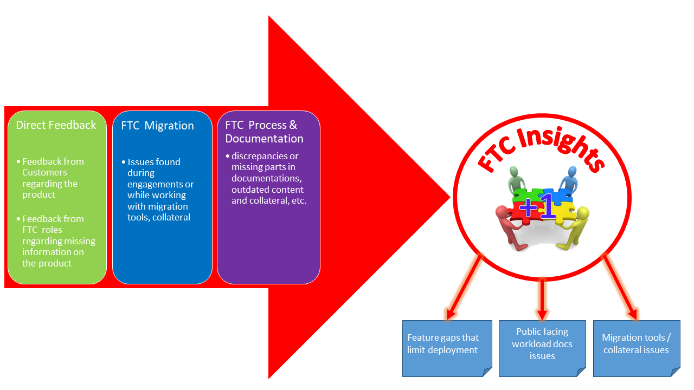

# FTC Insights Triage Process
### Sections

**[FTC Insights Triage Workflow](workflow.md)**

- **[Tier 1 Triage Workflow](workflow-t1.md)**

- **[Tier 2 Triage Workflow](workflow-t2.md)**

- **[Tier 3 Triage Workflow](workflow-t3.md)**

**[Sending Post-Triage Meeting Status Notes](notes.md)**

**[Using Azure DevOps for FTC Insights](ado.md)**

**[FTC Insights Logistics](logistics.md)**

## Introduction to FTC Insights
The FTC Insights program has been included as part of the FastTrack Center's core priorities, and the process and structure has been revised. Initially the Insights portal was created to help FTC team members to provide consolidated feedback. It was one of the various things the FTC was doing to improve the customer experience with onboarding by providing feedback to CXP and the Office 365 Product Groups about customer pain, difficulties, issues, missing documentation etc. 

Keeping in mind the number of O365 customers worldwide, it is pretty obvious that triaging, prioritizing, understanding and solving the requests with appropriate feedback to the product feature teams and other stakeholders becomes a very important instrument and is now gaining improved visibility across the organization. 
- The original idea: collect and count feedback over occurrences to identify the top issues and provide feedback to product feature groups and other instances with a *valid number of occurrences*
- The current idea: same as above but today we are looking more for a *valid impact* along with the number of occurrences
- The submission portal: The [FTC Insights Desktop PowerApps](https://aka.ms/ftcinsights) is where submissions are created and supports the ability to add an occurrence **+1** to existing items

## Scope
The goal of FTC Insights is to track **emerging issues** recurrently faced or reported by customers during onboarding. They can be issues related to FastTrack processes, FastTrack onboarding collateral, product features, and product documentation.

**Out of scope**
- Issues that are outside of the FastTrack Center benefit service description
- Issues that directly block a specific workload from being deployed during an engagement where leadership needs to be alerted that a customer is blocked and can make no further progress onboarding 
	- The customer should be flagged as ***Blocked*** in FTOP using the appropriate L3 Service Entitlement Status
	- In this case FM/FE should directly refer to *FTC Help* and raise a ticket for immediate attention
- Customer escalations 
	- An onboarding failure or migration event that causes problems for the customer
	- Other urgent issues that need immediate escalation 
	- Security or data leak or breach incidents – if you believe that a customer's data or FastTrack internal data has been leaked or breached, it is critical that you engage the appropriate response teams without delay. Treat all security and privacy incidents as "Need to Know" (NTK). Share incident details only with the correct team, securely.
		- [Incident Reporting Process Guidance](https://microsoft.sharepoint-df.com/:b:/t/FastTrackSecurityAllHands58/ESpCV8MinMFMngZOU8kFrbIB-oeXC9dOvVftBVMib-actA?e=yhB2hQ)

**Incorrect use of FastTrack Center Insights**  
Requests on **How-to** questions for a product related inquiry, advisory type of questions etc. These kind of queries can be directly posted into the appropriate Teams channels and are subject to be removed from the FTC Insights portal.

### FTC Insights short URL reference
How-To FAQ [https://aka.ms/ftcinsightsfaq](https://aka.ms/ftcinsightsfaq)  
FTC Insights Submission Portal [https://aka.ms/ftcinsights](https://aka.ms/ftcinsights)  
Create a new FTC Insight [https://aka.ms/ftcinew](https://aka.ms/ftcinew)  
FTC Insights BI Report [https://aka.ms/ftcireporting](https://aka.ms/ftcireporting)  
Triage Process documentation (this site) [https://aka.ms/ftcitriage](https://aka.ms/ftcitriage)  
Detailed triage workflow diagram [https://aka.ms/ftciflowdetail](https://aka.ms/ftciflowdetail)

**Azure DevOps Triage Dashboards**  
Overview [https://aka.ms/ftci_ADO](https://aka.ms/ftci_ADO)  
Tier 1 [https://aka.ms/ftciT1](https://aka.ms/ftciT1)  
Tier 2 [https://aka.ms/ftciT2](https://aka.ms/ftciT2)  
Tier 3 [https://aka.ms/ftciT3](https://aka.ms/ftciT3)  
