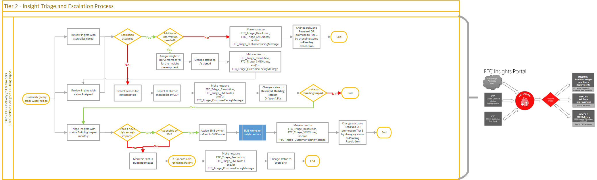
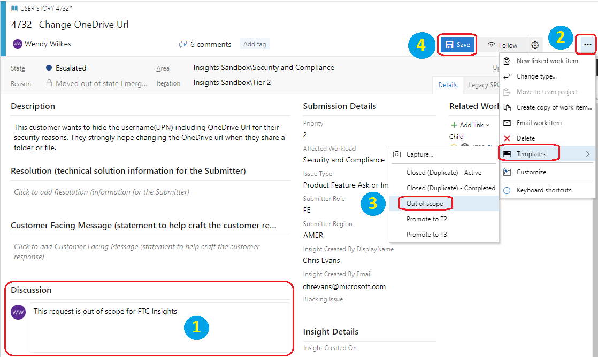
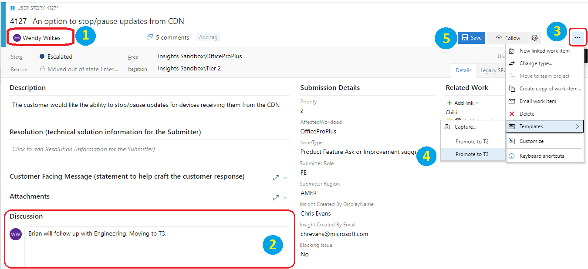

# Tier 2 Triage Team
The FTC Insights Tier 2 Triage team is composed of the Ops PM for each workload, the Workload PM, a Tier 1 Triage SME, and other stakeholders as appropriate for each workload. They will review the qualified FTC Insights from Tier 1 and take appropriate actions on each item. Tier 2 Triage is responsible for reviewing and processing items with statuses of ***Escalated***, ***Assigned***, and ***Building Impact***. It is expected that ownership be assigned to one of the Tier 2 representatives according to the area it is being escalated to. If ownership is assigned to the Tier 1 SME, they can reassign to another Tier 1 SME if needed and send them an e-mail to let them know they need to follow up on the item. Each Feature Engineering Team will have unique requirements for item escalation and it is the responsibility of the Workload PM to gather and communicate those requirements to the Tier 2 Triage team.

## States
The current list of **[FTC Insights States](../status.md)** can be found in the FTC Insights FAQ. *State* for the Triage Team maps to *Status* in the submission portal.

## Tier 2 Triage [Escalated]
Review and triage Insights with a status of ***Escalated*** for [scope](index.md#scope), accuracy, proper description, and meeting the Feature Engineering Team threshold.
- If the item is outside of the scope for FTC Insights apply the template **Out of scope** (removes owner if assigned, sets **State** to **Closed (Denied)**, updates **Resolution** with *"out of scope"* statement)
    1. Provide the relevant information in the **Discussion** field 
    2. Click on the **…** in the top right corner of the item
    3. Expand **Templates** and choose **Out of scope**
    4. **Save** the item
    
    
 
- If the description is insufficient for Tier 2 to investigate the item, or scope cannot be confirmed based on existing information, the item can be sent back to Tier 1 for review by applying the template **Pass back to T1** (removes owner if assigned, sets **State** to **Emerging Issue**, updates **Iteration Path** to **Tier 1**, clears the Customer Facing Message)
    1. Provide the relevant information in the **Discussion** field 
    2. Click on the **…** in the top right corner of the item
    3. Expand **Templates** and choose **Pass back to T1**
    4. **Save** the item
- If the item is inaccurate or a known workaround exists, and work needs to take place outside of the Triage meeting
    1. Assign a SME as the owner
    2. Update the **State** to **Assigned** 
    3. Provide the relevant information in the **Discussion** field for tracking and transparency (this field is for triage use only and is not visible to the submitter)
    4. **Save** the item
- If the description is insufficient for escalation to Tier 3 but the item is likely within the scope of FTC Insights
    1. Assign a SME as the owner
    2. Update the **State** to **Assigned**
    3. Provide the relevant information in the **Discussion** field for tracking and transparency 
    4. **Save** the item
- If the item is qualified for escalation to Tier 3 Triage but the engineering impact threshold has not been met apply the template **Building Impact** (removes owner if assigned, sets **State** to **Building Impact (more evidence needed)**, updates **Resolution** with *"building impact"* statement)
    1. Provide the relevant information in the **Discussion** field 
    2. Click on the **…** in the top right corner of the item
    3. Expand **Templates** and choose **Building Impact**
    4. **Save** the item
- If the item is qualified for escalation to Tier 3 Triage apply the template to **Promote to T3** (sets **State** to **Pending Resolution**, sets **Iteration** to **Tier 3**, adds Customer Facing Message update)
    1. Assign to the correct owner
    2. Provide the relevant information in the **Discussion** field
    3. Click on the **…** in the top right corner of the item
    4. Expand **Templates** and choose **Promote to T3** 
    5.	**Save** the item  

  

## Tier 2 Triage [Assigned]
Review and triage Insights with a State of ***Assigned*** for [scope](index.md#scope), accuracy, proper description, and meeting the Feature Engineering Team threshold.
- If the item is rejected for escalation to Tier 3 
    1. Remove the owner (if assigned)
    2. Update the **State** to **Closed (Denied)**
    3. Provide the relevant information in the **Discussion** field for tracking and transparency
    4. Provide the reason for not accepting the item into the **Resolution** field
    5. Provide the **Customer Facing Message**
    6. **Save** the item
- If the item is qualified for escalation to Tier 3 Triage but the engineering impact threshold has not been met apply the template **Building Impact** (removes owner if assigned, sets **State** to **Building Impact (more evidence needed)**, updates **Resolution** with *"building impact"* statement)
    1. Provide the relevant information in the **Discussion** field 
    2. Click on the **…** in the top right corner of the item
    3. Expand **Templates** and choose **Building Impact**
    4. **Save** the item
- If a known workaround exists for the item and the details are ready to add
    1. Remove the owner
    2. Update the **State** to **Resolved (Education)**
    3. Provide the relevant information in the **Discussion** field for tracking and transparency
    4. Provide the relevant information in the **Resolution** field for communication to the Submitter 
    5. **Save** the item
- If the item is qualified for escalation to Tier 3 Triage apply the template to **Promote to T3** (sets **State** to **Pending Resolution**, sets **Iteration** to **Tier 3**, adds Customer Facing Message update)
    1. Assign to the correct owner
    2. Provide the relevant information in the **Discussion** field
    3. Click on the **…** in the top right corner of the item
    4. Expand **Templates** and choose **Promote to T3** 
    5. **Save** the item  
    
## Tier 2 Triage [Building Impact]
Review and triage Insights with a status of ***Building Impact*** for [scope](index.md#scope), accuracy, proper description, and meeting the Feature Engineering Team threshold.
- If the item is qualified for escalation to Tier 3 Triage apply the template to **Promote to T3** (sets **State** to **Pending Resolution**, sets **Iteration** to **Tier 3**, adds Customer Facing Message update)
    1. Assign to the correct owner
    2. Provide the relevant information in the **Discussion** field
    3. Click on the **…** in the top right corner of the item
    4. Expand **Templates** and choose **Promote to T3** 
    5. **Save** the item   
- If the item has been in ***Building Impact*** status for 6 months it should be retired. Apply the template **Low Impact** (removes owner if assigned, sets **State** to **Closed (Low Impact)**, updates **Resolution** with *"low impact"* statement, clears Customer Facing Message)
    1. Provide the relevant information in the **Discussion** field 
    2. Click on the **…** in the top right corner of the item
    3. Expand **Templates** and choose **Low Impact**
    4. **Save** the item
