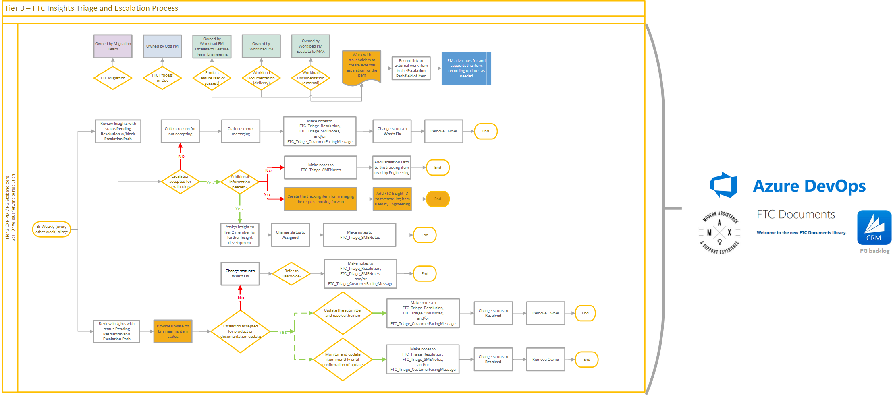
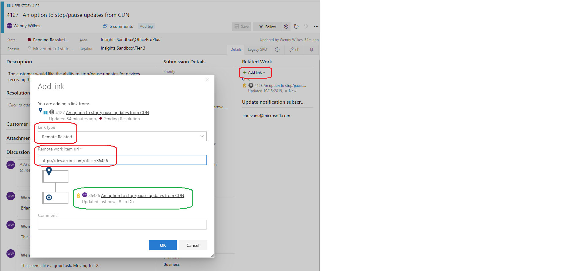

# Tier 3 Triage Team
The FTC Insights Tier 3 Triage team is composed of the Workload PM, the Ops PM for each workload, and other stakeholders as appropriate for each workload. They will review the qualified FTC Insights from Tier 2 and take appropriate actions on each item. Tier 3 Triage is responsible for reviewing and processing items with the status of **Pending Resolution**. It is expected that ownership be assigned to the Tier 3 representatives according to the area it is being escalated to.

## States
The current list of **[FTC Insights States](../status.md)** can be found in the FTC Insights FAQ. *State* for the Triage Team maps to *Status* in the submission portal.

## Tier 3 Triage [Pending Resolution]
Review and triage Insights with a status of **Pending Resolution** to ensure that issues are making progress and updates are being delivered to the submitter of the item. These items should be reviewed and updated by their owners at least monthly. Many T2 Triage teams find it helpful to spend some time in their scheduled call to review the pending items.
- If the item has an issue type of ***FTC Migration*** it is the responsibility of the FastTrack Migration Team to resolve 
    - Assign an owner to drive the item to resolution
    - These items are tracked within FTC Insights
    - These items may result in CMRs for implementation of the change
- If the item has an issue type of ***FTC Process or Docs*** it is the responsibility of the Ops PM to resolve 
    - Assign an owner to drive the item to resolution
    - These items are tracked within FTC Insights
    - These items may result in CMRs for implementation of the change
- If the item has an issue type of ***Product Feature Ask or Improvement suggestion*** it is the responsibility of the Workload PM to resolve 
    - Assign an owner to drive the item to resolution
    - These items are tracked outside of FTC Insights
        - Working with the external stakeholder, create the work item for their review
        - Add the link to the external work item to the FTC Insight item in the **Triage Escalation Path (if no Remote Related link)**. If the external stakeholder item tracking system supports it, add the FTC Insight item number or URL to their system for cross-linking. If the external stakeholder item is in Azure DevOps add a **Remote Related** link.
            1. Record the URL for the escalated external work item
            2. Click on **Add** link in the **Related Work** section of the FTC Insight item
            3. Choose **Existing item**
            4. Select **Remote Related** from the **Link type** list
            5. Enter the remote work item URL 
            6. Confirm that the expected object resolves

                
                
            7. Click on **OK**
- If the item has an issue type of ***Workload Documentation*** it is the responsibility of the Workload PM to resolve 
    - Assign an owner to drive the item to resolution
    - These items are tracked outside of FTC Insights
    - Working with the external stakeholder, create the work item for their review
    - Add the link to the external work item to the FTC Insight item in the **Triage Escalation Path (if no Remote Related link)**. If the external stakeholder item tracking system supports it, add the FTC Insight item number or URL to their system for cross-linking. If the external stakeholder item is in Azure DevOps add a **Remote Related** link.
        1. Record the URL for the escalated external work item
        2. Click on **Add** link in the **Related Work** section of the FTC Insight item
        3. Choose **Existing item**
        4. Select **Remote Related** from the **Link type** list
        5. Enter the remote work item URL 
        6. Confirm that the expected object resolves
        7. Click on **OK**
- At the monthly item review provide the relevant information in the **Discussion** field
- If an item is **rejected** by the external stakeholder and has an active UserVoice submission, it should be retired
    - Apply the template **UserVoice - Active** (removes owner if assigned, sets **State** to **Closed (UserVoice)**, updates **Resolution** and **Customer Facing Message**)
        1.	Provide the relevant information in the **Discussion** field 
        2.	Click on the **…** in the top right corner of the item
        3.	Expand **Templates** and choose **UserVoice - Active**
        4.	Update the *UserVoice link* in the **Customer Facing Message** field to the correct link
        5.	Review the **Customer Facing Message** statement and make any desired edits 
        6.	Review the **Resolution** statement and make any desired edits  
        7.	**Save** the item
- If an item is **rejected** by the external stakeholder without an active UserVoice submission, it should be retired and the customer referred to UserVoice when available
    - Apply the template **UserVoice - New** (removes owner if assigned, sets **State** to **Closed (UserVoice)**, updates **Resolution** and **Customer Facing Message**)
        1.	Provide the relevant information in the **Discussion** field 
        2.	Click on the **…** in the top right corner of the item
        3.	Expand **Templates** and choose **UserVoice - New**
        4.	Update the *UserVoice link* in the **Customer Facing Message** field to the correct link
        5.	Review the **Customer Facing Message** statement and make any desired edits 
        6.	Review the **Resolution** statement and make any desired edits  
        7.	**Save** the item
- Once an item is **Accepted** by the external stakeholder you can update the submitter right away and close the item or you can continue to monitor until confirmation of the update can be established. 
    - To resolve the item once it has been accepted: 
        - Apply the template **Resolved (Accepted)** (removes owner if assigned, sets **State** to **Resolved (Accepted)**, updates **Resolution** and **Customer Facing Message**)
            1.	Provide the relevant information in the **Discussion** field 
            2.	Click on the **…** in the top right corner of the item
            3.	Expand **Templates** and choose **Resolved (Accepted)**
            4.	Review the **Customer Facing Message** statement and make any desired edits 
            5.	Review the **Resolution** statement and make any desired edits  
            6.	**Save** the item
    - To continue to monitor until confirmation of update can be established:
        - Continue to review and update the item at least monthly
        - Provide the relevant information in the **Discussion** field
        - Once the change has been released, apply the template **Resolved (Deployed)** (removes owner if assigned, sets **State** to **Resolved (Deployed)**, updates **Resolution** and **Customer Facing Message**)
            1.	Provide the relevant information in the **Discussion** field 
            2.	Click on the **…** in the top right corner of the item
            3.	Expand **Templates** and choose **Resolved (Deployed)**
            4.	Review the **Customer Facing Message** statement and make any desired edits 
            5.	Review the **Resolution** statement and make any desired edits 
            6.	**Save** the item
