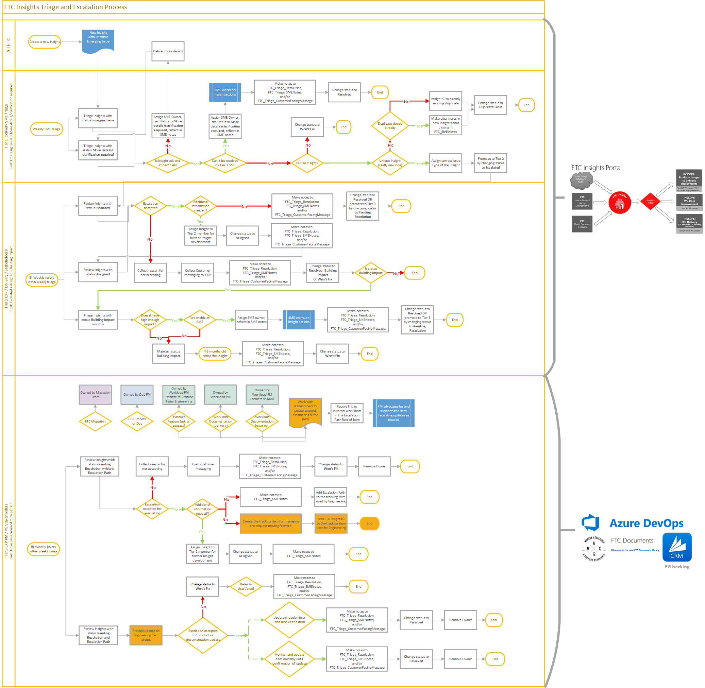
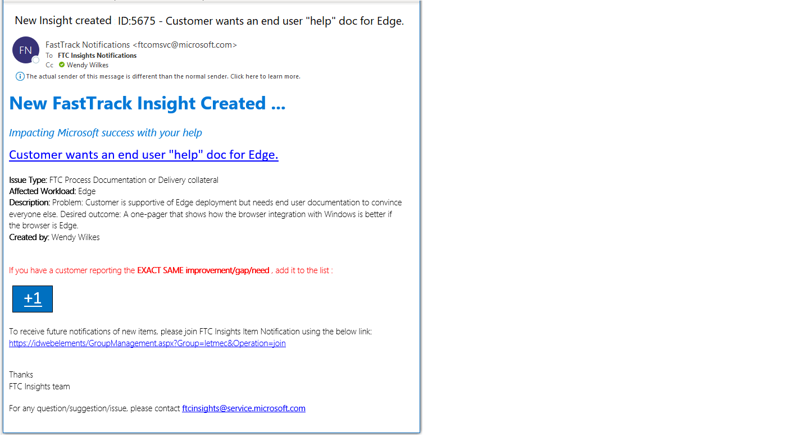
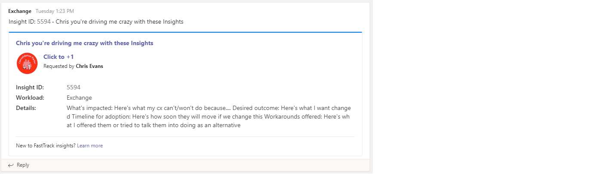
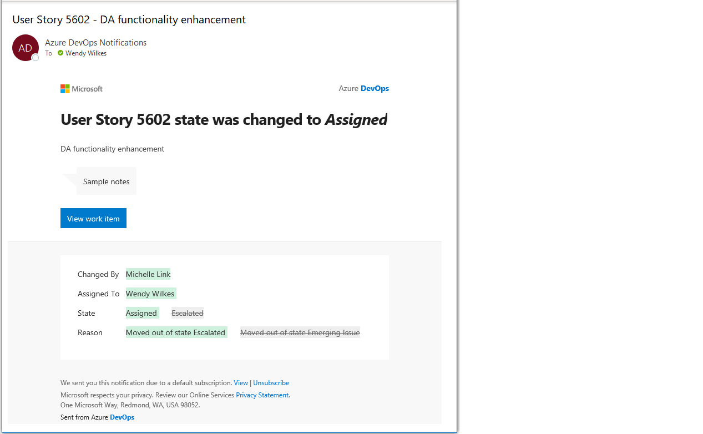

# FTC Insights Triage Workflow
This framework is designed to be flexible when needed, but prescriptive enough to provide a consistent process across workloads. The process itself is independent of the backend storage used for tracking the items. The backend infrastructure for FTC Insights is Azure DevOps, and occasionally specific guidance on how to accomplish the recommended updates has been included where it seemed helpful. This [page](ado.md) contains some more detailed information on the mechanics of our implementation. First time Triage Team members may want to start with this page.

Communication throughout the lifecycle of an FTC Insight item is very important, and this process is designed to improve item documentation, as well as encourage sharing post-meeting status updates. The key attribute for managing each level of triage is the FTC Insights item ***State***. 

## States
The current list of **[FTC Insights States](../status.md)** can be found in the FTC Insights FAQ. *State* for the Triage Team maps to *Status* in the submission portal.

## Issue Types
The following issue types are supported within the FTC Insights Process:
- **Product Feature Ask or Improvement suggestion:**  Asks that will ***unblock*** the ability to deploy FastTrack supported workloads
- **Workload Documentation (public facing, i.e. TechNet, Support, Docs):**  Enhancements to ***public*** workload documentation to improve ease of use
- **FTC Migration (Guidance, Tools, Migration docs, asks):**  Related to the ***FastTrack Migration*** benefit guidance, collateral, tooling (Exchange Online and OneDrive migration)
- **FTC Process, Documentation or delivery collateral:**  Feedback about ***how*** we can expedite engagements by augmenting the FTC guidance and supporting workload collateral
## Submitter
All Delivery roles in FTC can participate in FTC Insights either by clicking the **+1** button to add a new occurrence to an existing item or by submitting a new item. 
1.	Submitter identifies an issue or an improvement and visits the FTC Insights submission portal
2.	Submitter checks to see if this or a similar issue was already reported
3.	Submitter either adds a new occurrence **(+1)** or creates a new item

**If entry already exists**

Submitter may use the **+1** option to add their customer tenant GUID* directly to the existing Insight.
- From the portal search results directly on the item
- From the e-mail received 
- From the Teams message card in its respective channel

**If new FTC Insight is created**
- Submitter starts a new FTC Insight and adds their customer tenant GUID* (aka ID which is found in FTOP) 
- A notification e-mail will be sent to FM and FE community regarding the newly created item which supports the ability to add their own **+1**
- A message card is posted via webhook in the Teams Channel for the workload which supports the ability to add their own **+1**
- Submitter that created this entry adds any of their other customer tenant GUIDs* using the +1 option
- Updates for items can be subscribed to through the submission portal 
- Subsequent changes to *State* trigger an e-mail to the submitter, the +1 contributors, and subscribers

> [!IMPORTANT]
> No customer names or other direct PII is to be used in the FTC Insight item due to GDPR and privacy rules.

## The Triage Team
The Triage Team is made up of people from all across FastTrack. Many workloads include *gourmet* team members from outside of the FTC who find participation in the FTC Insights Triage meetings to be useful/helpful/educational. Access to the FTC Insight items is managed through security groups defined for each workload, as well as each level of triage. Only members of the triage security groups can be assigned as owners of an FTC Insight.

- Primary contacts for the Triage Teams can be found **[here](poc.md)** 
- Triage Team security groups, and their owners, can be found **[here](logistics.md#azure-devops-triage-team-security-groups)** 
- Triage roles and responsiblities can be found **[here](roles.md)**

## Triage Flow
A high level view of the triage flow, as well as a breakdown of the triage roles, can be found **[here](../tiers.md)** in the *FTC Insights FAQ*. 

The detailed triage flow is shown in the following diagram. Please review the workflow and escalate any questions you have to your FTC Insights Lead. 
*The full Visio file is available [here](https://aka.ms/ftciflowdetail)*.

## Submitter Notifications
### E-mail
When a new item is submitted, a notification e-mail will be sent to the FM and FE community regarding the newly created item which supports the ability to **+1**. Subsequent changes to *State* trigger an e-mail to the submitter, the +1 contributors, and subscribers.

Notifications are sent to **FTC Insights Notifications** *(ftciAlerts)*

### Integration with Teams
Using webhooks and Flow, we have introduced another avenue to encourage discussion for FTC Insights. In addition to an e-mail message, new Insights trigger a message card being posted within the workload's FastTrack Team Channel. These message cards support the ability to click through to the item as well as click through to +1 the item.

 
Discussion which takes place in Teams cannot automatically be updated in the item. Because of this we have some recommendations for managing the items:
- If a member of the FTC Insights Triage Team engages in the Teams conversation for the item, they should click through to the item and take ownership. They would be responsible for putting the relevant details in the SME Notes field prior to the next triage meeting
    - If a Tier 1 Triage member, take ownership and update the status to **More details/clarification required**
    - If a Tier 2 Triage member, take ownership and update the status to **Assigned**
- If no member of the FTC Insights Triage Team engages in the Teams conversation for the item, the expectation is that the item would be managed through Triage
    - If there are questions on the item which were already answered in Teams, the submitter would be expected to be able to provide that information upon investigation for the item triage

## Triage Team Notifications
Azure DevOps includes some default notifications.
- Notification to the owner of an item when it is updated
- Notification to anyone who is @mentioned in the item

> [!IMPORTANT]
> It is also possible to @ mention non-Triage Members, however ***they will not have access to the items***. Conversation with non-Triage Members should be managed outside of ADO. 