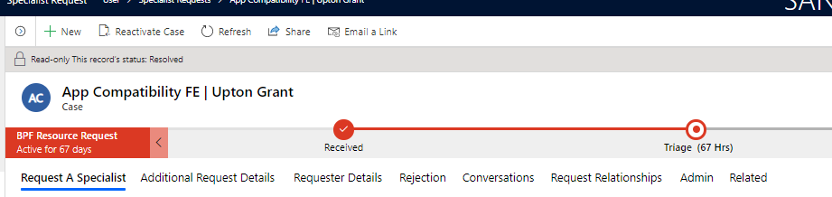
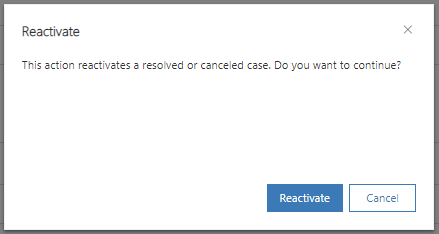

---
# required metadata
title: FastTrack Center Resource Request Approver User Guide - Frequently Asked Questions
description: Process guidance for FastTrack Center users who need to approve resources.
author: Connie Brenden
ms.author: v-conbre
manager: jimmuir
ms.date: 5/5/2020
ms.topic: help-guide
ms.prod: non-product-specific
ms.custom: help-guide
ft.audience: internal
ft.owner: jimmuir
---
# Frequently Asked Questions

## Scenario

Our assignment teams cannot find any documentation on how to change a status of a SME request after it is completed.  We need this ability.  There are situations where a request may be originally rejected, but then an issue resolved, and assignment could continue instead of a new request being submitted.

## Response

Once the request is completed, there’s an internal flow that is Resolving the Case. In this scenario, the form will show as Read-Only and will not allow the user to continue working.

In order to continue with this case, select **Reactivate Case** in the upper menu and confirm in the pop-up. This will allow the user to continue with the approval process.

## Next steps

See [Onboarding Assignments Business Rules](onboarding-assignments-business-rules.md)
