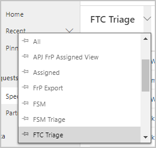
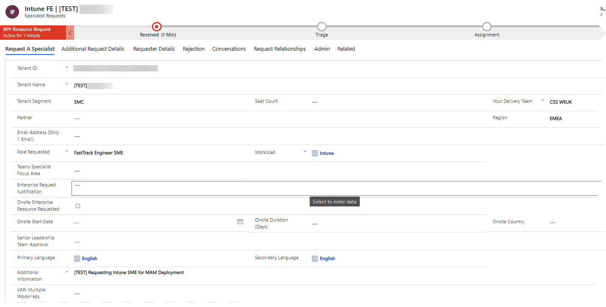
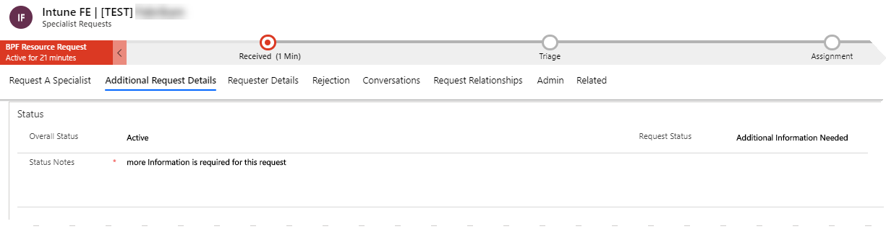
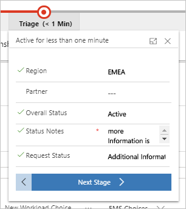

---
# required metadata
title: FastTrack Center Resource Request Approver User Guide - How to Request More Details
description: Process guidance for FastTrack Center users who need to approve resources.
author: Connie Brenden
ms.author: v-conbre
manager: jimmuir
ms.date: 2/28/2020
ms.topic: help-guide
ms.prod: non-product-specific
ms.custom: help-guide
ft.audience: internal
ft.owner: jimmuir
---
# How to Request More Details

Once a request is submitted you can find it in the [Management Portal](https://aka.ms/ftcreqmanagement):

Review newly submitted requests on a first in, first out basis. Select the preferred view for triage, either FTC Triage or FRP Triage in the view selector in the left upper corner:

You may filter by Region or POD as necessary. Double-click the request to open it. Once the request is open, you have access to all the details provided by the requestor:

If additional information is required to process the request, document what additional information is needed and why in the Status Notes field & set the Request Status to Additional Information Needed.

Initiate the triage flow

1. Make sure the request is in the **Triage** stage.

1. Input your “**Status Notes**” (it is important to do this before proceeding to step #3)

1. Do not click the “**Next Stage**” button until you have the additional information to decide whether to approve or reject the request. You can also click the save icon at the bottom right of the browser window to save the changes and send the email immediately.

1. Now you can change Request Status to “**Additional Information Requested**”.

Once you do this, the “**Status Notes**” added will be auto-saved in 30 seconds and an email notification will be sent automatically to the requester asking for additional information.

The request should be kept in this stage until it’s ready for assignment or rejection. Once the information is received, you can continue with the flow.

## Next steps

See [How to Reject a Request](how-to-reject-a-request.md)
