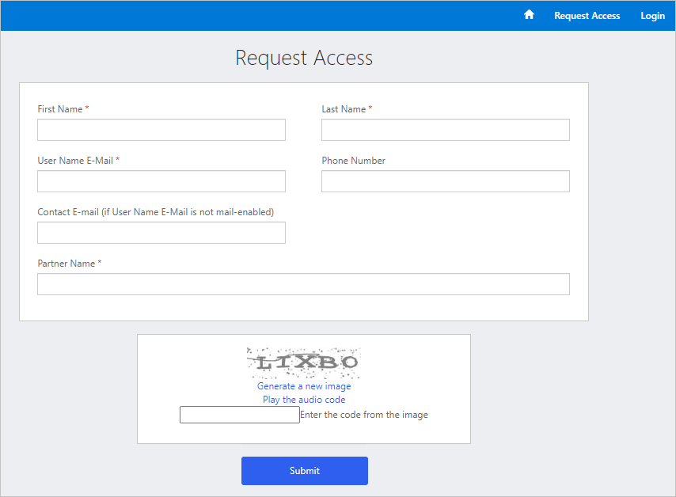
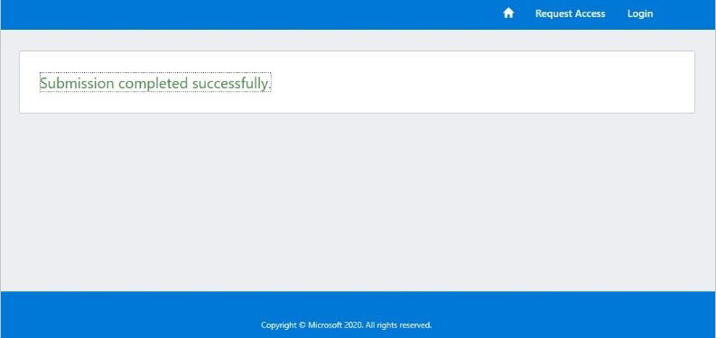
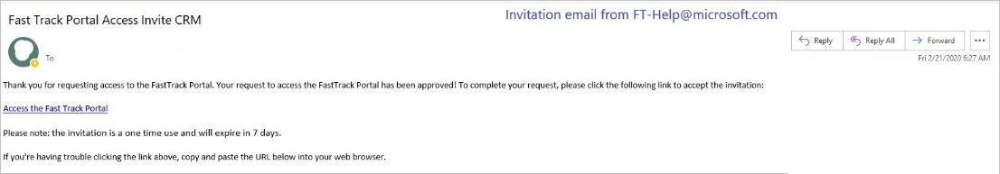
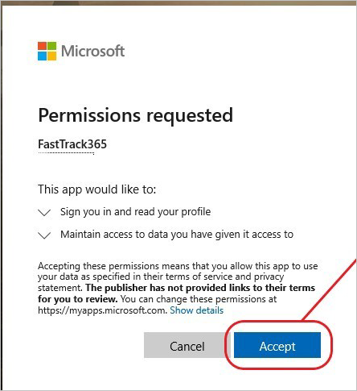
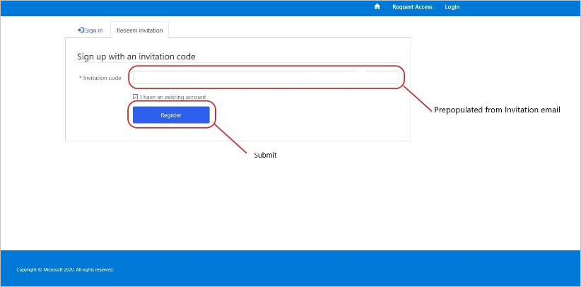

---
# required metadata
title: FastTrack Center Resource Request Requester User Guide - How to Request Access (Partners)
description: Process guidance for FastTrack Center users who need to request resources.
author: Connie Brenden
ms.author: v-conbre
manager: jimmuir
ms.date: 3/2/2020
ms.topic: help-guide
ms.prod: non-product-specific
ms.custom: help-guide
ft.audience: internal
ft.owner: jimmuir
---

# How to Request Access (FRP)

FastTrack Ready Partners (FRP), must follow a registration process.

All existing & new contacts at FRP, who are responsible for submitting SME requests, will need to register on the new platform, starting February 28th. Without the registration, they will no longer be able to submit SME requests.

To log in to the tool:

1. Access the FRP SME Request site [frpsmerequest](https://aka.ms/frpsmerequest)

2. Select **Request Access**.

3. Fill in the registration information.

Once the submission is completed, the requestor will receive an email.

The email contains the invitation and next steps.

4. Access the link provided in the accept invitation email.

5. Add the invitation code.

6. Sign up with the invitation code.

Follow the steps to request a resource.

## Next steps

[How to Submit a Resource Request](how-to-submit-a-resource-request.md)
