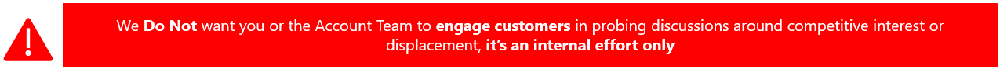
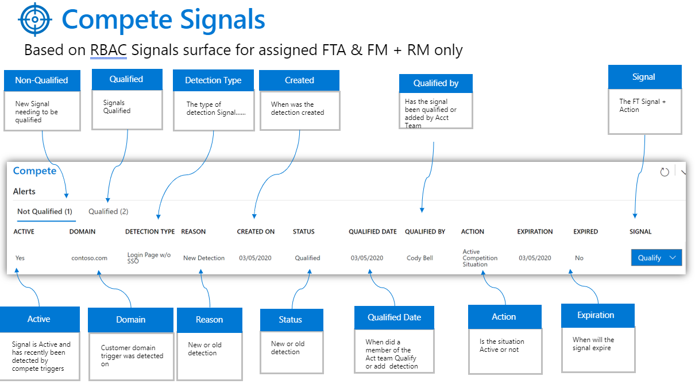
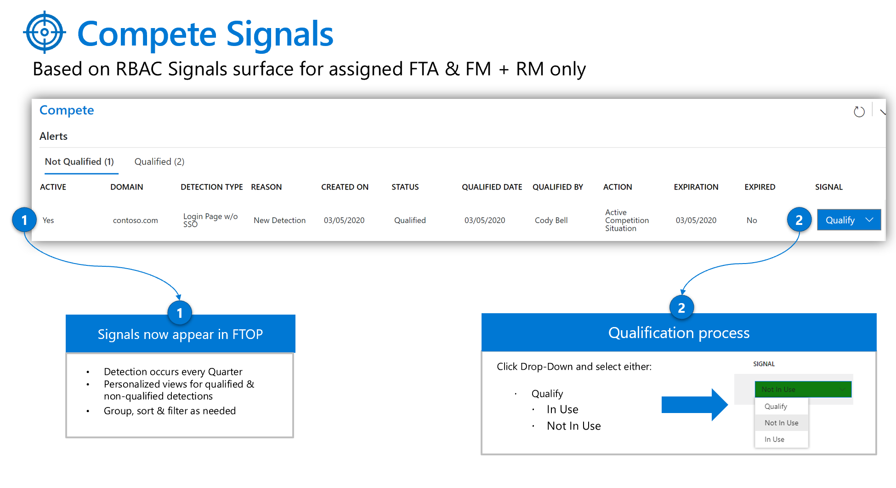
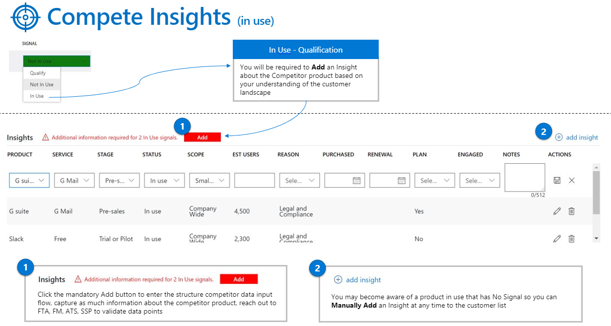
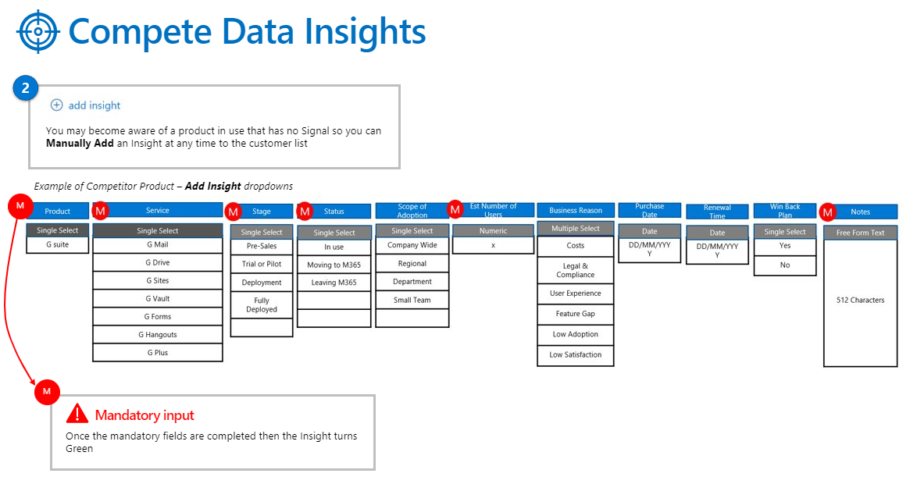

---
# required metadata
title: FTOP User Guide - Customer View - Compete
description: Process guidance for internal FTOP users.
author: Connie Brenden
ms.author: v-conbre
manager: jimmuir
ms.date: 4/21/2020
ms.topic: ftop-user-guide
ms.prod: non-product-specific
ms.custom: ftop-user-guide
ft.audience: internal
ft.owner: jimmuir
---

# Compete

## Overview

The compete section is available in the Customer View to display customer compete signals. Compete signals are gathered from publicly available sources or from account team insights to determine if a customer may be using a competitor's product in test or production.

If an FM or FTA has any supporting knowledge of a compete signal, they can qualify the validity of the signal based on insight and provide details of the product in use based on conversations with the account team or general knowledge.

>[!NOTE]
>**FastTrack Managers and FastTrack Architects**: When having conversations with your customers, **do not** discuss how alerts are captured by Microsoft and FastTrack. During discussions, our recommendation is to determine if a specific workload is in scope, if that workload is not in scope and the customer highlights they are looking at competitor products, inquire to what competitor product it is to gain further insights.

### Procedure

#### To update your customer compete signals

1. Open the compete page within FTOP.

1. Review the active alerts for your customers. The screen shot below details the meaning of each column.

3. If the signal column on the far right is set to Qualify, select the correct drop-down item based on your insight or knowledge of whether the product is in use or not in use.

4. If you select IN USE, Click the mandatory Add button to enter the structured competitor data input flow for each signal. Capture as much information about the competitor product as you can, reach out to FTA, FM, ATS, SSP to validate data points when possible.

5. If you become aware of a product in use that is not listed as a signal, you can manually add it by clicking ADD INSIGHT, top right.

## Resources

- [FastTrack Compete Training H2](https://aka.ms/AA7sc1q)

>[!TIP]
>When you launch the video, right-click, select Open in new tab.

## Next steps

To learn about the next view, see [**Contacts**](customer-contacts.md).
