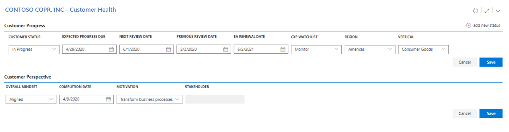
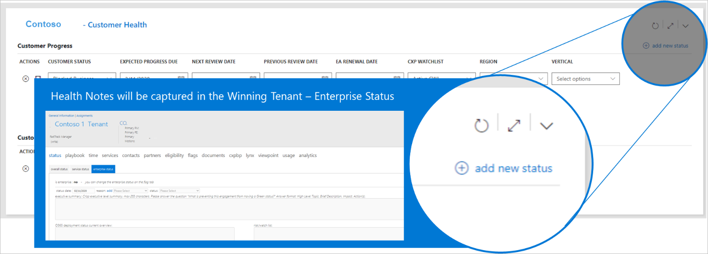

---
# required metadata
title: FTOP User Guide - Customer View - Customer Health
description: Process guidance for internal FTOP users.
author: Connie Brenden
ms.author: v-conbre
manager: jimmuir
ms.date: 4/27/2020
ms.topic: ftop-user-guide
ms.prod: non-product-specific
ms.custom: ftop-user-guide
ft.audience: internal
ft.owner: jimmuir
---

# Customer Health

## Overview

The Customer Health view is available for the customer selected in the summary. The custom name will display in section header to provide confirmation of the current customer.

The assigned customer health approach resources use this view to maintain the current health status.

These values are updated by the assigned health FM or FTA. Note that the existing values will be updated. Refer to this table for an explanation of each field. You must select the pencil icon to edit the entries. Click **Save** to commit your edits in each section. To suspend current changes click **Cancel** to return the values before starting your edit.

### Customer Progress

The health FM/FTA should update the following values as part of the recurring activities.

|Field  |Type  |Explanation  |
|---------|---------|---------|
|Customer Status    |Selection         |**In Progress** indicates the customer is engaged with the FTC, Partner, or self-led, and have intent to move forward. **Blocked Business** indicates the customer has intent, but cannot move forward due to a blocker outside of FTC influence. **Blocked Technical** indicates the customer has a blocker that may be within FTC or other Microsoft department influence, technical in nature. **No intent** indicates the customer might be completely unresponsive or using competitor products.         |
|Expected Progress Due  |Date         |Date expected for customer to reach new progress milestone.         |
|Next Review Date   |Date         |Date for the next status review.         |
|Previous Review Date    |Date         |Date of prior review.         |
|CXP Watchlist    |Selection         |Indicate current watchlist status.         |
|Region    |Selection         |Select the region assigned for health activities.          |
|Vertical    |Selection         |What is the overall best vertical/industry selection to match the Customer all-up.         |

### Customer Perspective

Record the current overall customer view.

|Field  |Type  |Explanation  |
|---------|---------|---------|
|Overall Mindset  |Selection         |**Aligned** indicates the customer has an overall strategy that is "Pro Microsoft cloud". **Averse** indicates the customer is opposed, overall, to moving to the cloud. **Compete** indicates the customer is aligned with moving to the cloud, but with a competitor.         |
|Completion Date  |Date         |Expected completion date of the onboarding project.         |
|Region   |Selection      |Customer’s primary  business reason for purchasing M365 licenses.         |
|Vertical   |Selection     |Customer Contact who owns the success of the onboarding project. (To select you must enter customer contacts in the contacts widget.)   |

## Enterprise Status Notes

To record enterprise status notes select the “add new status” option. This will open a new tab and select the winner / reference tenant and set to the focus to the enterprise status notes.

Continue recording notes at this location. In the future these notes will be moved to the notes library.

## Resources

- FTOP [Customer Health Training](https://aka.ms/ftop/customertraining) Video 55:05 Minutes
- FTOP [Customer View - Customer Health](https://aka.ms/AA895a0) Video 2:08 Minutes
- FTOP [All Customer Walk-through Videos](../ftop-user-guide/customer-view-videos.md)
- FTOP [Customer Health Data Quality Guide](../customer-health-data-quality-guide/index.md)

>[!TIP]
>When you launch the video, right-click, select Open in new tab.

## Next steps

To learn about the next section, see [**Tenants**](customer-tenants.md).
