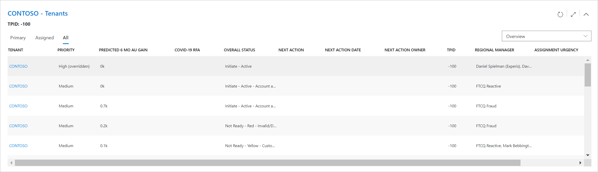
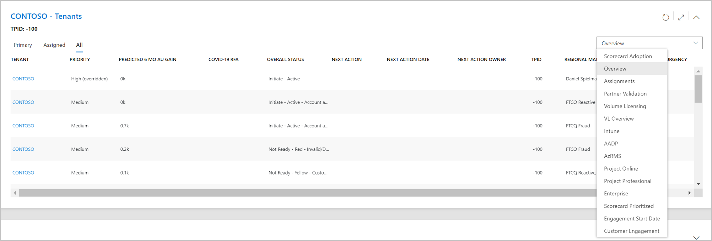

---
# required metadata
title: FTOP User Guide - Customer View - Tenants
description: Process guidance for internal FTOP users.
author: Connie Brenden
ms.author: v-conbre
manager: jimmuir
ms.date: 4/25/2020
ms.topic: ftop-user-guide
ms.prod: non-product-specific
ms.custom: ftop-user-guide
ft.audience: internal
ft.owner: jimmuir
---

# Tenants

## Overview

This section enables you to view all tenants associated to the selected customer in the summary section. This provides you a simple way to find all tenants associated to the selected customer as shown in this figure.

## Tenant displays

You can change the tenants section display by selecting the display options in the upper right. These are the same displays available in the tenants view, refer to the list of the [available displays](tenant-view-sorting-and-filtering-customer-information.html#display). Select the Scorecard Adoption view if you want to include the column to identify the winner tenant.

## Tenant selection

Selecting a tenant in the list will open the selected tenant in a new browser tab. Use this list to open the tenant to perform actions like executing playbook activities and updating entitlement status.

Customer Health playbook activities will be executed at the winner tenant.

>[!NOTE]
>If the customer has numerous tenants you should use the [**Tenant View**](tenant-view.html) to search for the tenant from the existing view. A future update is planned to enable search within the customer tenants section.

## Resources

- FTOP [Customer Health Training](https://aka.ms/ftop/customertraining) Video 55:05 Minutes
- FTOP [Customer View - Tenants](https://aka.ms/AA895a1) Video 0:58 Seconds
- FTOP [All Customer Walk-through Videos](../ftop-user-guide/customer-view-videos.md)

>[!TIP]
>When you launch the video, right-click, select Open in new tab.

## Next steps

To learn about the next section, see [**Compete**](customer-compete.md).
