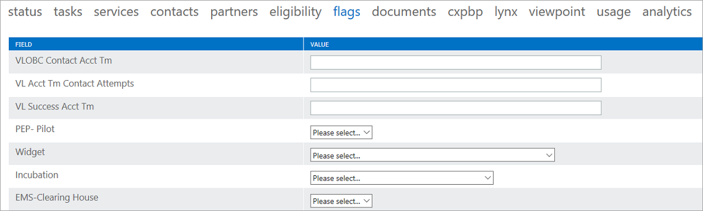

---
# required metadata
title: FTOP User Guide - Detailed Tenant View Flags Tab
description: Process guidance for internal FTOP users.
author: Connie Brenden
ms.author: v-conbre
manager: jimmuir
ms.date: 2/22/2019
ms.topic: ftop-user-guide
ms.prod: non-product-specific
ms.custom: ftop-user-guide
ft.audience: internal
ft.owner: jimmuir
---
# Flags tab

## Overview

The Flags tab includes editable fields that indicate certain aspects of customer health.

## Next steps

To learn about the next tab, see the [**Documents tab**](detailed-tenant-view-documents-tab.md).
