---
# required metadata
title: FTOP User Guide - Detailed Tenant View Services Tab
description: Process guidance for internal FTOP users.
author: Connie Brenden
ms.author: v-conbre
manager: jimmuir
ms.date: 5/21/2020
ms.topic: ftop-user-guide
ms.prod: non-product-specific
ms.custom: ftop-user-guide
ft.audience: internal
ft.owner: jimmuir
---
# Services tab

## Overview

The services tab provides information and status about the services available to the customer for deployment. You will spend most of your time working on this tab.

The service tab is divided into four sections: services overview, motions overview, detailed service overview, and editing services overview.

### Services overview

Services overview provides a general overview of all the services available.

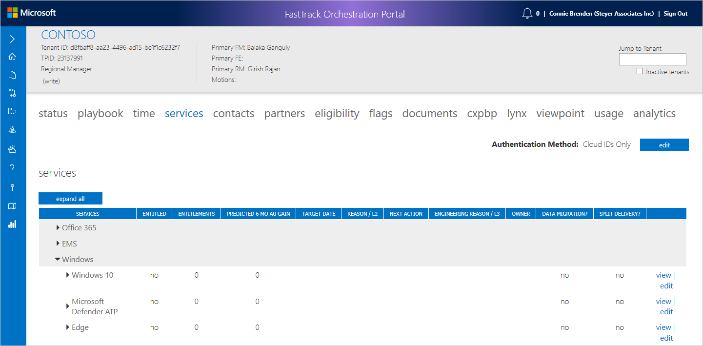

#### List of Services

- Office 365
    - Exchange
    - Exchange: Outlook Mobile
    - SfB (Skype for Business)
    - Teams
    - SharePoint
    - OneDrive
    - Yammer
    - OfficeProPlus
    - Project Professional
    - Project Online Professional/Premium
    - Project Online Essentials
    - Power BI
    - Classroom/SDS
    - Office 365 ATP
- EMS
    - Intune
    - AADP
    - MCAS
    - AIP
    - AzRMS
- Windows
    - Windows 10
    - Microsoft Defender ATP
    - Edge

>[!NOTE]
>Effective May 29, 2020, the legacy Edge browser is no longer supported.

>[!NOTE]
>Windows service **Windows Defender ATP** has been renamed to **Microsoft Defender ATP**.

Select the **name** of a specific service (or the arrow next to the name) to expand the service and display the consumption status (L1) for the service.

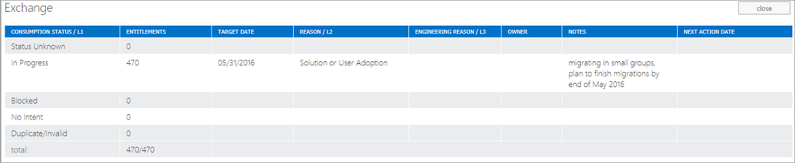

>[!NOTE]
>In cases where a tenant is flagged as eligible yet there are no entitlements shown, this is a known issue and you can verify the entitlements using [**ViewPoint**](https://support.office.net) or [**Lynx**](https://lynx.office.net).

### Motions overview

Three motions have been created, Customer Health, RFA, and Targeting. Customer Health applies to all services within a tenant. Request for Assistance (RFA) and Targeting are aligned to specific services.

- If a tenant is Customer Health, the targeting motion is in addition to the customer health motion, and the RFA motion cannot be added.

- Any tenant, except a Customer Health tenant, can have either or both RFA and Targeting motions.

#### RFA and Targeting

The following example shows a tenant with RFA and Targeting.

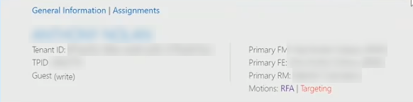

See the RFA icon  next to Exchange: Outlook Mobile and the Targeting icon next to Intune.

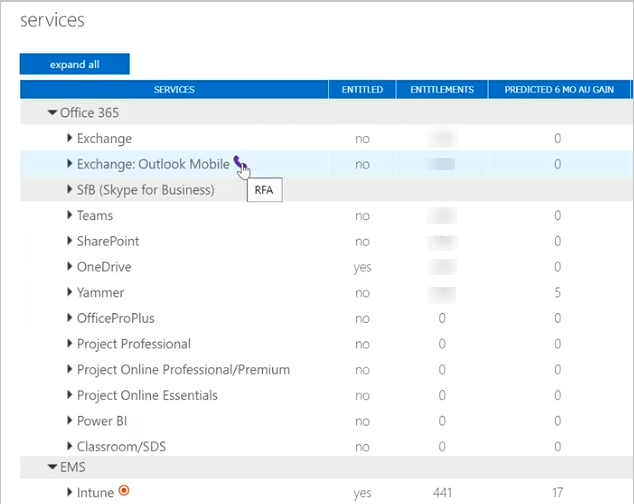

>[!NOTE]
>The above screen shows what services are entitled. This relates to the conditional menu of services that displays for each tenant.

### Detailed services overview

You can zoom-in to an individual service to see the detailed service view or service editing sections.

#### To view detailed services view

1. Select **View** to the right of the service to view the detailed service view or edit to open servicing editing.

### Editing services overview

You will complete all work in the editing services tab. The editing services tab is divided into seven sections: entitlement status, adoption indicators, data migration, delivery, FastTrack-ready partner forecasting, assignments, and note history.

*Save* and *cancel* buttons display at the top of the window. The buttons also display at the bottom of the page (not shown).

Select **Save** to save changes to the service before leaving the page.

#### Entitlements status

FastTrack Managers and some SME teams should utilize *Entitlement Status* notes, per [**FTOP Notes Guidance**](https://aka.ms/FTNotesGuidance), to provide a current, accurate technical picture of the entitlements in each workload. The Entitlement Status section enables you to update entitlement status for a service.

For specific L1 to L3 taxonomy definitions and example scenarios, see [Status and Entitlement Home](https://aka.ms/l1l2l3).

> [!NOTE]
> The entitlements must total the available entitlements. If the conditions are not met, you will see an error message.

When you open the Services tab, the services display. Within services you can add, edit, or delete entitlements when you have the appropriate permissions to the tenant.

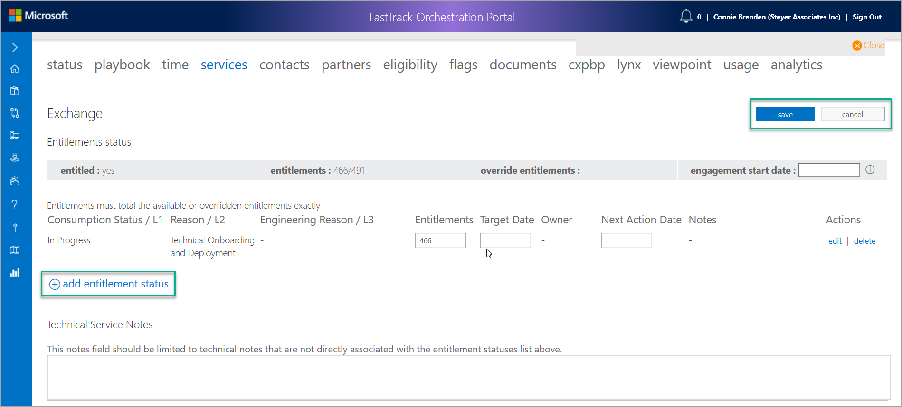

To update the Entitlement Status for a service, select the “add entitlement status” button. Before you enter an Entitlement Status note, make sure that you understand how to write a great note. See [Entitlement Status Notes Guidance](https://aka.ms/FTCNoteGuidance), which includes examples, note templates for various classifications, and how the notes could be worded in different situations.

> [!NOTE]
> A great note should show a green confidence level. When you write your note, please ensure you have clearly articulated the intent, or lack thereof, and the primary reason (if the customer does not have intent or is blocked).

The following procedures provide step-by-step instructions to add, edit, and delete an entitlement status.

#### To add entitlement status

The following sequence demonstrates how to the add an entitlement status with a status note that generates a high confidence value. Remember, the **Enter Status Note** field is appropriate for capturing intent and reason.

> [!NOTE]
> If you want to provide additional status about the service, use the Overall Status Note on the Status tab. For instructions, see [Status tab](detailed-tenant-view-status-tab.md), and review the procedure *To update the overall status note*.

1. Enter **Status Note**.

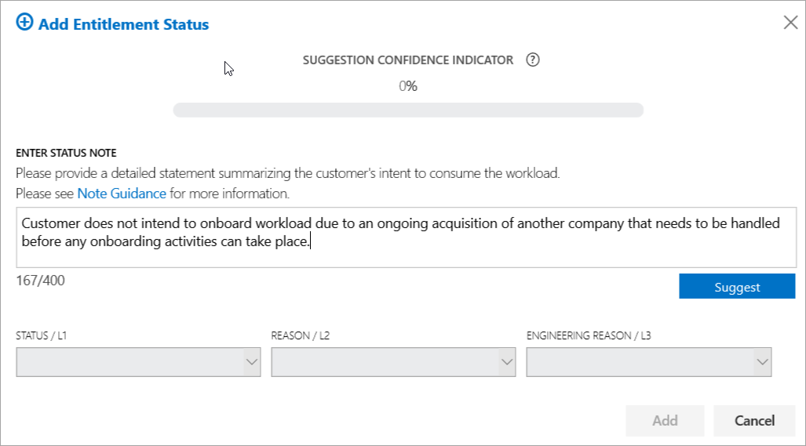

2. Select **Suggest**. The screen refreshes based on the information you entered in the Status Note.

The following screen shows an example of a great note.

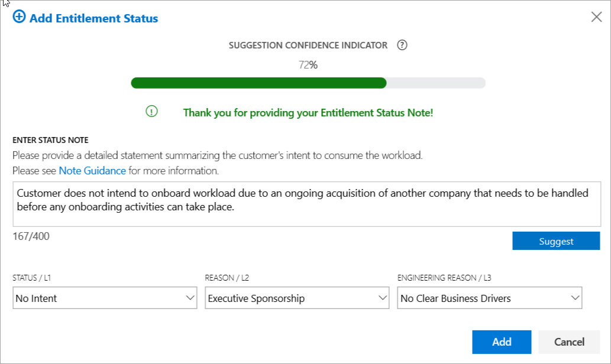

3. Select **Add**.

4. Move the Entitlements.

5. Select **Owner**.

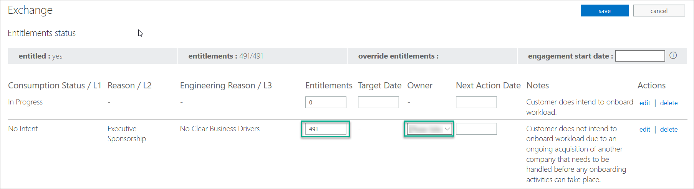

6. Select **Save**.

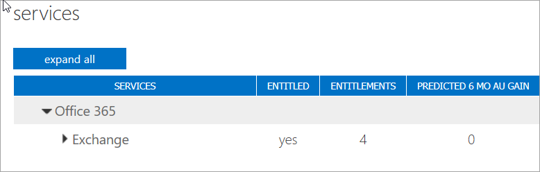

In the next scenario, the screen shows an example of a marginal note, this note is marginal because a reason was not provided.

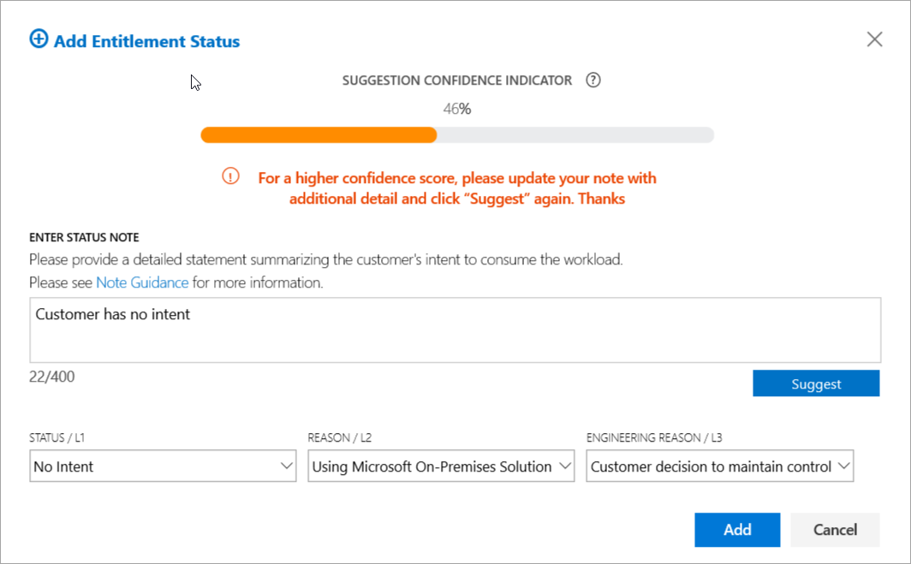

The following screen shows an example of a poor note. You can tell it is a poor note because of the confidence level indicator and because you cannot select Add. The status note does not provide enough information.

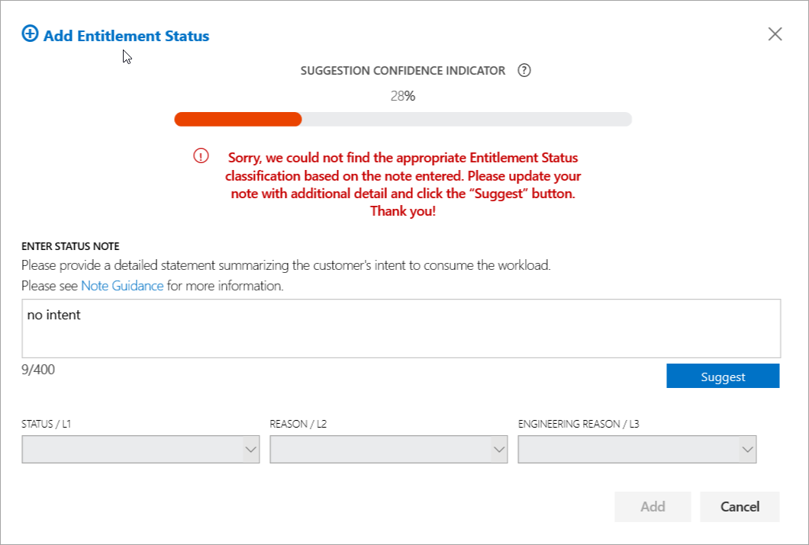

#### To edit entitlement status

1. Select **Edit**.

1. Update your status note.

1. Select **Suggest**.

1. Select **Update**. 

1. Select **Confirm**.

#### To delete entitlement status

The following example shows how to delete an entitlement status.

1. Select **Delete**.

#### Comsumption (L1) status

The entitlements grid shows the five possible **consumption statuses** (typically referred to as L1 indicators or L1 statuses) with the number of entitlements assigned to each one (if any) and any relevant target date, reason, engineering reason, owner, notes, and next action date.

Review the table below for descriptions of the consumption (L1) status:

| Consumption (L1) status | Description                                                                                                                                                                                                                                                                                                                |
| ----------------------- | -------------------------------------------------------------------------------------------------------------------------------------------------------------------------------------------------------------------------------------------------------------------------------------------------------------------------- |
| Status Unknown          | Customer has not been successfully contacted to determine intent for eligible service entitlements. ​                                                                                                                                                                                                                      |
| In Progress             | Customer declares intent and are deploying and/or adopting the service, regardless of engagement scenario. This includes long running customers or customers who aren't planning on deploying for X amount of days.                                                                                                        |
| Blocked                 | Customer has intent to use the workload but there are some blocking issues that need to be removed with assistance from the Account or Engineering teams.                                                                                                                                                                  |
| No Intent               | Customer has no intent to deploy the service at any time.                                                                                                                                                                                                                                                                  |
| Duplicate/Invalid       | If there is a duplicate/invalid tenant, use this L1 status to remove their entitlements from all FTC reporting; for which, all service entitlements should be set to this status. You can also use this status to classify Outlook Mobile entitlements for tenants with Office ProPlus and Outlook Mobile but not Exchange |

For specific L1 to L3 taxonomy definitions and example scenarios, see [Status and Entitlement Home](https://aka.ms/l1l2l3).

For each consumption (L1) status, the following fields are available. Not all fields are available at all times.

|Field  |Definition  |
|---------|---------|
|Entitlements     |This is the number of entitlements assigned to that specific consumption (L1) status. The total number of entitlements assigned must match the total number of entitlements (including override) reported for the tenant.         |
|Target date     |This is the expected completion/end date for the consumption status. NOTE: Only In progress and blocked have target dates available.         |
|Reason (L2)    |This is the customers reason for the entitlements being assigned to the consumption status. NOTE: Only Status Unknown, Blocked, and No Intent have L2 reasons available to them.         |
|Engineering Reason (L3     |This is the more detailed reason that engineering has determined for the blockage. Only consumption statuses with a L2 reason set have an engineering reason available.         |
|Owner    |Person (contact or FTC role) that is responsible for owning the blockage. (Not available for in progress.)         |
|Notes    |Available space for notes that specific to the consumption status (available for all L1s).         |
|Next Action Date |Date defined for the next action on that consumption status.         |
|Engagement Start Date    |Displays the date the customer provided to specify when the customer is ready to engage with the FastTrack Manager to start the FastTrack process for deployment of a workload(s).         |

#### To create or view a note from within the tenant services tab

You can add or view Technical Enablement notes from Technical Services Notes. If you select **Add a New Technical Enablement Note**, the Notes Editor opens with the Note Category Technical Enablement and the tenant populated. For help, see [Notes Library](notes-library.md).

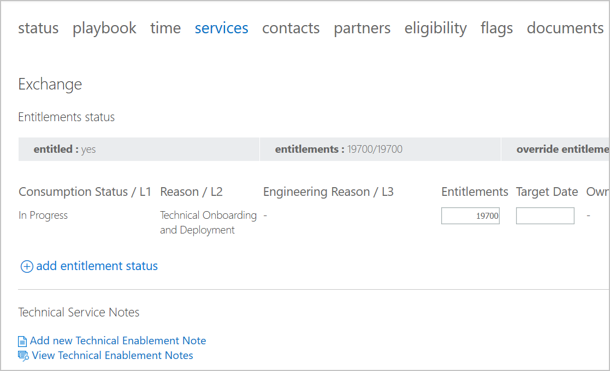

>[!NOTE]
>The service intent note is now part of the Notes Library.

#### Technical service notes

Technical Service notes have been deprecated, therefore it is suggested that teams using these notes refer to [FTOP Notes Guidance](https://aka.ms/FTNotesGuidance).

#### Adoption indicators

The Adoption Indicators are used to capture D.I.B.S. and S.S.A.T. data for the service.

Each field is a pre-defined set of options you can select.

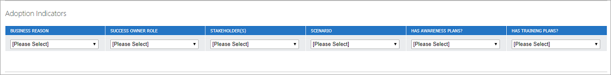

For specific guidance on capture D.I.B.S. and S.S.A.T. see the [guidance document](https://microsoft.sharepoint.com/teams/ftccm/FTOP/OneAdoptionWizard/Guidance_when_4+4_not_present.docx?web=1).

#### Data migration

For services that are eligible for data migration, use the Data Migration section to define who will be responsible for migrating the service.

If the *Microsoft performing migration?* box is not checked, the user can select a migration rejection reason from the drop-down list to specify why Microsoft is not performing the migration and the user can add a note.

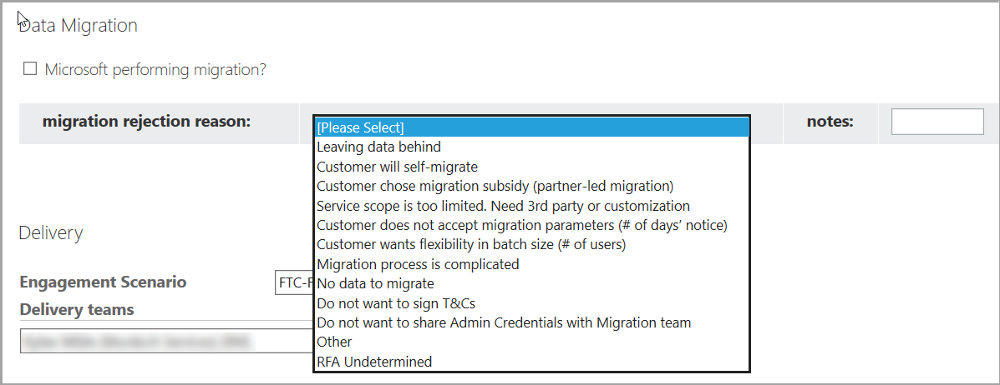

If the *Microsoft performing migration?* box is checked, a new table appears that enables the user to define the type of migration and number of entitlements.

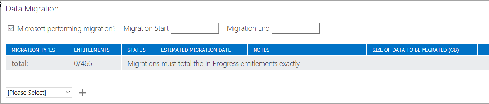

Select a scenario from the **Please Select** drop-down list and select **+ plus icon**. The scenario is added to the table and additional fields appear.

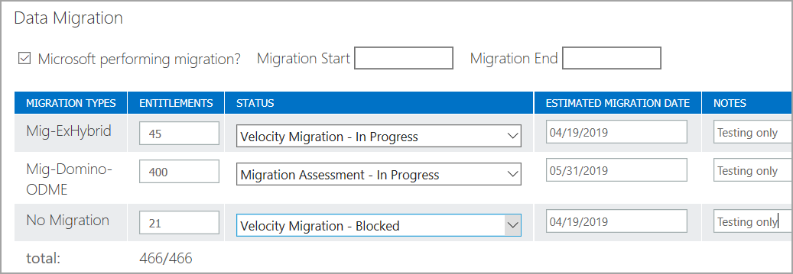

> [!NOTE]
> You can add multiple scenarios, but the total number of entitlements must exactly match the number of In Progress entitlements for the service.

> [!NOTE]
> Based on the scenarios selected, the dedicated migration related tasks are visible or hidden in the playbook. This selection only affects tasks for migration.

#### Delivery

The Delivery section defines the Engagement Scenario and defines Delivery teams (members or groups). For Engagement Scenario, FTOP defaults to **Customer-Led with FTP Assist**.

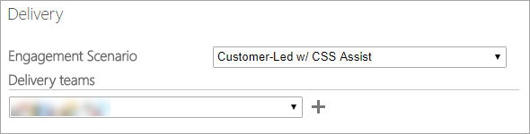

Locate the name of the delivery team member from the **Delivery teams** drop-down list and select **+** plus icon.

> [!NOTE]
> The engagement scenario field is controlled by security role.

If the delivery team member is not authorized, he or she will see the following message. You do not have permission to modify the current Engagement Scenario. To update Engagement Scenario please make a request through FTC Help [https://aka.ms/FTCHelp](https://aka.ms/FTCHelp) and select category Engagement Scenario Change.

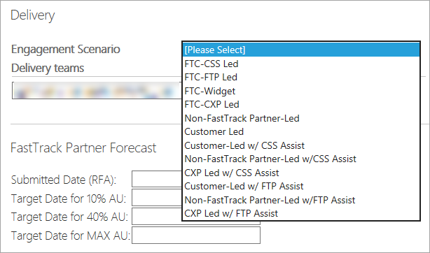

#### FastTrack-ready partner forecasting

The following fields capture the dates for when the service it planned to meet the milestones for 10% and 40% active use. The Max AU date is not currently used.

1. Enter the dates from the date picker, if available, for the Target Date for 10% AU and Target Date for 40% AU.

1. Select **Save**. If there is no Submitted Date (RFA) visible, then the forecast dates cannot be saved, and an error will appear. The dates entered need to be in chronological order. For example, the Target Date for 10% AU cannot be earlier that the Submitted Date (RFA) and the same is true for Target Date for 40% AU, etc.

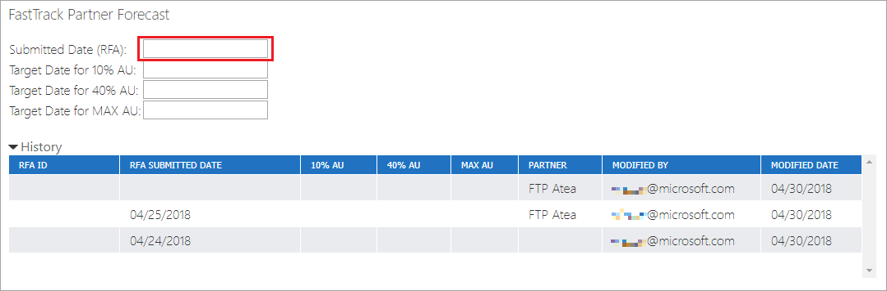

3. Select **Save**. You will return to the services list.

Each time you save a new date in either of these fields, the history of this change records in the History table.

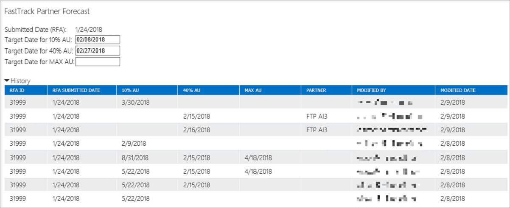

#### Assignments

Assignments are managed through the contextual menu in Tenant View. See [Assignment](tenant-view-summary-view.md#assignment).

#### Note history

At the bottom of the page is a new note history section. This section displays a running history of service entitlement and technical service notes related to the service. The most recent notes are displayed at the top.

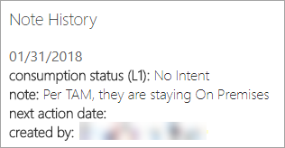

### Viewing service details

When View is selected, the service detail information opens in a read-only format. This is the only option available to users that are not assigned to the tenant.

The view page is divided in seven sections: entitlement status details, technical service notes, adoption indicators, data migration, delivery, assignments, and notes history.

This section will not go into detail about this page because it is a read-only version of the service editing page.

## Next steps

To learn about the next tab, see the [**Contacts tab**](detailed-tenant-view-contacts-tab.md).
