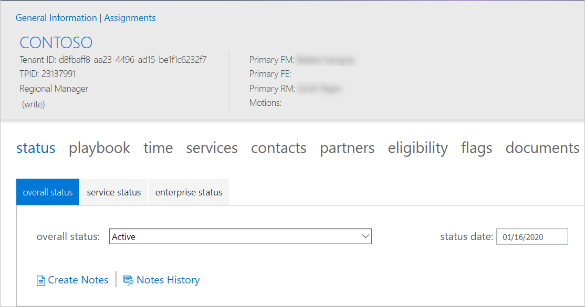
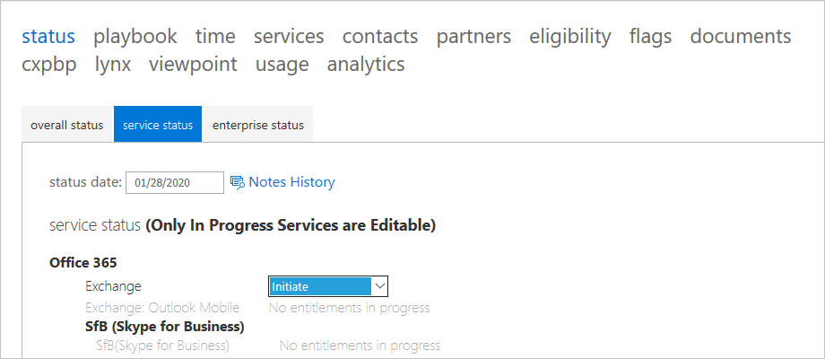
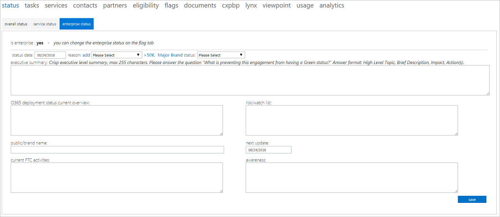
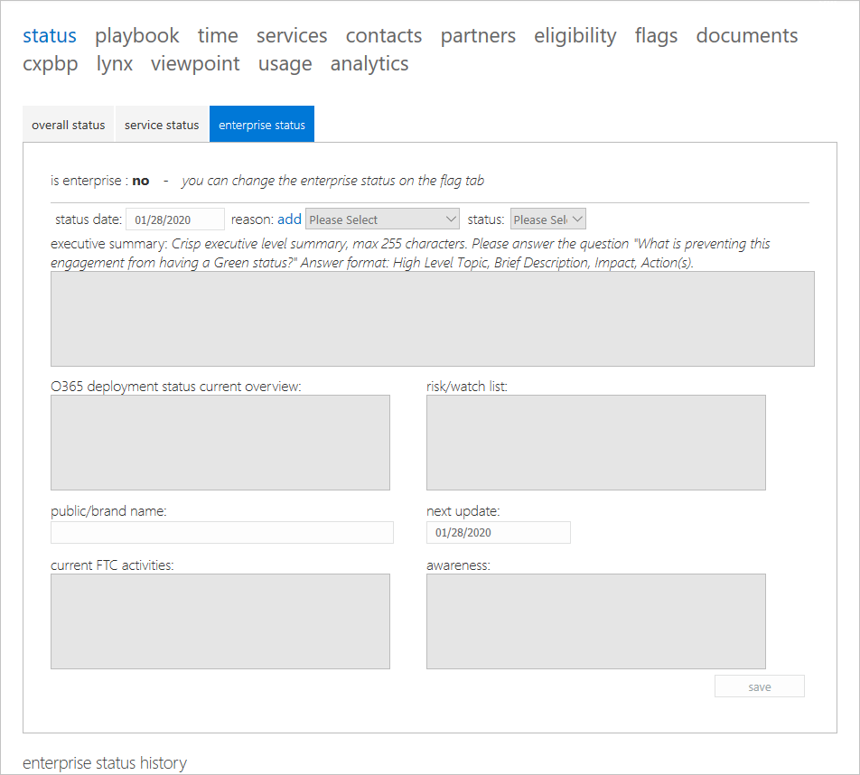

---
# required metadata
title: FTOP User Guide - Detailed Tenant View Status Tab
description: Process guidance for internal FTOP users.
author: Connie Brenden
ms.author: v-conbre
manager: jimmuir
ms.date: 2/4/2020
ms.topic: ftop-user-guide
ms.prod: non-product-specific
ms.custom: ftop-user-guide
ft.audience: internal
ft.owner: jimmuir
---
# Status tab

## Overview

The status tabs in the detailed tenant view contain three subsections for recording overall status, service status, and enterprise status.

## Overall status

When you create a note from the Overall Status tab, the Notes Editor launches with the Note Category preselected as Engagement Management and the tenant you were viewing populated.

> [!NOTE]
> To view instruction for updates to the Engagement Management notes, please refer to [**FTOP Notes Guidance**](https://aka.ms/FTNotesGuidance).

### Procedures

#### To update the overall status

1. Select a status from the **overall status** drop-down list.

1. Enter a date in the **status date** field.

3. Select **Create Notes** to open Notes Editor with Engagement Management and Tenant populated.

4. Click **save**.

#### To update notes history

1. If you wish to view notes history, select **Notes History** to open Latest Notes.

>[!NOTE]
> The Overall Notes History section is now a consolidated display of all notes for the tenant. The location and method for entering other kinds of notes has not changed and those notes will still be stored in the location where they are entered.

## Service status

The Service Status notes have been deprecated. Notes previously entered can be viewed in Latest Notes, select **Notes History**.

>[!IMPORTANT]
>Service status is an important metric in the FastTrack service as it identifies a customer’s progress on the FastTrack path. The goal is to move a customer through the onboarding process and to successful adoption, so understanding where they are on the path and the steps needed to help them move to the next stage is critical.

>[!NOTE]
>For specific L1 to L3 taxonomy definitions and example scenarios, see [**Status and Entitlement Home**](https://aka.ms/l1l2l3).

### Adoption statuses

Review the table below for the various adoption statuses and the order in which they are followed in the preferred path.

|Phase  |Description  |
|---------|---------|
|Initiate    |During the initiate phase, we discuss the onboarding process, verify data and set up a kick-off meeting with the customer. The focus of this phase is to drive intent especially for those customers who don’t currently have intention to use all services.          |
|Assess   |During the assess phase, we work to assess the customer’s source environment and gather requirements. The FE will identify environmental issues that need to be addressed to insure a successful move to the cloud. One important output of this phase is an FE report to the customer on their environment and necessary changes.         |
|Remediate    |During the remediate phase, we work with the customer to create a remediation plan to meet the requirements for onboarding. During this phase, the customer may work with other groups, such as support, to remediate any issues that may hinder full adoption. This phase may be followed by an additional assessment phase.         |
|Enable     |During the enable phase, the project shifts to configuring core infrastructure for service consumption and provisioning Office 365. Generally during this phase, technical onboarding is considered complete and the FEs disengage while the FMs continue working with the customer.         |
|Migrate     |During the migration phase, if a customer selects Microsoft to perform the mail migration, we assist the customer with various activities to enable and perform migrations.         |
|Adoption    |Customers remain in the adoption phase while they have enabled between 1 and 10% of their entitlements.         |
|Operate    |Customers move to the operation phase when the have activated more than 10% of their entitlements. At this point, the customer is considered to have completed the onboarding process.         |

## Enterprise status

FastTrack Architect (FTA) roles should use Enterprise Notes. If the customer is flagged as an enterprise customer, the **enterprise status** tab is enabled. Use the enterprise status tab to capture additional status information for enterprise customers. Please refer to [**FTOP Notes Guidance**](https://aka.ms/FTNotesGuidance).

>[!NOTE]
>Notes captured on the Enterprise Status page are displayed in Latest Notes.

After the updated status saves, the information is stored in a **Latest Notes** . If the customer is not an enterprise customer, the status fields are greyed out.

## Next steps

To learn about the next tab, see the [**Playbook tab**](detailed-tenant-view-playbook-tab.md).
