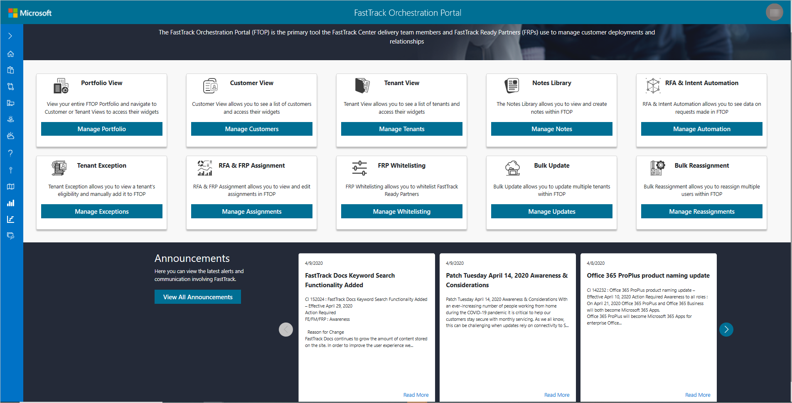
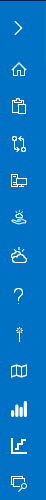
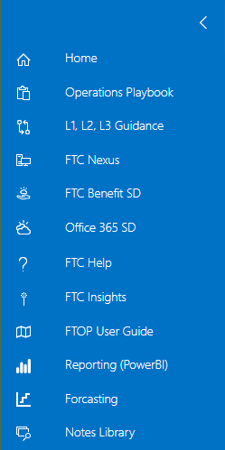

---
# required metadata
title: FTOP User Guide - Landing Page
description: Process guidance for internal FTOP users.
author: Connie Brenden
ms.author: v-conbre
manager: jimmuir
ms.date: 4/16/2020
ms.topic: ftop-user-guide
ms.prod: non-product-specific
ms.custom: ftop-user-guide
ft.audience: internal
ft.owner: jimmuir
---
# Landing Page

The landing page appears when you open FTOP and it displays general information that is divided into three sections: Title banner, Content Views and Tools,  and Announcements. On the left side of the window (often referred to as the left fly-out menu) you have a *FastTrack Guidance* menu. This menu expands to display links (*see FastTrack Guidance menu in this article*).

## Content Views and Tools

The FTOP content and tools section consists of the following tools: Portfolio View, Customer View, Tenant View, Notes Library, RFA & Intent Automation, Tenant Exception, RFA & FRP Assignment, FRP Whitelisting, Bulk Update, and Bulk Reassignment.

|View/Tool  |Description  |
|---------|---------|
|Portfolio View  |Provides customer and tenant views you are assigned to, see [Portfolio View](portfolio-view.md). |
|Customer View   |Provides list of customers you are assigned to, see [Customer View](customer-view.md).  |
|Tenant View     |Provides list of tenants you are assigned to, see [Tenant View](tenant-view.md).  |
|Notes Library   |Provides centralized area for to view, create, and search notes, see [Notes Library](notes-library.md).  |
|RFA & Intent Automation    |View and edit assignments.   |
|Tenant Exception |View and manually add tenants eligibility. |
|RFA & RFP Assignment    |View and edit assignments.  |
|FRP Whitelisting    |Whitelist FastTrack Ready Partners.  |
|Bulk Update     |Update multiple tenants.  |
|Bulk Reassignment   |Reassign multiple users.  |

## Announcements

The Announcements section provides a scrolling view of the latest alerts and communications. Each link in the Announcements list opens to a detailed announcement or you can select View All Announcements. View all announcements directs you to [FTC Info.](https://microsoft.sharepoint.com/teams/ftccm/ftcinfo/default.aspx)

The scrolling view displays the three most recent announcements. Select the arrow to scroll for more.

## FastTrack Guidance Menu

The *FastTrack Guidance menu* is on the left side of FTOP. This menu expands to display links to help and guidance information for FTOP and the FastTrack Center. The menu appears collapsed by default and displays menu item icons.

Click each icon to open the content you want to view in a window. To view what is linked to each icon, hover over the menu item. Click the arrow at the top to expand and collapse the menu.

Review the table below for a definition of each link/icon.

|Link/button          |Description                                                  |
| ------------------- | ----------------------------------------------- |
|Home                 |The Home icon navigates back to the landing page.         |
|Operations Playbook  |The Clipboard icon navigates to the FastTrack Operations playbook.    |
|L1, L2, L3 Guidance  |The Connector icon navigates to the Status & Entitlement Home and provides definition and guidance around the consumption status (L1) and reasons (L2 and L3) that are assigned to service entitlements.             |
|FTC Nexus            |The FTC Nexus icon navigates you to the FTC Nexus home page and provides access to FTC Documents, videos, and other content.                 |
|FTC Benefits SD      |The Benefits icon navigates you to the FastTrack Center Benefit for Office 365 and provides FTC Benefits service description (SD) on Docs.       |
|Office 365 SD        |The Cloud icon navigates you to the Office 365 Service Descriptions on Docs.            |
|FTC Help             |The Question mark icon navigates you to the Microsoft 365 CSP Portal where internal support tickets can be opened.       |
|FTC Insights         |The Insights icon navigates you to the FTC Insights (feedback) page where suggests/ideas can be logged.        |
|FTOP User Guide      |The Guide icon opens this user guide.                     |
|Reporting (Power BI) |The Graph icon navigates you to FastTrack Power BI instance. To access FastTrack Power BI you will need to join the **[FastTrack Power BI](https://outlook-sdf.office.com/owa/?realm=microsoft.com&path=/group/FastTrackPowerBI@service.microsoft.com/mail) modern group.** |
|Forecasting          |The FastTrack forecasting app is used to gather S1500 customer forecasting data. FastTrack forecasting is detailed in the playbook, see [Motion Customer Health Forecasting](https://fasttrack-docs.microsoft.com/playbook/motion-customer-health-forecasting.html).
|Notes Library        |Provides centralized area for to view, create, and search notes, see [Notes Library](notes-library.md).

## Next steps

To learn about Customer View, see the [**Customer View**](customer-view.md).
