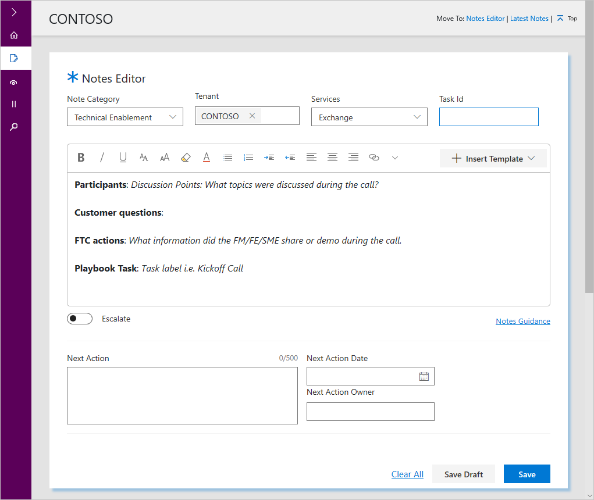
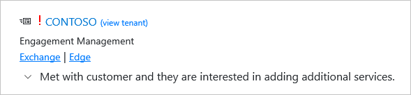
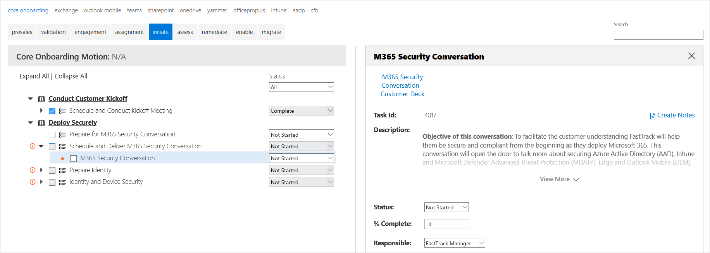
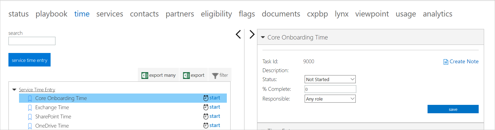
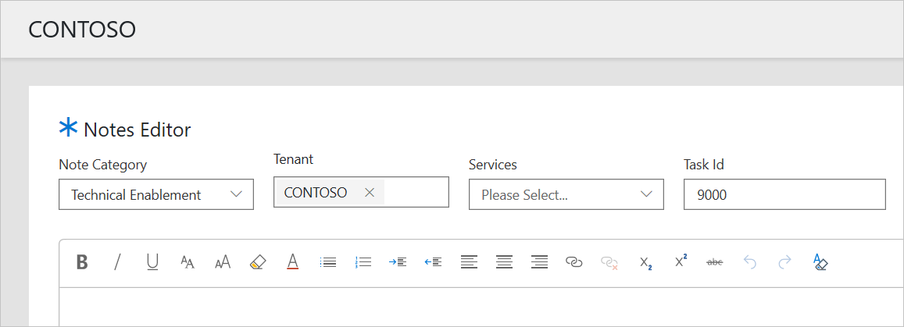

---
# required metadata
title: FTOP User Guide - Notes Library - Notes Editor
description: Process guidance for internal FTOP users.
author: Connie Brenden
ms.author: v-conbre
manager: jimmuir
ms.date: 3/23/2020
ms.topic: ftop-user-guide
ms.prod: non-product-specific
ms.custom: draft
ft.audience: internal
ft.owner: jimmuir
---
# Notes Editor

## Overview

The **Notes Editor** screen is for creating notes and updating drafts. When you open the Notes Editor, it is blank until you make your sections from the drop-down menu. As you make your selections from the drop-down menus it is populated.

>[!NOTE]
>This page can also be accessed from tasks within FTOP. You will find a link to **Create Notes** from the Status, Playbook, Time, and Services tabs.

## Procedures

### Creating a Note

You will select your Note Category, Tenant, and Services from the drop-down menus, insert template if you wish, draft your note, and specify next steps.

#### Select from drop-down menu

Specify your selections from the drop-down menus. When you see **Tenant** in the Notes category, it means you are applying a note at the tenant level.

|Drop-down Menu |Menu Items and Descriptions  |
|---------|---------|
|Notes Category    |Engagement Management Technical Enablement Service Intent Environment         |
|Tenant   |List of tenants assigned to you. Select the tenant that you wish to create a note for, you can compose your note and save up to 10 drafts.          |
|Services    |List of services available. Select the services associated with the tenant that you would like your note to reference.   |
|Task Id    |An optional field. If you are accessing Create Note from within FTOP, the Task Id will be populated. If you enter an incorrect task id, you will see an error message "Value is not a valid Task Id."  |

At this point you are ready to compose your note. If you are composing a note for Engagement Management or Technical Enablement you can insert the optional template.

>[!IMPORTANT]
>Insert the template before you start; otherwise, your content will be overwritten.

#### Enter content into text box

This area is used to write your note. Author your note in the note text box using rich text formatting, including linking. If you want to use the optional template, select it before you start.

#### Turn on escalated flag

Turn on the escalate flag if you want your note to appear on the Latest Notes and Search Notes Library screen. It will be marked red exclamation point and if it is less than one week old it will also have the recent note indicator. When you set the escalated flag, be aware that the flag does not trigger an automated notification.

>[!TIP]
>To learn more, refer to [**FTOP Notes Guidance**](https://aka.ms/FTNotesGuidance).

#### Specify next steps

|Next Step  |Description  |
|---------|---------|
|Next Action     |Specify your next action in 500 characters or less.         |
|Next Action Date  |Pick the desired date from the calendar.         |
|Next Action Owner   |Pick the next action owner from the list.         |

#### Set actions

|Action  |Description  |
|---------|---------|
|Clear All     |Clears all content from data and fields.         |
|Save Draft  |Saves your draft, only you will be able to see it and you can save up to 10 drafts.       |
|Save   |Saves your note. It will display in Latest Notes and within a few minutes it will display in a search. It cannot be deleted.         |

### Creating a Note from FTOP

You can create notes from the Status, Playbook, Time, and Services tabs.

#### Create note from Status tab

When you create a note from the Overall Status tab, the Notes Editor launches with the Note Category preselected as Engagement Management and the tenant you were viewing populated.

#### Create note from Playbook Task Id

When you create a note from within the Playbook Task Id, the Notes Editor opens with Technical Enablement Notes Category, tenant you were viewing and Task Id populated.

The data flows from the Task Id you were viewing.

#### Create note from Time tab

You can create a note from Service Time Entry.

The data flows from the Task Id you were viewing.

#### Create note from Services tab

You can add or view Technical Enablement notes from Technical Services Notes section. If you select **Add a New Technical Enablement Note**, the Notes Editor opens with the Note Category Technical Enablement and the tenant populated.

>[!NOTE]
>The service intent note is now part of the Notes Library.

## Next steps

To learn about the Latest Notes, see [**Latest Notes**](notes-library-latest-notes.md).
