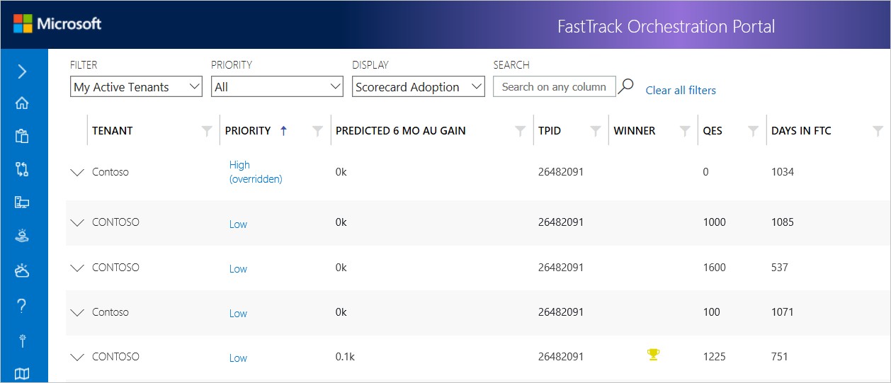
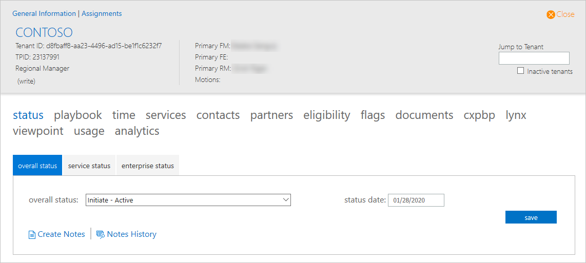

---
# required metadata
title: FTOP User Guide - Tenant View - Contextual Menu
description: Process guidance for internal FTOP users.
author: Connie Brenden
ms.author: v-conbre
manager: jimmuir
ms.date: 4/16/2020
ms.topic: ftop-user-guide
ms.prod: non-product-specific
ms.custom: ftop-user-guide
ft.audience: internal
ft.owner: jimmuir
---
# Contextual Menu

## Overview

When you access Tenant View you will see a list of tenants, in this case, filtered by My Active Tenants.

The row is highlighted when you select a tenant.

Select the down arrow to expand the contextual menu to view different levels of status. The following screen shows overall status.

> [!NOTE]
> These menu options are the same tab options you would see if you viewed the customer/tenant in the Detailed Tenant view.

Review the table below for a description of the tabs on the menu.

| Priority           | Description                                                                                                                                                                                                                                                                                                                                                                                                                                 |
| ------------------ | ------------------------------------------------------------------------------------------------------------------------------------------------------------------------------------------------------------------------------------------------------------------------------------------------------------------------------------------------------------------------------------------------------------------------------------------- |
| Status             | The Status tab contains subsections (tabs – for recording overall status, service status, and enterprise status, and customer satisfaction issues. |
| Playbook           | The Playbook tab lists life cycle phases that display depending on Motion.|
| Time               | The Time tab provides service time entry tracking.|
| Services           | The Services Windows tab provides information and status about the services available to the customer for deployment.|
| Contacts           | The Contacts tab tracks customer, partner, and Microsoft contacts related to the customer deployment.|
| Partners           | The Partners tab when relevant, contains partner (company) information.|
| Eligibility        | The Eligibility tab displays information about tenant eligibility for the FTC. |
| Flags              | The Flags tab includes editable fields that indicate certain aspects of customer health. |
| Documents          | The Documents tab provides the Tenant an option to create a Document Library.                        |
| Cxpbp              | The Cxpbp tab is a URL that opens the current customer’s information in the CXP Business Portal. |
| Lynx               | The Lynx tab is a URL that opens to access information about customer account, usage, health, network, and services events specific to the customer tenant.   |
| ViewPoint          | The ViewPoint tab is a URL that opens the current customer’s tenant information in the ViewPoint portal.     |
| Usage              | The Usage tab opens the Usage Report that provides usage statistics for each tenant, providing detail and insight into active use at set points in time, and changes in use from month to month.  |
| Analytics          | The Analytics tab provides a different view of the customer data and is generally used for management reporting. |

## Next steps

To learn about the summary view, see [**Summary View**](tenant-view-summary-view.md).
