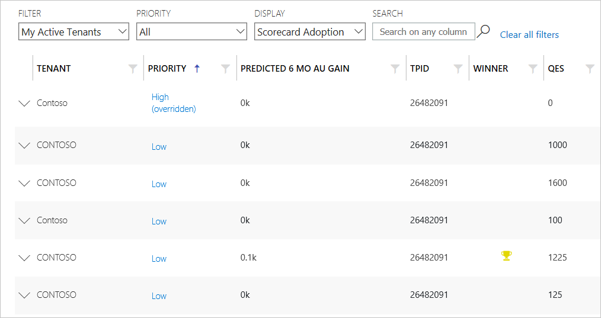
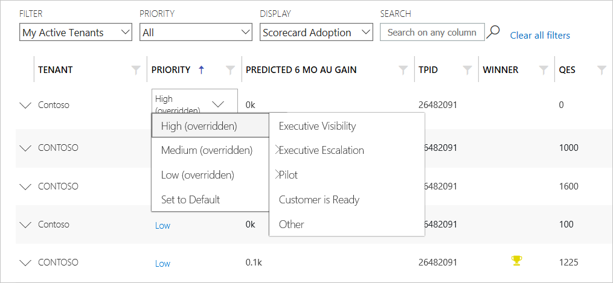
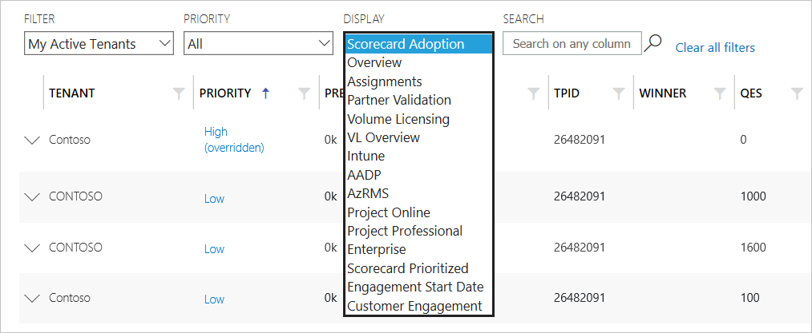
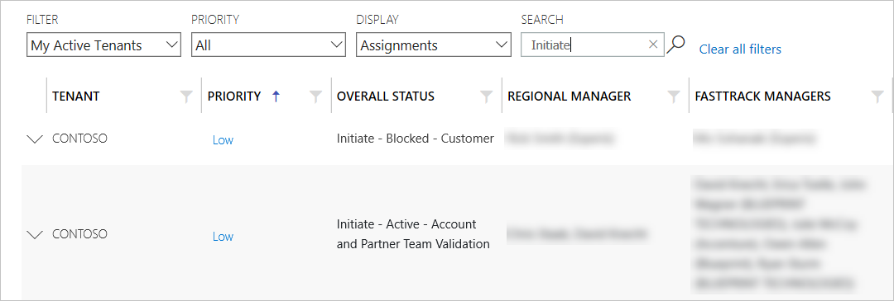
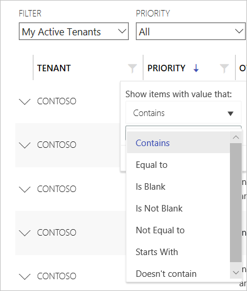
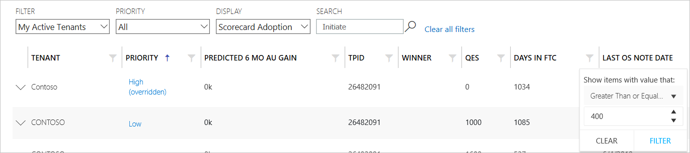
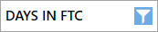
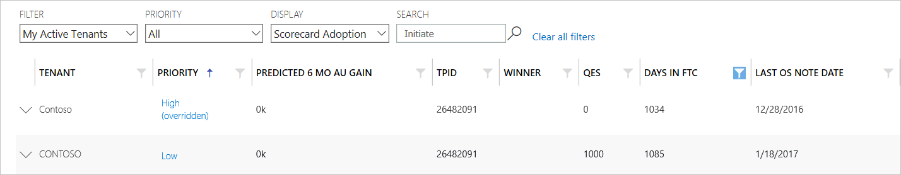
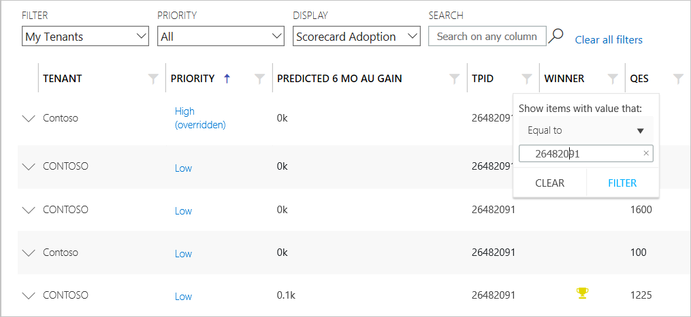
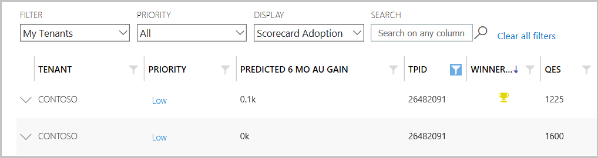

---
# required metadata
title: FTOP User Guide - Tenant View - Sorting and Filtering
description: Process guidance for internal FTOP users.
author: Connie Brenden
ms.author: v-conbre
manager: jimmuir
ms.date: 4/16/2020
ms.topic: ftop-user-guide
ms.prod: non-product-specific
ms.custom: ftop-user-guide
ft.audience: internal
ft.owner: jimmuir
---
# Sorting and Filtering

## Overview

When you first open Tenant View, the default filter is set to *My Active Tenant* and the default view is set to *Scorecard Adoption*. The list of tenants is sorted by highest to lowest priority.

### Using the filters

#### To sort by column

1. Click a **column name** to sort the list of tenants by that attribute. The column selected by which to sort displays an up or down arrow to the right of the column name.

1. Click the **column name**, or the **arrow**, to reverse the sort order.

1. You can adjust the filters, priority, display, or search the list of tenants using one of the fields above the grid.

Review the table below for descriptions of the tabs above the grid.

| Button                                    | Description                                                                                        |
| ----------------------------------------- | -------------------------------------------------------------------------------------------------- |
| Wizard Experience                         | The Wizard Experience tab navigates you to Prioritized Portfolio View.                             |
| Portfolio Report                          | The Portfolio Report tab navigates you to a Power BI report that shows adoption.                   |
| Load 1000 tenants (For Gateway Team only) | The Load 1000 tenants tab displays the number of tenants loaded, based on your selection criteria. |

4. Click **Priority** to the right of customer/tenant name to display the customer view of the Prioritized Portfolio Wizard.

>[!NOTE]
>**Prioritized Portfolio** is an FTOP wizard that provides alternate views of the customer(s) you are assigned to. You can view customers/tenants sorted by highest-to-lowest impact for an FM (*active usage (AU), or opportunity to drive AU*). Microsoft’s FTC AU% increases when FMs dedicate their time to more impact customers.

### Filter drop-down

The filter drop-down list filters the list of tenants. The filters that show up depends on your tenant data RBAC permissions, see [RBAC Controls](rbac-controls.md)

Review the tables below for descriptions of the available filter options.

#### RBAC Role - Assigned

| Filter              | Description       |
| ------------------- | --------- |
| My Active Tenants   | Displays all active customer tenants assigned to the logged in user.   |
| My Inactive Tenants | Displays all inactive customer tenants assigned to the logged in user. |
| My Tenants          | Displays all tenants assigned to the logged in user.                   |
| My Customers        | Displays all customers assigned to the logged in user.                 |

#### RBAC Role - Privileged, Assigned and Assignment

| Filter              | Description        |
| ------------------- | --------- |
| My Active Tenants   | Displays all active customer tenants assigned to the logged in user.   |
| My Inactive Tenants | Displays all inactive customer tenants assigned to the logged in user. |
| My Tenants          | Displays all tenants assigned to the logged in user.                   |
| My Customers        | Displays all customers assigned to the logged in user.                 |
| All Customers       | Displays all GetModern and Customer Health tenants that the logged in user has access to view.               |
| Active Tenants      | Displays all active customer tenants.                                  |
| Inactive Tenants    | Displays all inactive customer tenants.                                |
| Volume Licensing    | Displays all volume license customers (pre-eligibility).               |
| All                 | Displays all tenants that the logged in user has access to view.                                               |

> [!NOTE]
> Filters that have *My* in the name will limit the scope to only tenants to which you are assigned. All other filters show all tenants that meet the filter criteria regardless of whether you are assigned.

### Priority

The **Priority** filter can be used to sort the list of tenants based on priority. Filters with *Override* in their name include tenants that have the priority manually set (that is, it overrides the automated priority).

Review the table below for a description of the priority filter options.

| Priority             | Description                                                                   |
| -------------------- | ----------------------------------------------------------------------------- |
| All                  | Displays all tenants.                                                         |
| High + High Override | Displays tenants that are ranked as high or have been overridden to high.     |
| Med + Med Override   | Displays tenants that are ranked as medium or have been overridden to medium. |
| Low                  | Displays tenants that are ranked as low priority.                                |
| Low Override         | Display tenants that have been overridden to low.                           |

#### To edit a customer’s priority in Tenant View

1. Hover over the customer’s current priority. A drop-down list appears displaying priority options.

1. Hover over High (overridden), Medium (overridden), or Low (overridden) to select a sub-category as the priority you want to set, or click Set to Default.

A drop-down list appears displaying sub-categories for High, Medium, and Low priority options.

3. Click the priority you want to assign to the customer from the drop-down list. The Tenant View window refreshes and displays the assigned priority.

### Display

Use Display to view information about the customer, such as their scorecard adoption, overview, assignments, and many other options. You can adjust the widths of the columns by and all displays provide horizontal and vertical scrolling.

Review the table below for the display views and their descriptions.

| Display               | Description                                                                                                                                                                                                                                                                                                                                 |
| --------------------- | ------------------------------------------------------------------------------------------------------------------------------------------------------------------------------------------------------------------------------------------------------------------------------------------------------------------------------------------- |
| Scorecard Adoption    | Displays each tenant based on their scorecard adoption with the highest one listed at the top. Columns include: Tenant, Priority, Predicted 6 MO AU Gain, TPID, WINNER, QES, Days in FTC, Last OS Note Date, Exchange %, SharePoint %, SFB %, Yammer %, Intune %, AADP %, ProPlus %, Teams %, OD4B %, EOM %, MDATP %, OATP %.       |
| Overview              | Displays overview. Columns include: Tenant, Priority, Predicted 6 MO AU Gain, Overall Status, Next Action, Next Action Date, Next Action Owner, TPID, Regional Manager, Assignment Urgency, Tags.                                                                                                                           |
| Assignments           | Displays the primary users assigned key roles. Columns include: Tenant, Priority, Overall Status, Regional Manager, FastTrack Managers, FastTrack Engineers, Migration Velocity Manager.                                                                                                                         |
| Partner Validation    | Displays WinRoom reason and assignments. Columns include: Tenant ID, Tenant, Reason Name, Priority, Regional Manager, FastTrack Managers, Created Date, Country Name, Tags.                                                                                                                                                                 |
| Volume Licensing      | Displays key eligibility flags. Columns include: Tenant, Account Owner, Has Deployment Plan, Partner Name, Partner MPNIP, Segment, Subsidiary.                                                                                                                                                                                              |
| VL Overview           | Displays overall status and primary FM. Columns include: Tenant, Overall Status, FastTrack Managers, Modified, AM Contracts, TPID.                                                                                                                                                                                                          |
| Intune                | Displays Intune service status and assignments. Columns include: OVerall Status, Service Status, In Scope, Regional Manager, FastTrack Managers, FastTrack Engineers, Has Exchange.                                                                                         |
| AADP                  | Displays AADP service status and assignments. Columns include: Tenant, Overall Status, Service Status, In Scope, Regional Manager, FastTrack Managers, FastTrack Engineers, Has Exchange.                                                                                                                                                    |
| AzRMS                 | Displays AzRMS service status and assignments. Columns include: Tenant, Overall Status, Service Status, In Scope, Regional Manager, FastTrack Managers, FastTrack Engineers.                                                                                                                                                                 |
| Project Online        | Displays Project Online service status and assignments. Columns include: Tenant, Overall Status, Service Status, In Scope, Regional Manager, FastTrack Managers, FastTrack Engineers, Has Exchange.                                                                                                                                          |
| Project Professional  | Displays Project Professional service status and assignments. Columns include: Tenant, Overall Status, Service Status, In Scope, Regional Manager, FastTrack Managers, FastTrack Engineers, Has Exchange.                                                                                                                                    |
| Enterprise            | Displays enterprise status and assignments. Columns include: Tenant, Level, Overall Status, Enterprise Status, Enterprise Modified, FastTrack Managers, Regional Manager, FastTrack Architect, FastTrack PM, DVNext.                                                                                                                        |
| Scorecard Prioritized | Like the Scorecard Adoption display but includes prioritization score for key services. Columns include: Tenant, QES, Days in FTC, Exchange %, SharePoint %, SFB %, Yammer %, Intune %, AADP %, AZRMS %, SFB_CXPScore, SFB_FTAScore, SFB_WeightedScore, SPO_CXPScore, SPO_FTAScore, SPO_WeightedScore, MDATP %.                                                                   |
| Engagement Start Date | Displays the date the customer provided to specify when the customer is ready to engage with the FastTrack Manager to start the FastTrack process for deployment of a workload(s). Columns include: Tenant, EXO, SPO, OD4B, OPP, AADP, Intune, Teams, Yammer, OLM, SFB, Win10, MCAS, AIP, AZRMS, MDATP, Project Pro, PO Professional, Po Essentials, SDS, SH, OATP % |
| Customer Engagement   | Displays multiple views the Gateway team will use providing a combination of displays. Columns include: Tenant, Tenant ID, Regional Manager, FastTrack Managers, Next Action, Next Action Date, Next Action Owner, Created Date, Priority, Reason Name, Assignment Urgency, TPID, Segment, Country Name, Tags.               |

### Search

Use the Search field to search any column in the view (including tenants not on the current screen). The default sort column is *Tenant*. You can search by tenant name or tenant ID in this column.

#### To search within display

Use the Search field to search for values within any column shown in the Display.

With the display set to Assignments, enter a value in the search field, for example Initiate. This will return all rows in the Assignments display that include the term Initiate.

### Column filter

The column filters can be used on multiple columns within a display. You may want to filter on conditions related to date and text, or filter on conditions related to numbers, for example DAYS IN FTC.

Each column has a filter  with additional filtering options.

#### To filter on DAYS IN FTC to find My Active Tenants greater than or equal to 400

1. Set DAYS IN FTC filter to show items greater than or equal to 400.

2. Select **Filter**. Notice that filter displays selected.

You can also filter on multiple columns within the same display.

3. Select **Clear**, to clear the filter.

#### To view WINNER tenant across all

The TPID column can be used to search for specific TPID.

1. From FILTER, select **ALL**.
2. Set TPID filter **Equal to** *TPID Number*, select **Filter**.
3. Set WINNER filter to sort by Ascending order.

The example shows the TPID filter set equal to a Contoso tenants TPID number.

The example shows the TPID filter set equal to plus the WINNER filter set to sort by ascending order.

### Tripwire icons

Tripwire icons appear next to a customer name to indicate abnormal behavior for the tenant. Each icon includes hover-text detailing the abnormal behavior.

Review the table below for a description of the tripwire icons.

| Priority       | Description                                                                           |
| -------------- | ------------------------------------------------------------------------------------- |
| Green up arrow | Significant AU gains occurred within the past 30 days.                                |
| Red down arrow | Significant AU drop occurred within the past 30 days.                                 |
| Blue up arrow  | The tenant purchased more entitlements within the past 30 days.                       |
| Glasses        | There was recent activity to access the Admin Center Setup Guide within the past 30 days. |
| Weight         | Admin Center logins significantly increased within the past 30 days.                  |

### Page size

Directly below the grid (typically at the bottom of the page) is a drop-down list that enables the user to adjust the number of records shown per page (25, 50, or 100). The default value is 25.

> [!NOTE]
> There is a small performance impact when the page size is set to 100. The list of tenants may take several seconds to load when this value is selected.

## Next steps

To learn about the contextual menu, see [**Contextual Menu**](tenant-view-contextual-menu.md).
