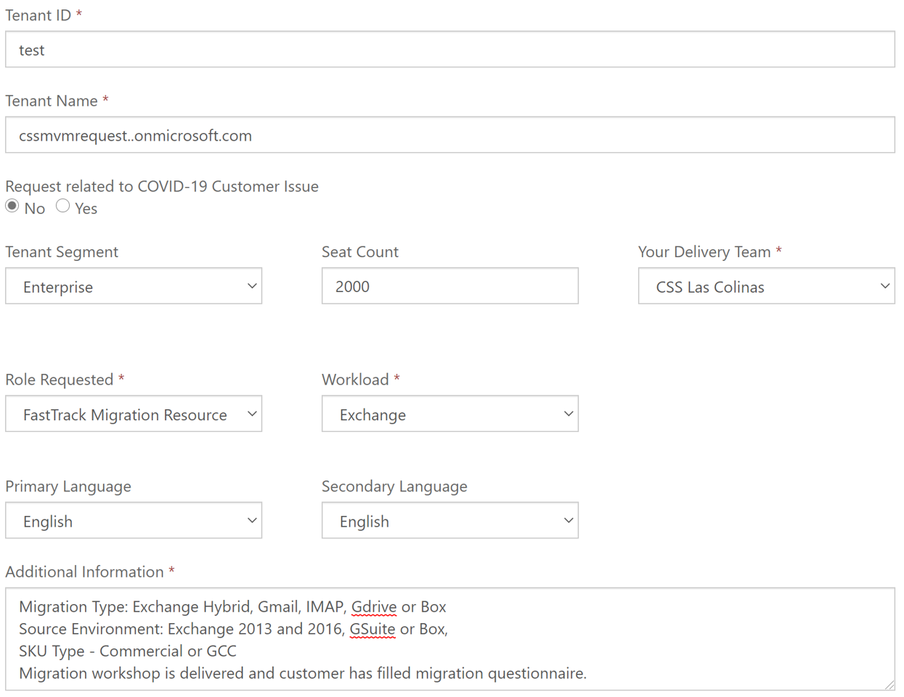

---
# required metadata
title: MVM ReqTask Instructions - Index
description: Process guidance for internal FTOP users.
author: Connie Brenden
ms.author: v-conbre
manager: jimmuir
ms.date: 5/14/2020
ms.topic: MVM ReqTask Instructions
ms.prod: non-product-specific
ms.custom: mvm-reqtask-instructions
ft.audience: internal
ft.owner: jimmuir
---
# Overview

You can now submit a new MVM request by going to [FastTrack Center Resource Request](https://aka.ms/ftcresourcerequest) portal. Those authorized to triage requests have also been enabled in the new request tool and will start to receive notifications for submitted requests.

## MVM request

### Location

 - [FastTrack Center Resource Request](https://aka.ms/ftcresourcerequest)

### Process

#### To submit request

1. Create a new FastTrack Migration Resource (MVM) Request Form by selecting **+Create**.

2. Complete all required fields in the form and include any additional information that would be helpful in identifying an appropriate MVM resource for your engagement.

>[!NOTE]
>Please fill in all the fields even the optional ones.

3. Select **Submit**.

Within 5 minutes of submitting your request, you should receive an automated email validating that your request has been submitted.

The MVM leads triage your request on Monday’s and Thursday’s. If additional information is requested you will be notified.

#### Example

The image below provides a mandatory/example of information needed to complete the request.

The table provides field name, type, and whether the field is required or optional. Please complete ALL fields.

|Field Name |Type  |Required/Optional  |
|---------|---------|---------|
|Tenant ID     |Text         |Required         |
|Tenant Name    |Text         |Required         |
|Request related to COVID-19 Customer Issue     |Radio Button         |Optional         |
|Tenant Segment    |Drop-down         |Optional          |
|Seat Count     |Text         |Optional          |
|Your Delivery Team  |Drop-down         |Required         |
|Role Requested  |Drop-down         |Required         |
|Workload   |Drop-down         |Required         |
|Primary Language   |Drop-down         |Optional          |
|Secondary Language  |Drop-down         |Optional          |
|Additional Information  |Text (2000 characters)         |Required         |
